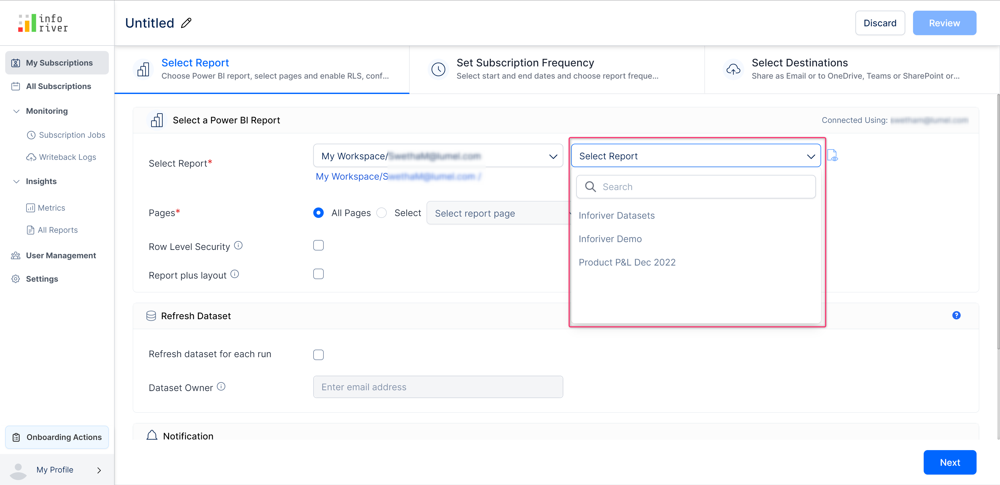
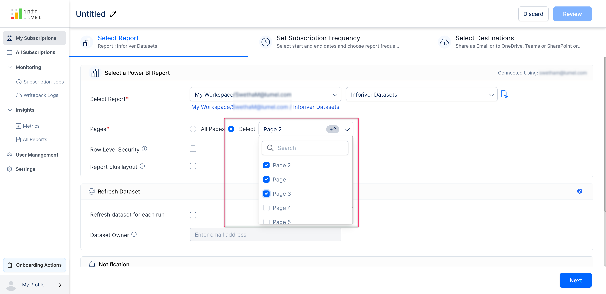
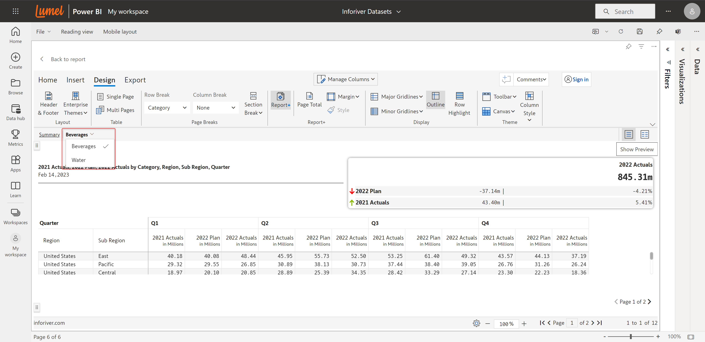
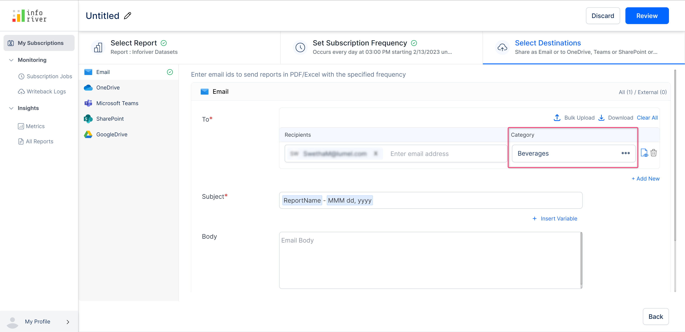
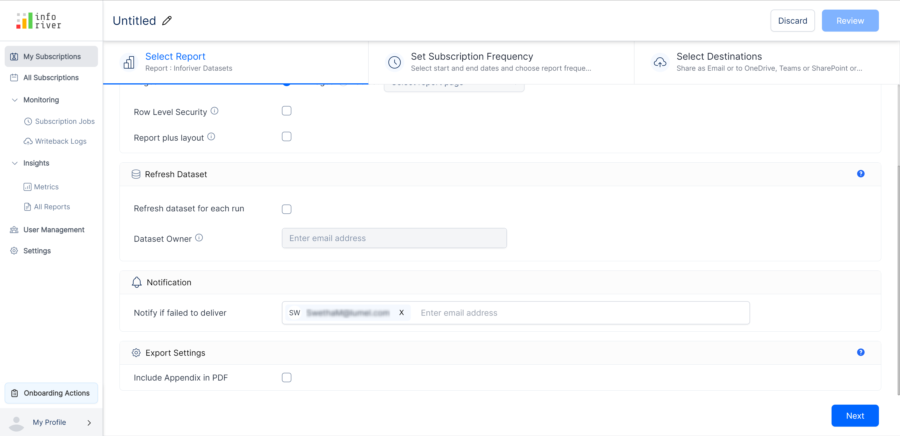

# Select a report

## 1. Select a Power BI report

In this section, you need to provide all the report-related details and configurations. This section has the following options:

### i) Select report

In the first drop-down, select the Power BI workspace in which the report you want to schedule is published.

The 'Workspace' and 'Report' fields will get auto-populated with the workspace and report name of the report. If you want to schedule a different report, you can update the details here.

<figure><figcaption>
Select workspace option
</figcaption></figure>

Based on the selection made in the first drop-down, the second drop-down gets populated with reports available in the selected workspace.&#x20;

In the second drop-down, select the report for which you want to create a subscription.

<figure><figcaption>
Select report option
</figcaption></figure>

### ii) Pages

Here you can select the pages of the report to schedule.&#x20;

* **All pages** - Schedule all the pages of the report&#x20;
* **Select** - If this option is chosen, then a drop-down becomes available in which you can select the pages that you want to schedule. More than one page can be selected.

<figure><figcaption>
Select pages option
</figcaption></figure>

### iii) Row-level security

Enabling this option will export the report based on the row-level security applied. If this option is enabled, initially a consent email will be sent to the selected recipients and only after the approval of the consent email, the scheduled reports will be sent to the recipients.

Recipients with 'Admin' and 'Member' access roles will be able to view the entire report whereas the recipients with 'Viewer' access would be able to view only the relevant data based on their role.&#x20;

You can manage the roles of the members using the 'Manage roles' option under the 'Modelling' tab in the Power BI toolbar.

<figure><figcaption>
Manage roles option
</figcaption></figure>

For example, in the following image, the 'Report Viewer' role has been set to view only the data related to the 'United states' region.

<figure><figcaption>
Applying security roles
</figcaption></figure>


If RLS is enabled then only the 'Email' destination is supported.


As seen below, members with the 'Report viewer' member role would be able to see only 'United States' under the categories while viewing the report.

<figure><figcaption>
Report with RLS
</figcaption></figure>

You can learn more about row-level security and how to define user roles and rules [here](https://learn.microsoft.com/en-us/power-bi/enterprise/service-admin-rls).

### iv) Report plus layout

You can create subscriptions based on the Report+ categories.  In this report, we have two categories - Beverages and Water. The records corresponding to these categories can be sent to different email IDs.&#x20;

You can learn more about Report+ [here](https://docs.inforiver.com/inforiver/working-with-inforiver/8.-paginated-reporting/report-layouts-report+).

<figure><figcaption>
Report plus view
</figcaption></figure>

Once you select 'Report plus layout', the scheduler automatically detects the number of categories present in the report page selected.

<figure><figcaption>
Report plus layout categories
</figcaption></figure>

These categories can be viewed and selected in the 'Select Destination' -> 'Category' section.

<figure><figcaption>
Report category in destination
</figcaption></figure>


If both the 'Report plus layout' and 'Row level security' options are enabled, only the 'Email' destination would be available.


## 2. Refresh dataset

### i) Refresh dataset for each run

If you have reports where the data gets frequently updated and you want the updated data to be used every time the schedule is run, then you can enable the 'Refresh dataset for each run' option.

<figure><figcaption>
Refresh dataset for each run option
</figcaption></figure>

If this option is enabled, only 'Email' can be chosen as the 'Destination' and other third-party destinations won't be available.

### ii) Dataset owner

This option becomes available only if the 'Refresh dataset for each run' option is enabled. You can add the email of the owners of the dataset.&#x20;

If the 'Refresh dataset for each run' option is enabled, then a consent email will be sent to the recipients added in the dataset owner option. The consent email is shown in the image below.

<figure><figcaption>
Refresh dataset consent email
</figcaption></figure>


The subscription will be created only if the dataset owner(s) provide consent. The scheduled jobs will keep failing until consent is provided.


## 3. Notifications

### i) Notify if failed to deliver&#x20;

Here you can specify the email addresses to which notifications should be sent in case of failure in report delivery. The schedule owner's name will be added by default.&#x20;

You can choose to add other members' names by typing in the input box or choosing from the drop-down. You can also add external email addresses of members who are not part of your team/organization.

<figure><figcaption>
Notify if failed to deliver option
</figcaption></figure>

If in case any of the scheduled runs fails, then an email will be sent to all the selected members, with the reason for failure, an error log, and a link to track back the error as shown in the image below.

<figure><figcaption>
Failed schedule email
</figcaption></figure>

## 4. Export settings

### i) Include an appendix in PDF&#x20;

Enabling this option will display an appendix for each report page with information like the font used, page name, filters applied, etc. A sample appendix is shown below.

<figure><figcaption>
PDF appendix
</figcaption></figure>

In the next section, we'll look at [configuring the subscription frequency](set-subscription-frequency.md).
