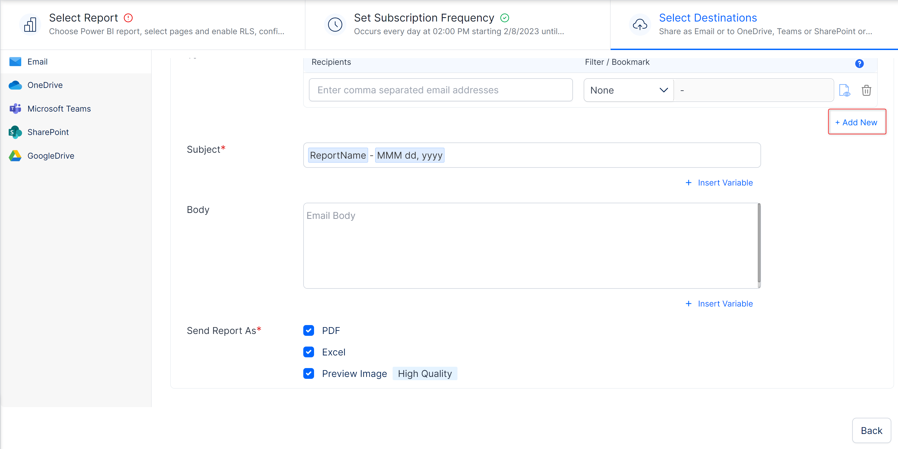
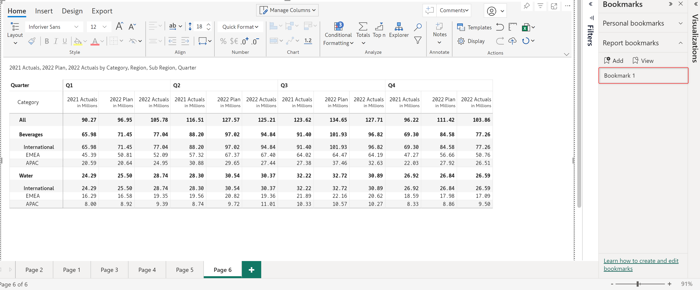
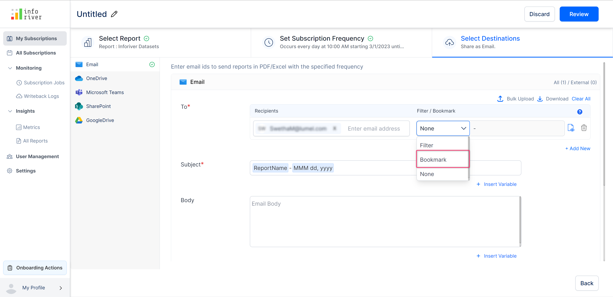
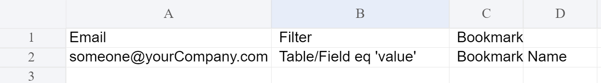

# Select destination(s)

Here you can select the destination(s) to which you want the send the reports. The scheduled reports can be exported to any of the following destinations: Email, OneDrive, Microsoft Teams, SharePoint, and Google Drive.

<figure><figcaption>
Destination option
</figcaption></figure>


By default, the email option is chosen in the destinations section.


## i) Email

The following options are available if the email destination is chosen.

The 'To' option has the following fields: Recipients and Filter/bookmark.

### **a) Recipients**&#x20;

Here you can specify the recipient's email address to which the report should be sent. AD groups can also be used.&#x20;

### **b) Filter/bookmark**&#x20;

Here you can specify if you want to apply any filter or bookmark to the report for the selected recipients before exporting it. This value is set to 'None' by default.&#x20;

<figure><figcaption>
To field in email destination option
</figcaption></figure>

#### **Filter**&#x20;

If this option is set to 'Filter', a new input field becomes available right next to the drop-down. In this field, you can specify the queries to filter the report.&#x20;


Hover over the '?' icon to find help links on how to use filter/bookmark


<figure><figcaption>
Tooltip in email destination
</figcaption></figure>

Click the 'Add new' option to add a new filter/bookmark.

<figure><figcaption>
Add new link option
</figcaption></figure>

#### **Bookmark**&#x20;

You can select the bookmark option to include the configured bookmarks in the scheduled reports.


The bookmark option is disabled by default and becomes available only if you have added bookmarks to the report


A bookmark has been created for the report as shown in the image below.

<figure><figcaption>
Adding bookmark to the report
</figcaption></figure>

The bookmark option will be available if you have added and configured a bookmark in your report.

<figure><figcaption>
Enable bookmark option
</figcaption></figure>

Once you select the bookmark option, the second drop-down gets populated with all the configured bookmarks in the report.

<figure><figcaption>
Select bookmark
</figcaption></figure>

### **c) Bulk upload**&#x20;

You can also bulk upload a CSV file of recipients' emails. Click the 'Bulk upload' option. This will open up the bulk upload modal as shown in the image below.\
\
Click the 'Upload' button or drag and drop to upload the CSV file with the recipient's details.

<figure><figcaption>
Bulk upload option
</figcaption></figure>

**Download sample**&#x20;

Click 'Download sample' to download a sample CSV document to understand how the uploaded CSV file should be structured.\
\
The image below displays the structure of the download sample CSV file.

<figure><figcaption>
Download sample csv file
</figcaption></figure>

**Download filterss/bookmark**

Clicking on this option will download the entered recipient's email address, and filter/bookmark selection as a CSV file.

<figure><figcaption>
Download email recipients option
</figcaption></figure>

The downloaded CSV file looks as shown in the below image.

<figure><figcaption>
Email recipients
</figcaption></figure>

**Clear all**&#x20;

Click the 'Clear all' link to clear or reset all the entered filter/bookmarks and recipients' details.

### **d) Report preview**&#x20;

This option shows a preview of the report with the applied filter/bookmark. You can preview the report in PDF or Excel formats.


If the report size is less than 2 MB it will be displayed as an inline preview. However, if the file size exceeds 2 MB the preview report will get downloaded as a zip file.


Clicking on the preview icon will display a 'Preview available' toast message at the bottom of the page (if the report/page size is less than 2 MB).

<figure><figcaption>
PDF preview option
</figcaption></figure>

Click the 'View' link to view an inline preview of the report.

<figure><figcaption>
Preview report toast
</figcaption></figure>

The report preview will be displayed as shown in the image below. You can also download the report preview by clicking on the 'Download' button on the preview.

<figure><figcaption>
Report preview download
</figcaption></figure>

**Delete icon**&#x20;

Click the 'Trash' icon to delete the applied filter/bookmark.

### **e) Subject**&#x20;

Enter the subject line of the email. Clicking the 'Insert variable' link will open up a 'Suggested variables' modal from which you can select the pre-declared variables to be inserted into the subject line.&#x20;

<figure><figcaption>
Insert variables option
</figcaption></figure>

### **f) Body**&#x20;

Enter the body/content of the email. Pre-configured variables can be included in the email body as well.&#x20;

### g) Send report as&#x20;

You can select the format you want the report to be sent.&#x20;

Currently, we offer the following three options: 'PDF', 'Excel', and 'Preview images' of high quality.&#x20;

If you have selected either the 'All pages' option or more than one page in the 'Select' option of the 'Pages' option, then you can export the report as a merged file or as multiple files.

<figure><figcaption>
Send report as option
</figcaption></figure>

## **ii) OneDrive**

To set OneDrive as the destination, select the 'OneDrive' option from the left pane. If you haven't connected your OneDrive account, you will get the following screen shown in the image below.

Click on 'Connect' and authenticate with your One Drive account.

<figure><figcaption>
OneDrive connection
</figcaption></figure>

After a successful connection, you will see the configuration screen with the following options:

### **a) Folder**&#x20;

You can specify the destination folder in OneDrive where you want the report to be exported. You can optionally specify a subfolder as well.&#x20;

Click on the 'Browse' button. This will open up a 'Select folder' modal in which you can select the OneDrive destination folder.

<figure><figcaption>
OneDrive destination folder selection modal
</figcaption></figure>

Clicking the 'Insert variable' link next to the subfolder field will suggest pre-defined variables that can be easily inserted into the subfolder field in a single click.

<figure><figcaption>
Subfolder insert variable option
</figcaption></figure>

### **b) File name**&#x20;

This field is pre-populated with the file name that you entered in the 'Select report' section.&#x20;

Clicking the 'Insert variable' link next to the file name field will suggest pre-defined variables that can be easily inserted into the file names field in a single click.

<figure><figcaption>
Filename insert variable option
</figcaption></figure>

### **c) Send report as**&#x20;

Here you can select how you want the report to be exported as. You can select either PDF or Excel format. Both PDF and Excel can be exported in merged or multiple formats.

### **d) Filter/bookmark**&#x20;

You can select if you want the applied filters/bookmarks to be exported to the chosen destination. It is set to 'None' if no filters/bookmarks are applied to the report.

<figure><figcaption>
OneDrive send report as option
</figcaption></figure>

You can create more than one OneDrive destination folder to export the report. Click on the 'Add folder' button on the top right corner to add another destination folder.

## **iii) Microsoft Teams**

To set Microsoft Teams as the destination, select the 'Microsoft Teams' option from the left pane. If you haven't connected your Microsoft account, you will get the following screen shown in the image below.


If Microsoft teams are chosen as the destination, a notification will be sent to the chosen channel whenever a schedule runs.


Click on 'Connect' and authenticate with your Microsoft account.

<figure><figcaption>
Microsoft teams connection
</figcaption></figure>

After a successful connection, you will see the configuration screen with the following options:

### **i) Team**&#x20;

Select the Microsoft team

### **ii) Channel**&#x20;

Select the channel from the chosen team

### **iii) Sub folder**&#x20;

Specify an optional sub folder to be created inside the chosen team's channel

### **iv) File name**&#x20;

This field is pre-populated with the file name that you entered in the 'Select report' section

### **v) Webhook URL**&#x20;

Enter the webhook URL of the team's channel you have selected as the destination.

To learn more about how to configure the incoming webhook, click on the 'How to configure incoming webhook?' tooltip as highlighted in the below image.

<figure><figcaption>
Webhook url option
</figcaption></figure>

### **vi) Send report as**&#x20;

Here you can select how you want the report to be exported as. You can select either PDF or Excel format.

### **vii) Filter/bookmark**&#x20;

You can select if you want the applied filters/bookmarks to be exported to the chosen destination. It is set to 'None' if no filters/bookmarks are applied to the report. You can learn more about it [here](select-destination-s.md#filter).

<figure><figcaption>
Microsoft teams send report as option
</figcaption></figure>

You can add more than one destination channel to export the report. Click on the 'Add channel' button to add a destination channel.

In the next section, we'll look at [reviewing and saving subscriptions](review-and-save-subscription.md).
