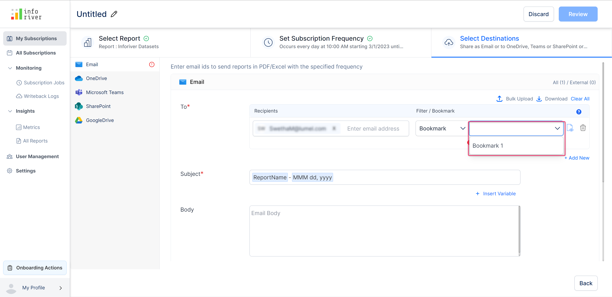

# Select destination(s)

Here you can select the destination(s) to which you want the send the reports. The scheduled reports can be exported to any of the following destinations: Email, OneDrive, Microsoft Teams, SharePoint, and Google Drive.

When you create a new subscription, you can choose between standard and dynamic subscriptions.

* **Standard subscription:** To send the report to all destinations, irrespective of the dimension categories.
* **Dynamic subscription**: Send the report to specific emails IDs/Teams channels/folders based on the dimension categories.

<figure><figcaption></figcaption></figure>

## 1. Standard Subscription

When you choose a **standard subscription**, the 'Select Destinations' page look as below:

<figure><figcaption>
Destination options - Standard subscription
</figcaption></figure>


By default, the email option is chosen in the destinations section.


Inforiver provides the capability to export any filters or bookmarks that have been applied to the report, to the chosen destination.

#### **Filter**&#x20;

You can apply filters on your reports if you want to expose specific dimension categories, for example, if you have multiple regions covered in your report, you can choose to expose selected regions in subscriptions.&#x20;


Hover over the '?' icon to find help links on how to use filter/bookmark


<figure><figcaption>
Tooltip in email destination
</figcaption></figure>

When you set the Filter/Bookmark option to 'Filter', a new input field becomes available next to the drop-down. In this field, you can specify the queries to filter the report.  The syntax for specifying a filter is **Table/Field eq 'value'**.

<figure><figcaption>
Creating a subscription filter
</figcaption></figure>

Click the 'Add new' option to add an additional filter/bookmark.

<figure><figcaption>
Add new link option
</figcaption></figure>

#### **Bookmark**&#x20;

You can select the bookmark option to include the configured bookmarks in the scheduled reports.


The bookmark option is disabled by default and becomes available only if you have added bookmarks to the report


A bookmark has been created for the report as shown in the image below.

<figure><figcaption>
Adding bookmark to the report
</figcaption></figure>

The bookmark option will be available if you have added and configured a bookmark in your report.

<figure><figcaption>
Enable bookmark option
</figcaption></figure>

Once you select the bookmark option, the second drop-down gets populated with all the configured bookmarks in the report.

<figure><figcaption>
Select bookmark
</figcaption></figure>

#### **Bulk Upload**

You can also bulk upload a CSV file containing the filters and bookmarks applied on the report. Click the 'Bulk upload' option. This will open up the bulk upload modal as shown in the image below.

<figure><figcaption>
Bulk upload option
</figcaption></figure>

\
Click the 'Upload' button or drag and drop to upload the CSV file with the recipient's details.

The CSV file requires the following details:

1. **Email ID**: Email ID of the recipient of the report if the selected destination is Email.
2. **Filter**: If a filter is applicable, use the format: \<Table name>/\<Field name> eq 'Value'.           Consider a filter applied to select US regions only. If the name of the table is 'Region' and the name of the field is 'Country', the filter value should be <mark style="color:green;">Region/Country eq 'US'.</mark>
3. **Bookmark**: The name of the bookmark, if applied.
4. **Name:** A relevant name for the filter or book applied for destinations like Teams, SharePoint and OneDrive.


While uploading, ensure that the csv file used for bulk upload is not open in any application.


**Download sample**&#x20;

Click 'Download sample' to download a sample CSV document to understand how the uploaded CSV file should be structured.\
\
The image below displays the structure of the download sample CSV file for Emails:

<figure><figcaption>
Download sample csv file
</figcaption></figure>

The image below displays the structure of the download sample CSV file for OneDrive/Teams/SharePoint:

<figure><figcaption>
Sample csv file for non-email destinations
</figcaption></figure>

The next step is to review the settings and save them to start the subscription. Navigate to [this section ](../review-and-save-subscription.md)for illustration or the [next section](email.md) to understand the configuration for different destinations.

## 2. Dynamic Subscription

With dynamic subscriptions, you can regulate the dimension categories shared with users. With dynamic subscriptions, Inforiver can detect email IDs from your semantic models/CSV files and implicitly send the relevant records to corresponding users.

The 'Select Destinations' page has a 'Table Selection' option as below when you choose dynamic subscription.

<figure><figcaption>
Configure table
</figcaption></figure>

When you click **Configure**, a pop-up appears where you can configure the table either from a semantic model or from a CSV file. We will demonstrate with an example using the semantic model option. The procedure is the same for CSV file uploads as well.

1. To select the table from the semantic model, choose 'Select from Semantic Model'.
2. Select the workspace, semantic model, table, and the column that contains the email addresses.
3. You also have the option to set up a filter if you wish to send users only specific records from the report. In the image below, we will only send the data related to the customer 'Claire Gute' using the filter option.

<figure><figcaption>
Dynamic table selection
</figcaption></figure>

4. In the preview, notice how different categories are assigned to different email IDs in the dataset, specifying to whom the respective records would be sent. Click **Save**.&#x20;

<figure><figcaption>
Preview and Save
</figcaption></figure>

5. Configure the report filter to extract data based on Email IDs and other required settings. Then, click on **Review.**

<figure><figcaption>
Configure report filter
</figcaption></figure>

6. In the next page, review the settings and select **Save Subscription.** The subscription is created.

<figure><figcaption>
Review and Save
</figcaption></figure>

In the next sections, we'll explore the configuration options for each type of destination.
