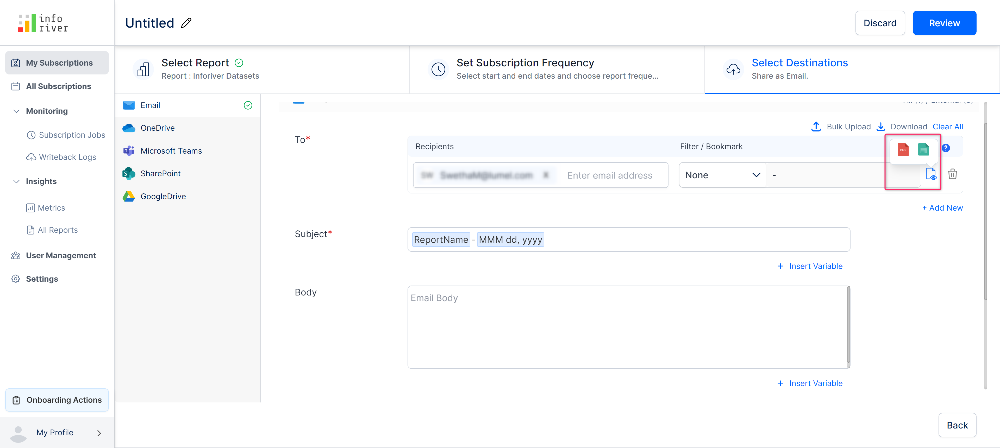
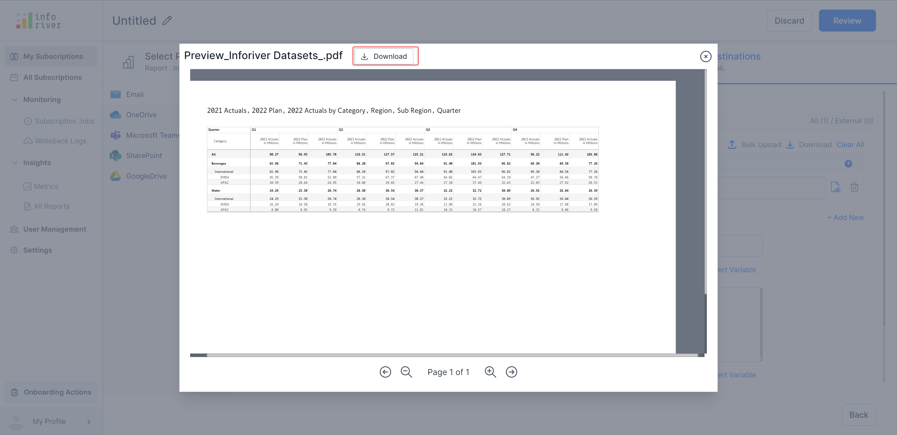

# Email

The configurations listed below can be used to setup an email destination.&#x20;

### **a) Recipients**&#x20;

Here you can specify the recipient's email address to which the report should be sent. AD groups can also be used.&#x20;

### **b) Filter/bookmark**&#x20;

You can specify whether you want to apply any filter or bookmark to the report for the selected recipients, before exporting it. This value is set to 'None' by default.&#x20;

You can learn more about filters and bookmarks [here](./#filter).


Click the 'Clear all' link to clear or reset all the entered filter/bookmarks and recipients' details.


<figure><figcaption>
To field in email destination option
</figcaption></figure>

&#x20;                                                                                                                            &#x20;

### **c) Bulk upload**&#x20;

You can also [bulk upload](./#bulk-upload) a CSV file of filters and bookmarks based on recipients' emails by clicking on the 'Bulk upload' option.&#x20;

<figure><figcaption>
Bulk Upload
</figcaption></figure>

### **d) Download filters bookmark**

Clicking on this option will download the entered recipient's email address and filter/bookmark selection as a CSV file.

<figure><figcaption>
Download email recipients option
</figcaption></figure>

The downloaded CSV file looks as shown in the below image.

<figure><figcaption>
Email recipients
</figcaption></figure>

### **e) Report preview**&#x20;

This option shows a preview of the report with the applied filter/bookmark. You can preview the report in PDF or Excel formats.


If the report size is less than 2 MB it will be displayed as an inline preview. However, if the file size exceeds 2 MB the preview report will get downloaded as a zip file.


Clicking on the preview icon will display a 'Preview available' toast message at the bottom of the page (if the report/page size is less than 2 MB).

<figure><figcaption>
PDF preview option
</figcaption></figure>

Click the 'View' link to view an inline preview of the report.

<figure><figcaption>
Preview report toast
</figcaption></figure>

The report preview will be displayed as shown in the image below. You can also download the report preview by clicking on the 'Download' button on the preview.

<figure><figcaption>
Report preview download
</figcaption></figure>

**Delete icon**&#x20;

Click the 'Trash' icon to delete the applied filter/bookmark.

### **f) Subject**&#x20;

Enter the subject line of the email. Clicking the 'Insert variable' link will open up a 'Suggested variables' modal from which you can select the pre-declared variables to be inserted into the subject line.&#x20;

<figure><figcaption>
Insert variables option
</figcaption></figure>

### **g) Body**&#x20;

Enter the body/content of the email. Pre-configured variables can be included in the email body as well.&#x20;

### h) Send report as&#x20;

You can select the format in which you want the report to be sent.&#x20;

Currently, we offer the following three options: 'PDF', 'Excel' and 'Preview images' of high quality.&#x20;

If you have selected either the 'All pages' option or more than one page in the 'Select' option of the 'Pages' option, then you can export the report as a merged file or as multiple files.

<figure><figcaption>
Send report as option
</figcaption></figure>

