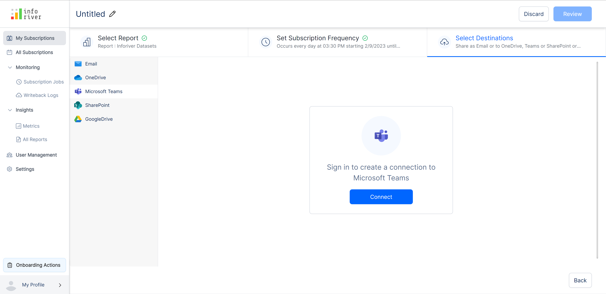
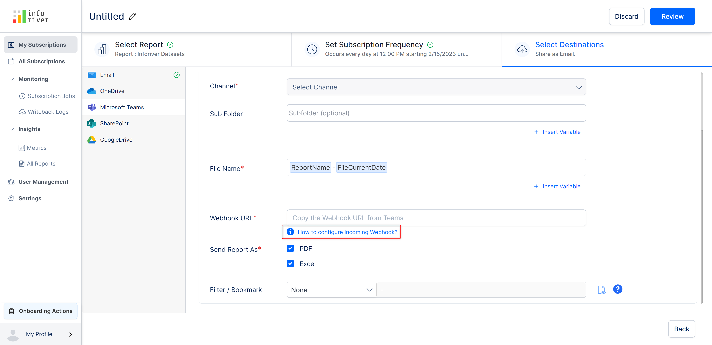

# Microsoft Teams

To set Microsoft Teams as the destination, select the 'Microsoft Teams' option from the left pane. If you haven't connected your Microsoft account, you will get the following screen shown in the image below.

Click on 'Connect' and authenticate with your Microsoft account.

<figure><figcaption>
Microsoft teams connection
</figcaption></figure>


If Microsoft teams is chosen as the destination, a notification will be sent to the chosen channel whenever a schedule runs.


After a successful connection, you will see the configuration screen with the following options:

### **a) Team**&#x20;

Select the Microsoft team to which to report will be delivered.

### **b) Channel**&#x20;

Select the relevant channel for the chosen team.

### **c) Sub folder**&#x20;

You can optionally specify the destination subfolder to be created inside the chosen team's channel. The report will be exported to the subfolder if selected.

### **d) File name**&#x20;

This field is pre-populated with the file name. To customize, click on the 'Insert variable' link next to the file name field. Inforiver will suggest pre-defined variables that can be easily inserted into the file names field in a single click.

### **e) Webhook URL**&#x20;

Enter the webhook URL of the team's channel you have selected as the destination.

To learn more about how to configure the incoming webhook, click on the 'How to configure incoming webhook?' tooltip as highlighted in the below image.

<figure><figcaption>
Webhook url option
</figcaption></figure>

### **f) Send report as**&#x20;

You can select the format in which the report has to be delivered. Currently, we offer three options: 'PDF', 'Excel', and 'Preview images' of high quality.&#x20;

If you have selected either the 'All pages' option or more than one page in the 'Select' option of the 'Pages' option, then you can export the report as a merged file or as multiple files.

### **g) Filter/bookmark**&#x20;

You can select this option if you want the applied filters/bookmarks to be exported to the chosen destination. It is set to 'None' if no filters/bookmarks are applied to the report. You can learn more about it [here](./#filter).

You can also [bulk upload](https://app.gitbook.com/o/Bi5mNLq31yHE9Ep9vISb/s/EbkCXCUXmtUq5tcnUtZE/\~/changes/237/working-with-inforiver/11.-scheduling-reports/create-new-subscription/select-destination-s/onedrive#e-bulk-upload) filters and bookmarks in csv format.

<figure><figcaption>
Deliver reports using Teams
</figcaption></figure>


You can add more than one destination channel to export the report. Click on the 'Add channel' button to add a destination channel.

