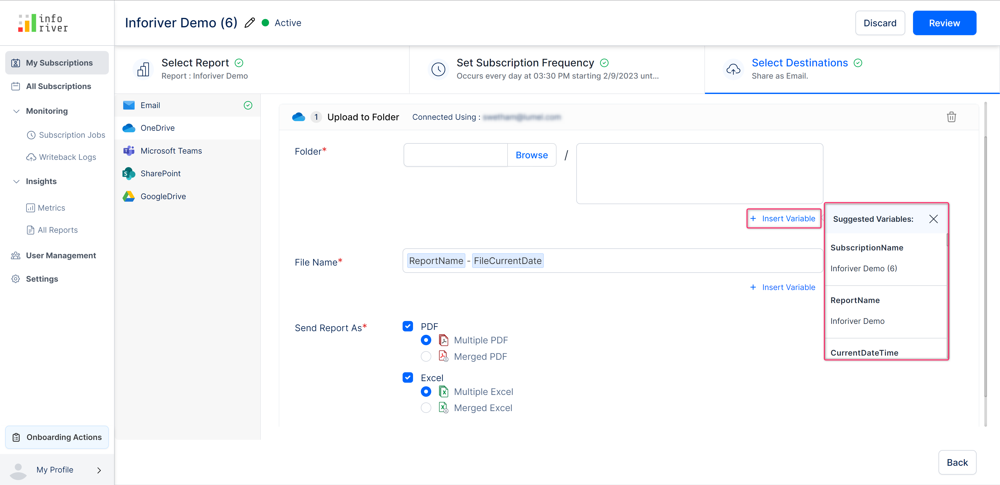
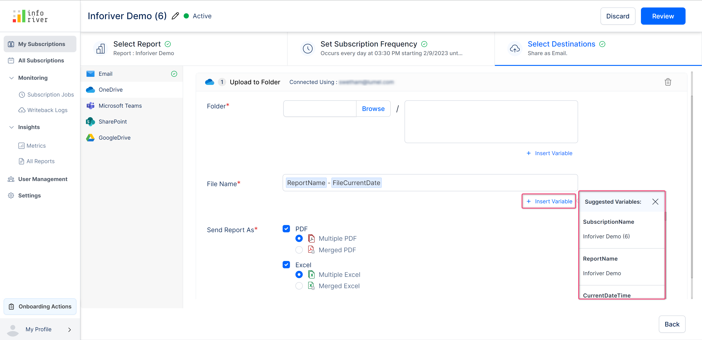
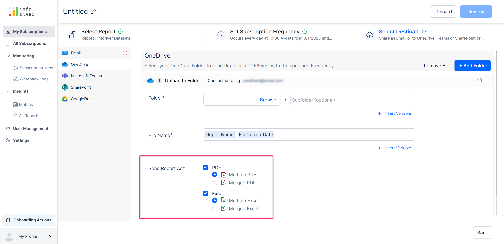

# OneDrive

To set OneDrive as the destination, select the 'OneDrive' option from the left pane. If you haven't connected your OneDrive account, you will get the following screen shown in the image below.

Click on 'Connect' and authenticate with your One Drive account.

<figure><figcaption>
OneDrive connection
</figcaption></figure>

After a successful connection, you will see the configuration screen with the following options:

### **a) Folder**&#x20;

You can specify the destination folder in OneDrive where you want the report to be exported. You can optionally specify a subfolder as well.&#x20;

Click on the 'Browse' button. This will open up a 'Select folder' modal in which you can select the OneDrive destination folder.

<figure><figcaption>
OneDrive destination folder selection modal
</figcaption></figure>

Clicking the 'Insert variable' link next to the subfolder field will suggest pre-defined variables that can be easily inserted into the subfolder field in a single click.

<figure><figcaption>
Subfolder insert variable option
</figcaption></figure>

### **b) File name**&#x20;

This field is pre-populated with the file name. To customize, click on the 'Insert variable' link next to the file name field. Inforiver will suggest pre-defined variables that can be easily inserted into the file names field in a single click.

<figure><figcaption>
Filename insert variable option
</figcaption></figure>

### **c) Send report as**&#x20;

Here you can select the format in which the report has to be delivered. You can select either PDF or Excel format. Both PDF and Excel can be exported in merged or multiple formats.

<figure><figcaption>
OneDrive send report as option
</figcaption></figure>

### **d) Filter/bookmark**&#x20;

You can select this option if you want the applied filters or bookmarks to be exported to the chosen destination. It is set to 'None' if no filters/bookmarks are applied to the report. You can learn more about filters and bookmarks [here](./#filter).

You can also [bulk upload](https://app.gitbook.com/o/Bi5mNLq31yHE9Ep9vISb/s/EbkCXCUXmtUq5tcnUtZE/\~/changes/237/working-with-inforiver/11.-scheduling-reports/create-new-subscription/select-destination-s/onedrive#e-bulk-upload) filters and bookmarks in csv format.

<figure><figcaption>
Configuring filters and bookmarks
</figcaption></figure>


You can create more than one OneDrive destination folder to export the report. Click on the 'Add folder' button on the top right corner to add another destination folder.

