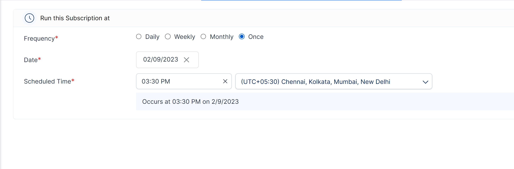

# Set subscription frequency

Here you can specify how frequently the subscriptions should be run. The report deliveries are scheduled according to the set frequency, start date, end date, and scheduled time.&#x20;

## 1. Frequency

The frequency at which the scheduler should run. You can select from the following options:&#x20;

* **Daily:** This option schedules the reports to be sent every day. If you want to schedule once every 'x' day(s), you can input 'x' in the 'Once every' input field.

<figure><figcaption>
Daily frequency option
</figcaption></figure>

* **Weekly:** This option will run the scheduler every week. If this option is enabled, the days of the week become available, and you can choose the exact day(s) of the week on which you want to schedule the report delivery.

<figure><figcaption>
Weekly frequency option
</figcaption></figure>

* **Monthly:** Selecting this option will run the scheduler every month. If this option is enabled, the 'Select months' option becomes available, in which you can select the required months you want to run the scheduler. \
  \
  You can also specify the exact calendar day(s) or the last day, or select frequencies such as 'First' Monday, Wednesday, and so on. The report is delivered to the chosen destinations on the selected days.

<figure><figcaption>
Monthly frequency option
</figcaption></figure>

* **Once:** Selecting this option will run the scheduler only once. You can specify the exact date and time at which the scheduler should run.

<figure><figcaption>
Once frequency option
</figcaption></figure>

* **Hourly:** On-prem users can get reports delivered multiple times a day. Users can schedule report subscriptions by the hour with the ‘Hourly’ frequency. You can set the interval in hours between runs in the textbox.

<figure><figcaption>
Hourly frequency option
</figcaption></figure>

## 2. Start date - End date&#x20;

This option lets you select the starting and ending dates of the schedule using a date picker. You can also select from the preconfigured options, such as 'Next month', 'Next 6 months' etc.&#x20;

<figure><figcaption>
Start and end date range
</figcaption></figure>

### Skip Holidays

You can skip subscription jobs based on a specific holiday calendar. Choose a predefined holiday calendar from the dropdown. [Learn more about setting up holiday calendars in the admin console.](../../../admin-console/settings/holidays.md)

<figure><figcaption>
Skip holidays
</figcaption></figure>

## 3. Scheduled time&#x20;

Here you can set the exact time along with the time zone at which the scheduler should run.

<figure><figcaption>
Scheduled time and timezone
</figcaption></figure>

In the next section, we'll look at configuring the subscription destination.
