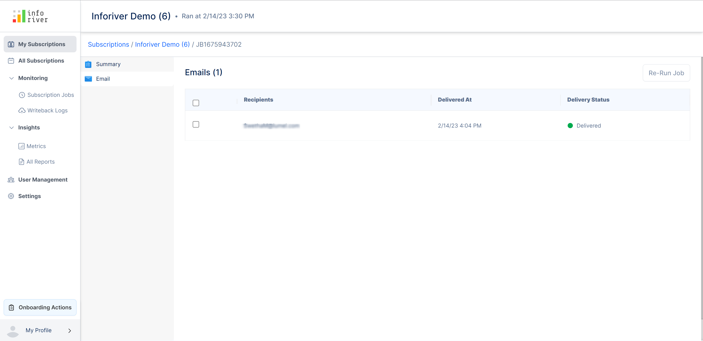

# Manage your subscriptions

You can manage all your subscriptions from the Inforiver console.&#x20;

Click on **Manage subscriptions** in an Inforiver report as shown below.&#x20;

<figure><figcaption>
Manage Subscription
</figcaption></figure>

You can also access your subscriptions directly from the Inforiver Console.

<figure><figcaption>
Accessing subscriptions from the console
</figcaption></figure>

## 1. View & filter subscriptions

The 'My subscriptions' page contains a list of all your subscriptions. For each subscription, the following details are displayed:

### 1.1. Subscription details

**i) Name**  - The name of the subscription.

**ii) Workspace -** The name of the workspace in which the subscribed report is available.

**iii) Report** - The name of the report in the workspace.

**iv) Owner**  - The owner of the subscription.

**v) Next job** - The date and the time of the next run.

**vi) Last job** - The date and time of the previous run.

**vii) Status** - This displays the current status of the subscription.

**viii) Actions -** The menu where you can perform the following options:

#### **Run**&#x20;

Clicking on the play icon will open a 'Run now' modal. Click the **Run now** button to run the subscription instantly.

<figure><figcaption>
Run subscription
</figcaption></figure>

#### **Pause**&#x20;

Click the **Pause** button in the modal to pause the subscription.

<figure><figcaption>
Pause subscription
</figcaption></figure>

#### **Delete**&#x20;

Clicking on the delete icon will open up a 'Delete' modal. Click the 'Delete' button in the modal to delete the subscription.

<figure><figcaption>
Delete subscription
</figcaption></figure>

Here is a detailed breakdown of all the options available on this page. It has the following filter options to filter and narrow down your search:

<figure><figcaption>
My subscription page
</figcaption></figure>

### 1.2. Search bar&#x20;

Using this search bar you can search for the subscription you need. If you have an enormous list of subscriptions this feature comes in handy.

<figure><figcaption>
Search bar option
</figcaption></figure>

### 1.3. Workspace

Using this drop-down you can filter the subscriptions based on the workspaces. Only the subscriptions of the selected workspaces will get displayed.

<figure><figcaption>
Workspace selection filter
</figcaption></figure>

### 1.4. Report

Using this drop-down you can filter the subscriptions based on the reports. Only the subscriptions of the selected reports will get displayed.

<figure><figcaption>
Report selection filter
</figcaption></figure>

### 1.5. Status&#x20;

Using this drop-down you can filter the subscriptions based on their status. Only the subscriptions of the selected statuses will get displayed. This filter has the following options:

* **Active** - This indicates all the currently running subscriptions and it is represented by a green dot
* **Paused** - This indicates all the currently paused subscriptions and it is represented by a yellow dot
* **Locked** - This indicates the subscriptions that are currently locked. A subscription is locked, if the scheduled destination is unavailable/removed.
* **Completed** - If the schedule reaches the end date set during schedule creation, then it has a complete status and it is represented by a grey dot.
* **Archived** - All the completed or paused subscriptions will be moved to the archived state after 90 days. The schedules in this status can't be run and can only be deleted.

<figure><figcaption>
Subscription status
</figcaption></figure>

Click on the 'More' option to view additional filter options for the scheduler. The additional filter options are 'Destination' and 'Subscription type'.

<figure><figcaption>
More filter option
</figcaption></figure>

### **1.6. Destination**&#x20;

If you enable this option, a destination filter drop-down will appear, in which you can filter your subscriptions based on the destination type.

<figure><figcaption>
Destination filter
</figcaption></figure>

### **1.7. Subscription type**&#x20;

If you enable this option, a subscription filter drop-down will appear, in which you can filter your subscriptions based on the subscription type. The available options are highlighted below.

<figure><figcaption>
Subscription filter
</figcaption></figure>

### 1.8. Reset all&#x20;

Clicking on this option will reset all the applied filters.

## 2. Manage a subscription

### 2.1. Summary

Clicking on the name of any subscription on the 'My subscriptions' page will display all the subscription details in the report. By default, the 'Summary' tab is shown.

<figure><figcaption>
Subscription Summary
</figcaption></figure>

The following options are available at the top bar of this page:

<figure><figcaption>
Options in the summary
</figcaption></figure>

* **Run now -** Clicking on this icon will run the job subscription instantly.
* **Send test email -** Using this option, you can send a test email to verify if the scheduled reports are being sent as expected and in the expected format.\
  Clicking on this option will open up a 'Send test email' modal in which you can specify all the required details to send a test email and click on the send button.

<figure><figcaption>
Send test email
</figcaption></figure>

* **Duplicate -** Clicking on this icon will duplicate the chosen subscription

<figure><figcaption>
Duplicate subscription option
</figcaption></figure>

* **Delete -** Clicking on this option will delete the chosen subscription

<figure><figcaption>
Delete subscription option
</figcaption></figure>

### **2.2. Jobs**

This tab displays all the jobs for the selected subscription.

<figure><figcaption>
Jobs list
</figcaption></figure>

Clicking on the job ID will provide an overall summary of the job. The 'Run details' section provides detailed information about the scheduled job runs.

<figure><figcaption>
Job summary
</figcaption></figure>

### 2.3. Milestones

A milestone represents the stages within the scheduled job progress. It consists of multiple levels, with each level providing a clear indication of the job's advancement to the user.

<figure><figcaption>
Milestones
</figcaption></figure>

#### Sub-Milestones

Sub-milestones refer to a group of smaller activities or tasks that, when completed, collectively contribute to achieving an individual milestone. These sub-milestones help break down larger milestones into more manageable steps, tracking progress at a granular level while still contributing to the overall goal.

Milestone details for both legacy mode and current mode subscriptions are provided below. It denotes the indication and progress for all types of jobs, such as single jobs or a parent with multiple child jobs.

#### Milestones Details

Milestones & sub-milestones will be provided with a specified time stamp to track the duration of the process. It applies to various job flows, like single jobs and parent jobs with multiple job processing.

The 'Milestones' section contains step-by-step event flow of the scheduled run as follows:

#### 1. Initial Job Data Setup

The system preprocesses the scheduled job configuration data to extract and organize the necessary information required to initiate the job. This includes:

**·** **Job Initialization:** Extracting key details from the pre-processed scheduled job configuration data to start the job execution process.

#### 2. Refresh Data Service

This process handles refreshing the dataset based on the configuration:

**· Refresh Execution:** If the **refresh dataset service** is enabled, the system updates the dataset to ensure the latest data is used before proceeding with further tasks.

**· Skip Condition:** If the refresh service is not enabled, the dataset refresh step is skipped, and the process continues with the existing data.

#### 3. Collect Page Visuals

The system processes embedding in a page-wise manner to ensure detailed tracking and configuration.

<figure><figcaption>
Collect Page Visuals
</figcaption></figure>

Key steps include:

**i) Initiate Puppeteer Services**

**· Start the Puppeteer Service:** Begin by activating the Puppeteer automation system to handle tasks like embedding a PowerBI report into the process.

**· Embed the PowerBI Report:** Use Puppeteer to include the PowerBI report, ensuring it is accessible for all further actions.

**ii) Page Wise Dynamic Milestone**

* Checks for page Limit settings
* Track Page-Wise Progress: As the system works through each page, it does the following:

&#x20;            \> Takes a screenshot of the overall report page.

&#x20;            \> Records the number of visuals processed on that page to meet the condition limit.

&#x20;            \> Handles specific actions for each visual, such as, running preview services for a quick overview and exporting data to PDF or Excel formats based on needs.

**iii) Combine and Merge Services**

Combine and merge files:

For PDF or Excel files if merging is enabled,

* Merge the multiple files as per destination and store them in the desired location.
* If a layout is provided, organize the PDF into a grid format (including the report screenshot pdf file)
* Deliver the final combined document to the designated destination.

**iv) PPT Services**

Generate PPT slides:

* Use preview images generated for each page to create PowerPoint slides.
* Once the slides are ready, a PowerPoint file is generated to the designated location.

**Note:** All outputs—PPT slides, PDFs, or Excel files—are securely saved to their respective locations for easy access.

#### 4.Deliver Destinations

The system processes the selected destinations and their configurations to ensure seamless delivery of the generated files.

**· Process Destination Configuration:** Retrieve the scheduled subscription configuration to determine the destinations where the outputs need to be delivered.

**· Deliver Attachments:** Based on the configured destinations, send the generated attachments (PDFs, Excel files, PPT slides, etc.) to their respective locations.

### 2.4. Cancel parent job

If your subscription job is running long or you need to make additional modifications to your report before sending it out, you can use the Cancel Job option in the scheduler. This will immediately abort the subscription and cancel both the parent and child jobs without having to cancel each child job individually.

<figure><figcaption>
Cancel job option
</figcaption></figure>

You’ll notice that the status of all your jobs is changed to Failed.

<figure><figcaption></figcaption></figure>

### 2.5. Re-run failed job

If a job run fails, then the 'Milestones' section has a 'Re-Run Job' button available at the top right corner of the section. Clicking on this option will rerun the failed job.

<figure><figcaption>
Re-run a failed job
</figcaption></figure>

### 2.6. Error Details

For failed jobs, an additional section called 'Error Details' becomes available. This section contains information about errors that occurred during the job run.

The 'Error details' section has a 'Download logs' button at the top right corner of the section. Clicking on this button will download the error logs for the failed job run in a text file.

<figure><figcaption>
Download logs option
</figcaption></figure>

Here is a sample of a downloaded error log

<figure><figcaption>
Downloaded error log
</figcaption></figure>

Clicking on the 'Email' tab will display a list of all the recipients to which the scheduled job email was sent along with the delivery date, time, and delivery status.

<figure><figcaption>
Email recipients list
</figcaption></figure>

You can also select any of the recipients by enabling the checkbox next to their corresponding email. If any of the checkboxes are enabled, then the 'Re-run job' button becomes available at the top-right corner of the page.&#x20;

Clicking on this button will run the job only for the chosen email recipient.

<figure><figcaption>
Email re-run jobs
</figcaption></figure>

### 2.7. Consents

This page becomes available only if the 'Refresh dataset' option is enabled during report creation.

If the 'Refresh dataset' option is enabled, then a consent email will be sent to the dataset owner emails mentioned during schedule creation.&#x20;

This page contains a list of recipients who have accepted and not accepted the consent emails.

<figure><figcaption>
Consent email
</figcaption></figure>

### 2.8. Export jobs

You can persist the status of your child job runs and save it to your desktop. Click the Export Jobs button to create an Excel extract.

<figure><figcaption>
Export jobs
</figcaption></figure>

### 2.9. Unsubscribe

This page contains a list of all the members who unsubscribed from the subscription along with the date of unsubscription.

<figure><figcaption>
Unsubscribe email
</figcaption></figure>

To unsubscribe from receiving the scheduled report emails, click on the unsubscribe link at the bottom of the subscription email.

<figure><figcaption>
Unsubscription email
</figcaption></figure>

In the next section, we'll look at how to manage the subscriptions for [workspace admins](administration.md).
