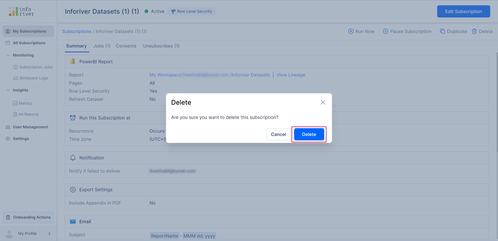

# Manage your subscriptions

You can manage all your subscriptions from the Inforiver console. Click on 'Manage subscriptions' in an Inforiver report as shown below. You can also access your subscriptions directly from the Inforiver Console.

<figure><figcaption>
Manage subscriptions option
</figcaption></figure>

## 1. View & filter subscriptions

The 'My subscriptions' page contains a list of all your subscriptions. For each subscription, the following details are displayed.

### a) Subscription details

**i) Name**  - The name of the subscription

**ii) Workspace** - The name of the workspace the subscription belongs to

**iii) Report** - The name of the report in the workspace

**iv) Owner**  - The owner of the subscription

**v) Next job** - The date and the time of the next run

**vi) Last job** - The date and time of the previous run

**vii) Status** - This displays the current status of the subscription

**viii) Actions** - The following options are available under the 'Actions' option

#### **Run**&#x20;

Clicking on the play icon will open up a 'Run now' modal. Click the 'Run now' button in the modal to run the subscription instantly.

<figure><figcaption>
Run subscription
</figcaption></figure>

#### **Pause**&#x20;

Clicking on the pause icon will open up a 'Pause' modal.  Click the 'Pause' button in the modal to pause the subscription.

<figure><figcaption>
Pause subscription
</figcaption></figure>

#### **Delete**&#x20;

Clicking on the delete icon will open up a 'Delete' modal.  Click the 'Delete' button in the modal to delete the subscription.

<figure><figcaption>
Delete subscription
</figcaption></figure>

Here is a detailed breakdown of all the options available on this page. It has the following filter options to filter and narrow down your search:

<figure><figcaption>
My subscription page
</figcaption></figure>

### b) Search bar&#x20;

Using this search bar you can search for the subscription you need. If you have an enormous list of subscriptions this feature comes in handy.

<figure><figcaption>
Search bar option
</figcaption></figure>

### c) Workspace

Using this drop-down you can filter the subscriptions based on the workspaces. Only the subscriptions of the selected workspaces will get displayed.

<figure><figcaption>
Workspace selection filter
</figcaption></figure>

### d) Report

Using this drop-down you can filter the subscriptions based on the reports. Only the subscriptions of the selected reports will get displayed.

<figure><figcaption>
Report selection filter
</figcaption></figure>

### e) Status&#x20;

Using this drop-down you can filter the subscriptions based on their status. Only the subscriptions of the selected statuses will get displayed. This filter has the following options:

* **Active** - This indicates all the currently running subscriptions and it is represented by a green dot
* **Paused** - This indicates all the currently paused subscriptions and it is represented by a yellow dot
* **Locked** - This indicates the subscriptions that are currently locked. A subscription is locked, if the scheduled destination is unavailable/removed.
* **Completed** - If the schedule reaches the end date set during schedule creation, then it has a complete status and it is represented by a grey dot.
* **Archived** - All the completed or paused subscriptions will be moved to the archived state after 90 days. The schedules in this status can't be run and can only be deleted.

<figure><figcaption>
Subscription status
</figcaption></figure>

Click on the 'More' option to view additional filter options for the scheduler. The additional filter options are 'Destination' and 'Subscription type'.

<figure><figcaption>
More filter option
</figcaption></figure>

### **f) Destination**&#x20;

If you enable this option, a destination filter drop-down will appear, in which you can filter your subscriptions based on the destination type.

<figure><figcaption>
Destination filter
</figcaption></figure>

### **g) Subscription type**&#x20;

If you enable this option, a subscription filter drop-down will appear, in which you can filter your subscriptions based on the subscription type. The available options are highlighted below.

<figure><figcaption>
Subscription filter
</figcaption></figure>

### h) Reset all&#x20;

Clicking on this option will reset all the applied filters.

## 2. Manage a subscription

### a) Summary

Clicking on the name of any subscription in the 'My subscriptions' page will display all the subscription details of the report. By default, the 'Summary' tab is shown.

<figure><figcaption>
Subscription summary page
</figcaption></figure>

The following options are present at the top bar of this page

<figure><figcaption>
subscription summary options
</figcaption></figure>

* **Run now -** Clicking on this icon will run the job subscription instantly
* **Pause subscription -** Clicking on this icon will pause the subscription
* **Send test email -** Using this option, you can send a test email to verify if the scheduled reports are being sent as expected and in the expected format. \
  \
  Clicking on this option will open up a 'Send test email' modal in which you can specify all the required details to send a test email and click on the send button.

<figure><figcaption>
Send test email
</figcaption></figure>

* **Duplicate -** Clicking on this icon will duplicate the chosen subscription

<figure><figcaption>
Duplicate subscription option
</figcaption></figure>

* **Delete -** Clicking on this option will delete the chosen subscription

<figure><figcaption>
Delete subscription option
</figcaption></figure>

### **b) Jobs**

This tab displays all the jobs for the selected subscription.

<figure><figcaption>
Job lists
</figcaption></figure>

Clicking on the job ID will provide an overall summary of the job. The 'Run details' section contains information about all the scheduled job runs.&#x20;

<figure><figcaption>
Job summary
</figcaption></figure>

The 'Milestones' section contains a flow about all

* **Start job -** This indicates the start of the job along with the date and time at which this milestone happened.
* **Validation -** This milestone indicates the verification and validation of the access token, report access, and report data. \
  \
  This option has the 'View events' link. Clicking on this link will display the validation status of each of these three verifications.

<figure><figcaption>
Token validation events
</figcaption></figure>

* **Load report -** This milestone indicates that the data/report has been loaded for further processing and data collection.
* **Collect visual data -** This milestone indicates the collection of all the visual data of the report including the bookmark, excel, and pdf data. \
  \
  This option has a 'View events' link. Clicking on this link will display detailed information and page configuration of the collected visual data including the page/visual from which the data was collected, and the task status.

<figure><figcaption>
Collect visual data events
</figcaption></figure>

* **Generate attachment -** Indicates that the PDF/excel attachment has been generated. This option has a 'View events' link. \
  \
  Clicking on this link will display detailed information about the generated attachments, the page it belongs to, the file status as well as the task status.

<figure><figcaption>
Generate attachments events
</figcaption></figure>

* **Deliver to destinations -** Indicates that the scheduled job report is delivered to the destination

<figure><figcaption>
Milestone details
</figcaption></figure>

If a job run fails, then the 'Milestones' section has a 'Re-Run Job' button available at the top right corner of the section. Clicking on this option will re-run the failed job.

<figure><figcaption>
Milestone re-run job option
</figcaption></figure>

Also for failed jobs, an additional section called the 'Error details' section becomes available. This section contains information about errors that occurred during the job run and an indication of which milestone failed during the job run.&#x20;

This section includes the following details:

* **Milestone -** The milestone at which the error occurred
* **Action -** The action that caused the error
* **Message -** A brief description of the error message
* **Page/visual -** The page or visual in which the error occurred&#x20;

The 'Error details' section has a 'Download logs' button at the top right corner of the section. Clicking on this button will download the error logs for the failed job run in a text file.

<figure><figcaption>
Download logs option
</figcaption></figure>

Here is a sample of a downloaded error log

<figure><figcaption>
Downloaded error log message
</figcaption></figure>

Clicking on the 'Email' tab will display a list of all the recipients to which the scheduled job email was sent along with the delivery date, time, and delivery status.

<figure><figcaption>
Email recipients list
</figcaption></figure>

You can also select any of the recipients by enabling the checkbox next to their corresponding email. If any of the checkboxes are enabled, then the 'Re-run job' button becomes available at the top-right corner of the page.&#x20;

Clicking on this button will run the job only for the chosen email recipient.

<figure><figcaption>
Email re-run jobs
</figcaption></figure>

### c) Consents

This page becomes available only if the 'Refresh dataset' option is enabled during report creation.

If the 'Refresh dataset' option is enabled, then a consent email will be sent to the dataset owner emails mentioned during schedule creation.&#x20;

This page contains a list of recipients who have accepted and not accepted the consent emails.

<figure><figcaption>
Consent email
</figcaption></figure>

### d) Unsubscribe

This page contains a list of all the members who unsubscribed from the subscription along with the date of unsubscription.

<figure><figcaption>
Unsubscribe email
</figcaption></figure>

To unsubscribe from receiving the scheduled report emails, click on the unsubscribe link at the bottom of the subscription email.

<figure><figcaption>
Unsubscription email
</figcaption></figure>

In the next section, we'll look at how to manage the subscriptions for [workspace admins](administration.md)
