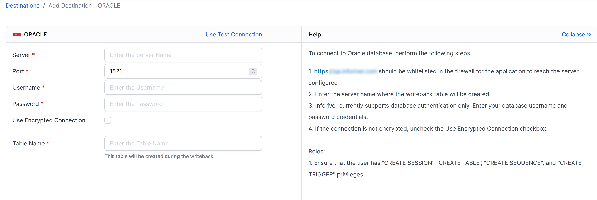
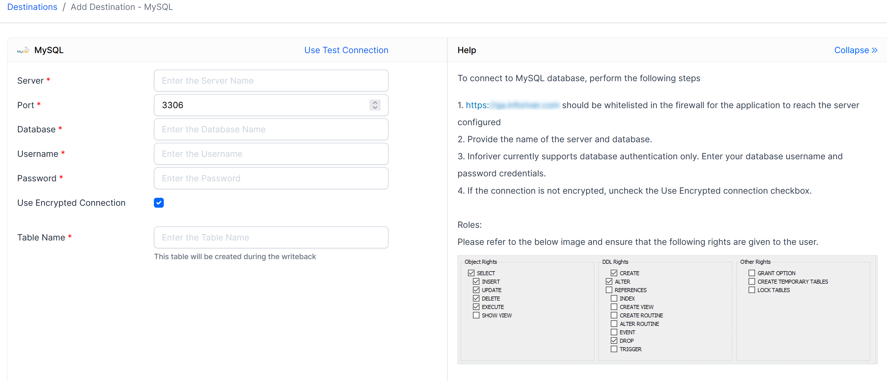

# Destinations

Inforiver supports fast writeback setup and execution for several types of data destinations

* **Cloud data warehouses:** Azure SQL, Synapse Analytics Dedicated SQL Pool, Amazon Redshift, Snowflake, BigQuery, SingleStore
* **On-Prem data warehouses:** SQL Server, SAP HANA, Oracle, PostgreSQL, MySQL, Databricks
* **Cloud data lakes:** Azure Data Lake Gen2
* **File Destinations:** OneDrive, SharePoint
* **Webhook URLs:** Can be used to trigger workflows in iPaaS such as Power Automate and Logic Apps)
* Dataverse (Upcoming)

Configuring writeback destination(s) is straightforward and involves the same procedure (picture below) for any destination.

<figure><figcaption>
Navigating to Inforiver writeback destination setup
</figcaption></figure>

A list of destinations will be displayed for the users to select from.&#x20;

<figure><figcaption>
Inforiver supported writeback destinations.
</figcaption></figure>

## 1. Azure SQL (Managed DB)

Allows you to configure a writeback destination in Azure SQL Database that **exists inside & owned by Inforiver tenant**. Recommended for POC purposes only. Users who have difficulties in setting up a database within their tenant are welcome to use this feature to understand Inforiver's writeback functionalities and perform test writebacks for POC purposes.

<figure><figcaption>
Terms of service while using Managed DB
</figcaption></figure>

After navigating to the writeback destination, enter a name for the writeback table.&#x20;

<figure><figcaption></figcaption></figure>

After saving the destination, the credentials to access this database will appear on the screen.&#x20;

The user can use this information to access the database using SSMS, Azure Data Studio or other similar applications. Please note, each table that is configured will have its unique login credentials.&#x20;

## 2. Azure SQL

Allows you to configure an Azure SQL database owned privately or by your organization as a writeback destination.&#x20;

After navigating to the add destination page, the following details will have to be entered.&#x20;

* Server&#x20;
* Port
* Database
* Schema
* Username
* Encrypted Connection (Y/N)
* Password
* Table Name

<figure><figcaption>
Configuring Azure SQL Database as a writeback destination
</figcaption></figure>

## 3. Microsoft SQL Server

Allows you to configure Microsoft SQL Server as a destination for Inforiver writeback.&#x20;

After navigating to the add destination page, the following details will have to be entered.&#x20;

* Server&#x20;
* Port
* Database
* Schema
* Username
* Encrypted Connection (Y/N)
* Password
* Table Name

<figure><figcaption>
Configuring Microsoft SQL Server as a writeback destination
</figcaption></figure>

## 4. Synapse Dedicated SQL Pool

Allows you to configure Synapse Dedicated SQL Pool as a destination for Inforiver writeback.&#x20;

After navigating to the add destination page, the following details will have to be entered.&#x20;

* Server&#x20;
* Port
* Database
* Schema
* Username
* Encrypted Connection (Y/N)
* Password
* Table Name

<figure><figcaption>
Configuring Synapse Dedicated SQL Pool as a writeback destination
</figcaption></figure>

## 5. Azure Data Lake Storage

Allows you to configure Azure Data Lake Storage as a destination for Inforiver writeback.&#x20;

After navigating to the add destination page, log-in using your O365 credentials.

<figure><figcaption></figcaption></figure>

After succesful log-in, following details will have to be entered,

* Account
* File System
* Directory
* Partition Required (Y/N)
* Writeback File Name
* Insert Variable

The writeback creates a Parquet file in the data lake storage.&#x20;

**Partition Required:** If the Inforiver scenario is created and included in the writeback, and the user wants to writeback base and scenarios in separate parquet files, this is recommended.&#x20;

**Insert Variables:** Writeback file name can be customized using variables such as Execution ID and date time related IDs.

**Security:** Please note Inforiver leverages Azure Access Control Lists (ACLs) while configuring Azure Data Lake Storage as a writeback destination. That means, the user is only shown folders and directories that they have access to as per the defined ACL rules.

<figure><figcaption>
Configuring Azure Data Lake Storage as a writeback destination
</figcaption></figure>

## 6. Databricks

Allows you to configure Databricks as a destination for Inforiver writeback.&#x20;

After navigating to the add destination page, the 6. following details will have to be entered.&#x20;

* Host Name
* Warehouse ID
* Access Token
* Catalog
* Schema
* Table Name

<figure><figcaption>
Configuring Databricks as a writeback destination
</figcaption></figure>

<figure><figcaption>
Steps to set up a writeback destination in Databricks
</figcaption></figure>

## 7. Snowflake

Allows you to configure Snowflake as a destination for Inforiver writeback.&#x20;

After navigating to the add destination page, the following details will have to be entered.&#x20;

* Account
* Database
* Schema
* Username
* Password
* Warehouse
* Role
* Encrypted Connection (Y/N)
* Table Name

<figure><figcaption>
Configuring Snowflake as a writeback destination
</figcaption></figure>

<figure><figcaption>
Steps to set up a writeback destination in Snowflake
</figcaption></figure>

## 8. Amazon Redshift

Allows you to configure Amazon Redshift as a destination for Inforiver writeback.&#x20;

After navigating to the add destination page, following details will have to be entered.&#x20;

* Server
* Port
* Database
* Schema
* Username
* Password
* Encrypted Connection (Y/N)
* Table Name

<figure><figcaption>
Configuring Amazon Redshift as a writeback destination
</figcaption></figure>

## 9. Big Query

Allows you to configure BigQuery as a destination for Inforiver writeback.&#x20;

After navigating to the add destination page, the following details will have to be entered.&#x20;

* Project ID
* Dataset ID
* Service Account Email
* Private Key
* Table Name

<figure><figcaption>
Configuring Big Query as a writeback destination
</figcaption></figure>

## 10. SingleStore

Allows you to configure SingleStore as a destination for Inforiver writeback.&#x20;

After navigating to the add destination page, the following details will have to be entered.&#x20;

* Server
* Port
* Database
* Username
* Password
* Encrypted Connection (Y/N)
* Table Name

<figure><figcaption>
Configuring Single Store as a writeback destination
</figcaption></figure>

## 11. SAP HANA

Allows you to configure SAP HANA as a destination for Inforiver writeback.&#x20;

After navigating to the add destination page, the following details will have to be entered.&#x20;

* Server
* Port
* Schema
* Username
* Password
* Encrypted Connection (Y/N)
* Table Name

<figure><figcaption>
Configuring SAP HANA as a writeback destination
</figcaption></figure>

## 12. Oracle

Allows you to configure Oracle as a destination for Inforiver writeback.&#x20;

After navigating to the add destination page, the following details will have to be entered.&#x20;

* Server
* Port
* Username
* Password
* Encrypted Connection (Y/N)
* Table Name

<figure><figcaption>
Configuring Oracle as a writeback destination
</figcaption></figure>

## 13. PostgreSQL

Allows you to configure PostgreSQL[^1] as a destination for Inforiver writeback.&#x20;

After navigating to the add destination page, the following details will have to be entered.&#x20;

* Server
* Port
* Database
* Schema
* Username
* Password
* Encrypted Connection (Y/N)
* Table Name

<figure><figcaption>
Configuring PostgreSQL as a writeback destination
</figcaption></figure>

## 14. MySQL

Allows you to configure MySQL as a destination for Inforiver writeback.&#x20;

After navigating to the add destination page, the following details will have to be entered.&#x20;

* Server
* Port
* Username
* Password
* Encrypted Connection (Y/N)
* Table Name

<figure><figcaption>
Configuring MySQL as a writeback destination
</figcaption></figure>

## 15. OneDrive

Allows you to configure OneDrive as a destination for Inforiver writeback. Inforiver will create a CSV file and save it in OneDrive.&#x20;

After navigating to the add destination page, log-in using your O365 credentials. Enter the following,

* Destination path
* File name

**Insert Variables:** Writeback file name can be customized using variables such as Execution ID and date time related IDs.

<figure><figcaption>
Configuring OneDrive as a writeback destination
</figcaption></figure>

## 16. SharePoint

Allows you to configure SharePoint as a destination for Inforiver writeback. Inforiver will create a CSV file and save it in SharePoint directory. Please note, users will only be able to add site addresses which they have access to.&#x20;

After navigating to the add destination page, log-in using your O365 credentials. Enter the following,

* Site Address
* Document Library
* Folder
* Writeback file name

**Insert Variables:** Writeback file name can be customized using variables such as Execution ID and date time related IDs.

<figure><figcaption>
Configuring SharePoint as a writeback destination
</figcaption></figure>

## 17. URL as destination

This option allows you writeback into a URL. Inforiver sends the entire writeback table as a JSON to a HTTP endpoint. The endpoint could be a Power Automate workflow that receives the writeback table via the Inforiver JSON where further data processing would take place before storing into a destination such as OneDrive, SharePoint, Dataverse, etc. There are other workflows possible using this method.&#x20;

After navigating to the add destination page enter,

* Endpoint URL
* Required headers and value

<figure><figcaption></figcaption></figure>

<pre><code>{"headers":{"Connection":"close",
<strong>"Accept-Encoding":"gzip,deflate",
</strong>"Host":"prod-17.westus.logic.azure.com",
"Content-Length":"583206",
"Content-Type":"application/json"},
"body":{
"data":"\"IrScenario\",\"Productkey\",\"FirstBrand\",\"Category\",\"IrWritebackTimestamp\"\n\
"Base\",\"1\",\"Contoso\",\"Audio\",\"01\",\"2023-04-21 04:05:32 (UTC)\"\n"}}
</code></pre>

[^1]: 
