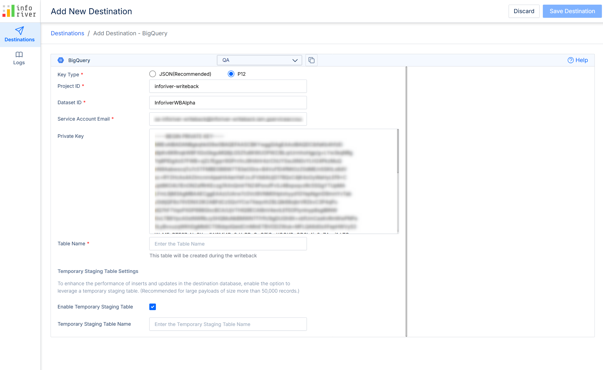

# BigQuery

Allows you to configure BigQuery as a destination for Inforiver writeback. You can either configure using the JSON or the P12 key type. The details listed in the table below will have to be entered depending on the chosen key type:

| JSON(Recommended) | P12                   |
| ----------------- | --------------------- |
| Dataset ID        | Project ID            |
| Json Key          | Dataset ID            |
| Table Name        | Service Account Email |
|                   | Private Key           |
|                   | Table Name            |


* If the tenant administrator creates a connection at admin level, the Dataset ID and Project ID fields will be populated automatically.
* Ensure that the user has permission to SELECT, INSERT, UPDATE, and DELETE data from the table


<figure><figcaption>
Configuring BigQuery with JSON key type
</figcaption></figure> <figure><figcaption>
Configuring BigQuery with P12 key type
</figcaption></figure>

### 1. Generating the JSON key

&#x20;Select the **Create new key** option from the ADD KEY dropdown.

<figure><figcaption>
Create new key
</figcaption></figure>

Select the JSON radio button.

<figure><figcaption>
Choose the JSON option
</figcaption></figure>

<figure><figcaption>
Key saved notification
</figcaption></figure>

### 2. Roles

Ensure that the account has “Data Editor” permission.

<figure><figcaption>
Account should have Data Editor permissions
</figcaption></figure>
