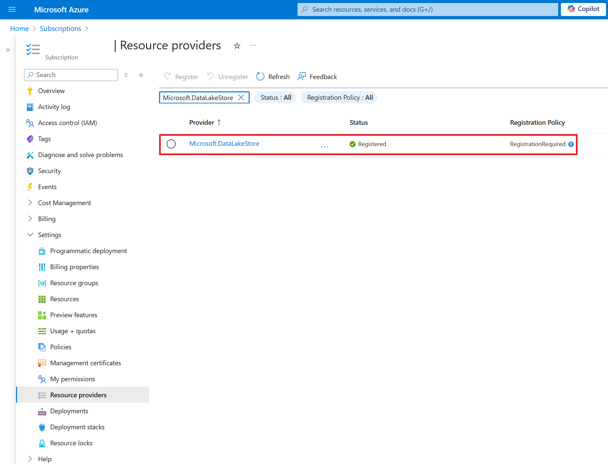

# Fabric lakehouse

To add a Fabric Lakehouse destination, you need to sign in with Microsoft Office 365 credentials first. After signing in, you will be able to see the list of workspaces and lakehouses that you have access to.&#x20;

<figure><figcaption>
Add Fabric Lakehouse destination
</figcaption></figure>

1. Select the required workspace and lakehouse.&#x20;
2. Enter the table name.&#x20;
3. When writeback is initiated, the delta csv file is uploaded and the writeback table is created automatically at the specified destination.&#x20;

<figure><figcaption>
Data writeback completed in lakehouse destination
</figcaption></figure>


The Lakehouse.ReadWrite.All permission needs to be provided to configure lakehouse destinations.


To connect to Fabric Lakehouse, perform the following steps

1. Please ensure that an active Azure subscription is available to connect to Fabric Lakehouse.
2. Please ensure that the Azure subscription is active and associated with the same Entra ID tenant.
3. Please ensure that **'Microsoft.DataLakeStore'** and **'Microsoft.Storage'** Resource providers are registered in the Azure subscription.

<figure><figcaption></figcaption></figure>

<figure><figcaption></figcaption></figure>
