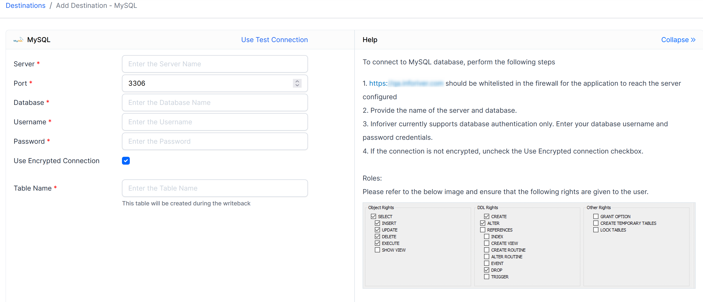

# MySQL

Allows you to configure MySQL as a destination for Inforiver writeback.&#x20;

After navigating to the add destination page, the following details will have to be entered.&#x20;

* Server
* Port
* Username
* Password
* Encrypted Connection (Y/N)
* Table Name

<figure><figcaption>
Configuring MySQL as a writeback destination
</figcaption></figure>
