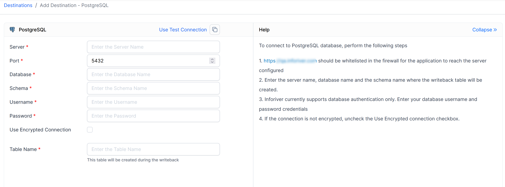

# PostgreSQL

Allows you to configure PostgreSQL[^1] as a destination for Inforiver writeback.&#x20;

After navigating to the add destination page, the following details will have to be entered.&#x20;

* Server
* Port
* Database
* Schema
* Username
* Password
* Encrypted Connection (Y/N)
* Table Name

<figure><figcaption>
Configuring PostgreSQL as a writeback destination
</figcaption></figure>

[^1]: 
