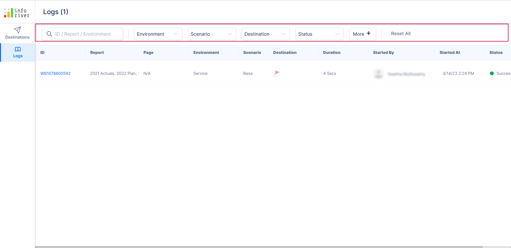
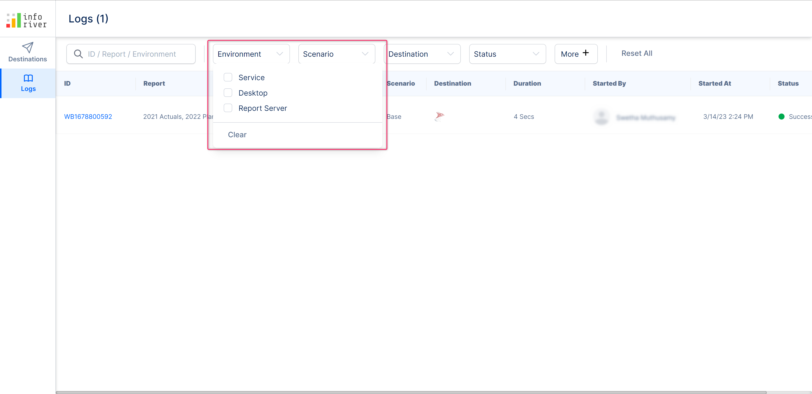
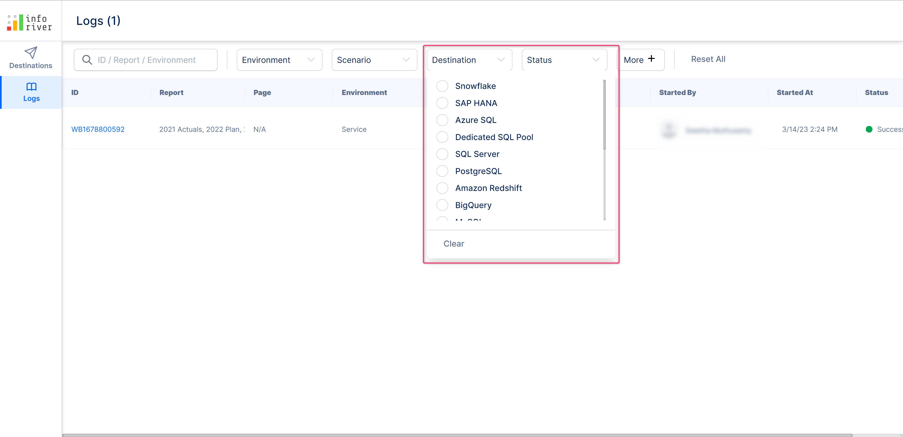
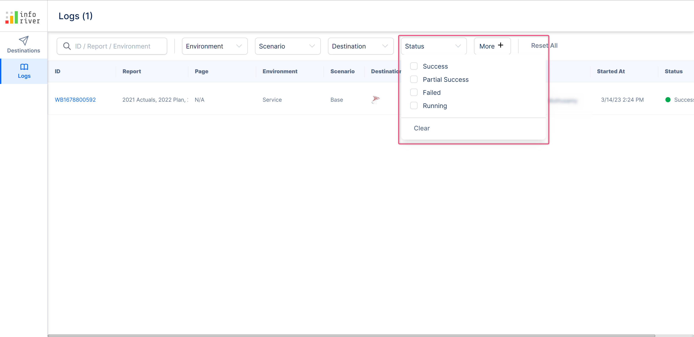
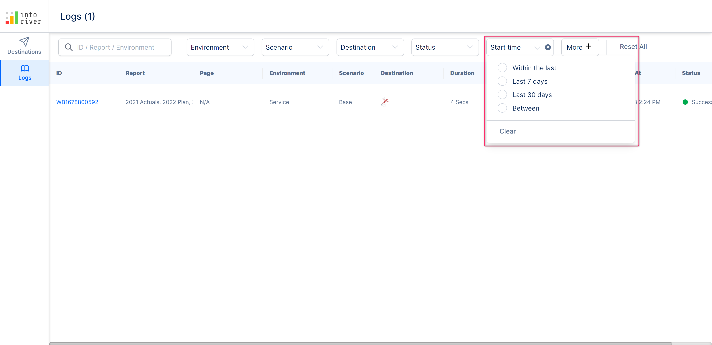
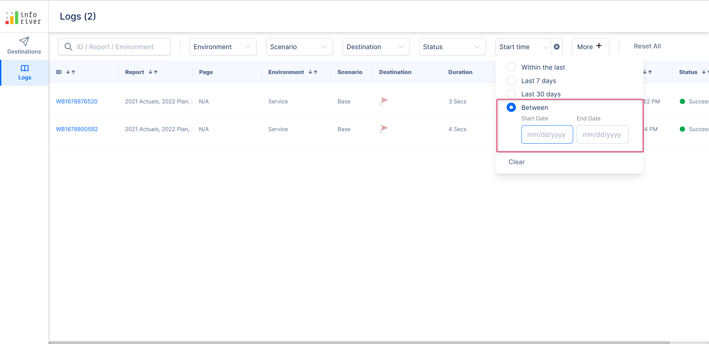

# Logs

Inforiver offers milestone based tracking as soon as the writeback button is clicked. To view a comprehensive log of an ongoing writeback instance or previous writeback instances, a user shall click "Logs" under the "Export" tab of the Inforiver toolbar. The user could also click "View Log" in the modal that would open upon clicking writeback in order to access the log page.

<figure><figcaption></figcaption></figure>

### i) Writeback log filters

The writeback logs page allows us to search through writeback logs using several filter criteria as shown in the below picture.&#x20;

<figure><figcaption></figcaption></figure>

#### a) Search bar&#x20;

In the search bar, a user could search and filter your writeback logs based on their id, report, or environment.

#### b) Environment&#x20;

Use drop-down to filter the writeback log based on the environment.

<figure><figcaption></figcaption></figure>

#### c) Scenario&#x20;

Use this drop-down to filter the writeback log based on the scenario.

#### d) Destination&#x20;

Use the below drop-down to filter the writeback logs based on the writeback destination.

<figure><figcaption></figcaption></figure>

#### e) Status

Use the below drop-down to filter the log based on the writeback status.&#x20;

<figure><figcaption></figcaption></figure>

#### f) Start time&#x20;

Use the below drop-down to filter the log based on the start time. It has the following filter options:

<figure><figcaption></figcaption></figure>

* **Within the last** - If you select this option,&#x20;
* **Last 7 days** - Selecting this option will filter the logs within the last 7 days&#x20;
* **Last 30 days** - This option will filter the logs that are started in the last 30 days.
* **Between** - If you select this option, then you can specify the starting and ending date within which you can filter your writeback logs.

<figure><figcaption></figcaption></figure>

#### f) Reset all

Clicking on this link will reset all the applied filters.

### ii) Writeback log columns

The writeback logs page has the following columns:

#### a) ID&#x20;

This column displays a unique log ID that is used to identify the writeback log. You can sort the ID in ascending or descending order using the up/down arrows respectively.

<figure><figcaption></figcaption></figure>

Clicking on the writeback ID will open up a page with a detailed summary of the writeback.&#x20;

Clicking the 'General' tab will display a summary of the writeback along with the milestones and their status.

<figure><figcaption></figcaption></figure>

The writeback log summarizes the following milestones:

#### i) Data processing&#x20;

This indicates the events and steps that occurred during data processing. Clicking on the 'View events' link you can view the data processing events in detail.

<figure><figcaption></figcaption></figure>

The data processing event logs the performed action, the date and time the event was last updated, and the status of the event.

#### ii) Deliver to destination

This milestone displays the events that occurred while the writeback data was delivered to the destination.

<figure><figcaption></figcaption></figure>

You can click on the 'View destination events' link to view the summary of the writeback destination, the date and the time the destination was updated, and the status of the writeback.

#### iii) Post processing

The post processing milestone indicates the events that occurred after processing the writeback. You can click on the 'View events' link to view the post processing action, the date and time the action was updated, and the status of the action/event.

<figure><figcaption></figcaption></figure>

Clicking on the name of the destination will display the connection details about the configured writeback destination.

<figure><figcaption></figcaption></figure>

#### b) Report &#x20;

This specifies the report the writeback belongs to. You can sort the reports alphabetically in ascending or descending order using the up/down arrows respectively.

#### c) Page

This specifies the page of the report the writeback belongs to

#### d) Environment

The environment of the writeback. You can sort the environments in ascending or descending order using the up/down arrows respectively.

#### e) Scenario&#x20;

The scenario that was written back

#### f) Destination&#x20;

Destination the data was written back to.

#### g) Duration&#x20;

The total duration of the writeback

#### h) Started by

Name of the user who started the writeback. You can sort the started by date in ascending or descending order using the up/down arrows respectively.

#### i) Started at&#x20;

The data and time at which the writeback was started. You can sort the started date in ascending or descending order using the up/down arrows respectively.

#### j) Status&#x20;

The status of the writeback. You can sort the status alphabetically in ascending or descending order using the up/down arrows respectively.

Navigate to the next chapter, to learn more about display settings.
