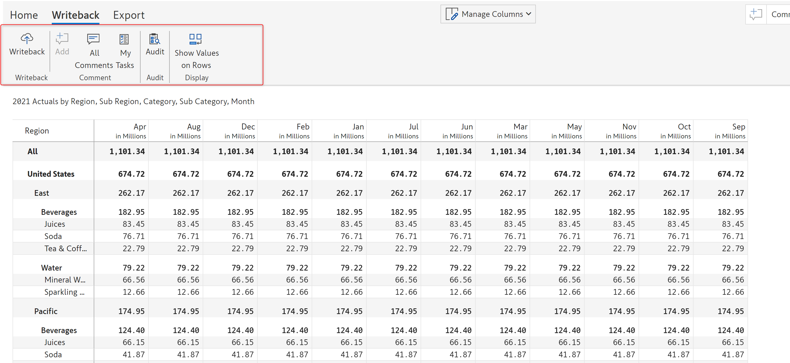

# Reading mode

Inforiver Enterprise allows a user to perform writeback even when the report is in reading view. This can be enabled by checking the 'Writeback Tab' option in the 'Allowed User Controls' menu.&#x20;

This means that if there are users in the workspace that have "Viewer" access, they would still be able to perform writeback to configured destinations. Users with edit mode access can allow/restrict others to perform writeback in read mode from Export -> Settings.&#x20;


In the Allowed User Controls menu, the Writeback tab is enabled only when there's at least one destination configured and the user has necessary permissions for writeback.


<figure><figcaption></figcaption></figure>

Inforiver displays the following options for users in reading view and also have writeback access.&#x20;

<figure><figcaption></figcaption></figure>

### 1. Writeback

Initiate writeback of report data to the configured destination by clicking the "Writeback" button. Please note, Inforiver acknowledges Row level security (RLS) in the original Power BI dataset. If the viewer has RLS rules applied, Inforiver will only writeback the RLS applied rows.&#x20;

### 2. Add

This allows a user to add comments. It is disabled by default but can be enabled by clicking any row, column, or cell. Inforiver supports row-level, data-level or cell-level comment.

### 3. All comments

Clicking on this option will display a list of all the comments added to the report in a side pane. A user can edit or delete any specific comment from the pane.

### 4. My tasks

Clicking on this option will display a list of all the added tasks in the report.

### 5. Audit

Clicking on this option will display the audit of all the changes made to the report.

### 6. Show values on rows

Clicking this option will display the values on the rows instead of columns.

### 7. Frequently asked questions

#### a. In Inforiver Enterprise, a user makes a change to a data input column in read mode and closes the report. Would he be able to see the latest data the next time he reopens it?

Yes, he would be able to. Inforiver captures adjustments to data inputs columns and saves them in its backend application DB. This works regardless the report is in read or edit mode. If a user makes any changes (provided he has access to make changes to data input columns in read mode) to data input columns, Inforiver stores the latest value in its backend DB. Upon reopening, Inforiver fetches the latest data input column values from the backend DB and loads the report with the latest data.

#### b. What happens to RLS for users using Inforiver Enterprise?

Inforiver respects the RLS applied in the original Power BI dataset. Inforiver Matrix will only display rows that a user is supposed to see. Please note RLS in Power BI works only for users in "Viewer" mode in the Power BI workspace.&#x20;

#### c. What happens to writeback for users with RLS?

Inforiver will only writeback rows that are applicable to the user performing the writeback. If a user only sees 3 dimension categories (as per RLS even though there are 10 total dimension categories in the dataset), he could only writeback rows related to 3 dimension categories. This is because he would only be able to see 3 dimensions. In simpler terms, you only writeback what you see on the display.

#### d. How would the data be stored if multiple users are performing writeback? When does Inforiver overwrite rows or append rows?

Inforiver performs writeback operations sequentially. For each operation, Inforiver writeback compares new writeback rows to existing DB rows and will overwrite only if all the dimension column names and its values match. However, if you would prefer Inforiver didn't overwrite rows during writeback commits, select Writeback only changes/Delta writeback as the writeback type. Under this mode, Inforiver retains previous values. &#x20;

<figure><figcaption></figcaption></figure>
