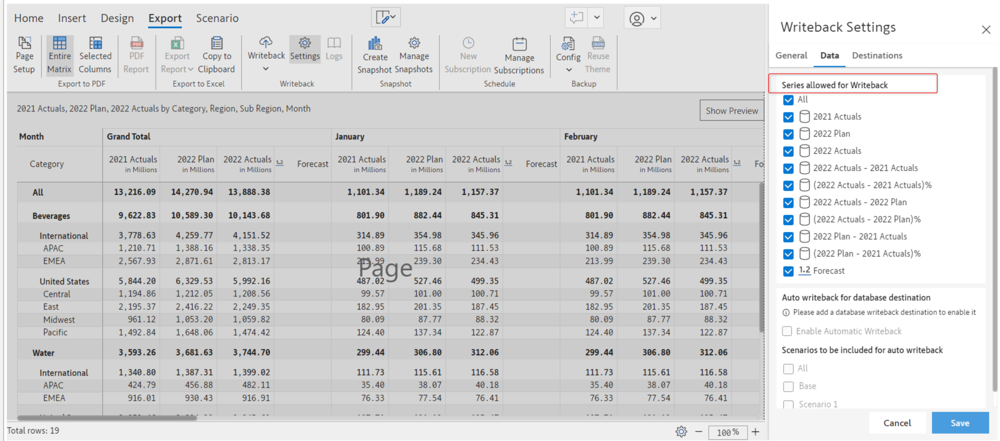
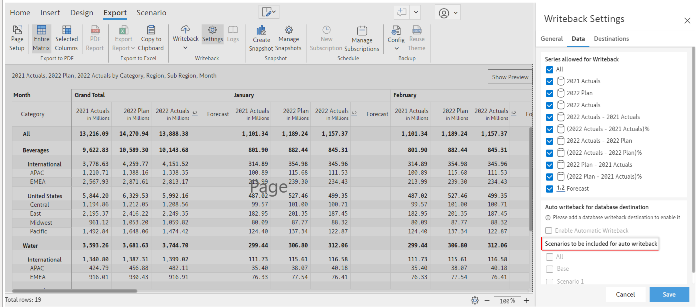

# Data Settings

Under the data settings, you can view a list of all the series configurations. Here you can select the series that should be included in the writeback.

#### i) Series allowed for writeback

This option will list all the possible series that are allowed for writeback. All the series are selected by default.

<figure><figcaption></figcaption></figure>

You can select/unselect the series you want to write back to the destination.

#### ii) Auto writeback for database destination

This option can be enabled only after configuring a database destination

<figure><figcaption></figcaption></figure>

If you enable this option, then the chosen series and scenario will be written back automatically without you having to initiate the writeback operation manually.

#### iii) Scenarios to be included for auto writeback

This option will be displayed only if you have created a scenario. You can read more on how to create a scenario here.

<figure><figcaption></figcaption></figure>

Under this option, you will find a list of all the created scenarios. You can select the scenario you want to write back. Please note, if no scenario is created and autowriteback is ON, only the data input columns will be auto written back if changes are made from the base table. Native columns will not be auto written back when modified.
