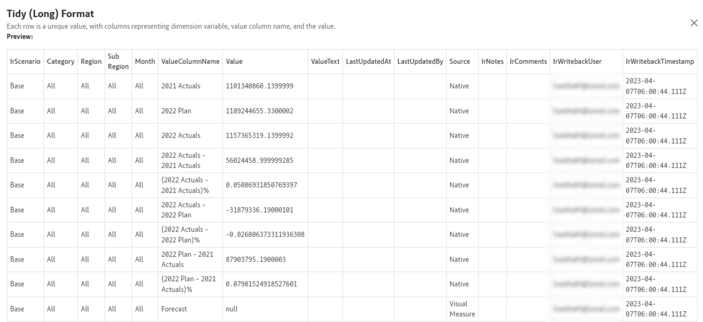
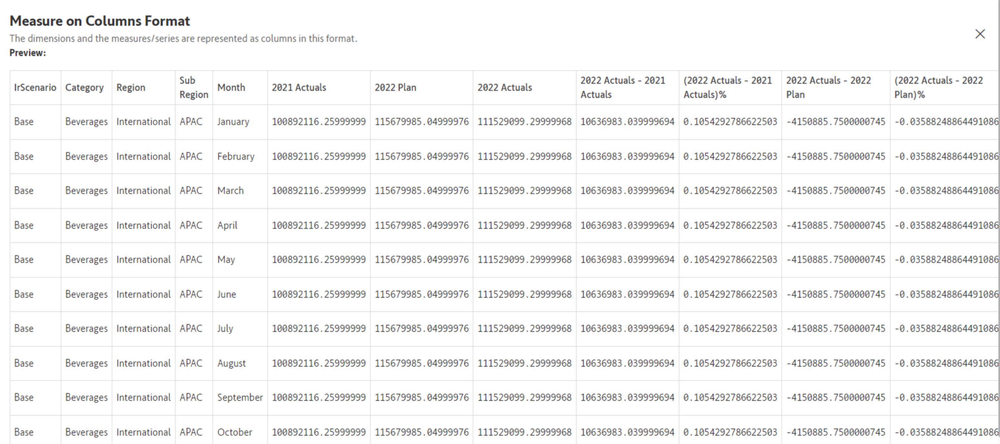
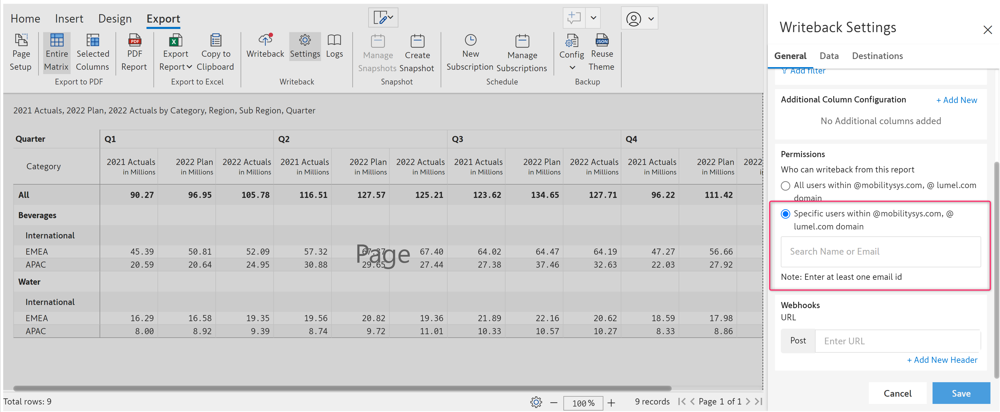

# General Settings

Under the general settings tab, you can configure the general writeback settings which will be explored in this section.

### 1. Writeback type&#x20;

Inforiver allows the user to choose the writeback table structure from a choice of 4 types.&#x20;

<figure><figcaption><p>Writeback types</p></figcaption></figure>

#### i) Long

This is the default writeback type for any writeback table. The Tidy (long) type has one row per observation and one column per variable. Please note only the Tidy (long) type supports writing back Inforiver's comments and notes.

<figure><figcaption><p>Inforiver Tidy (long) writeback type</p></figcaption></figure>

#### ii) Wide

This option stores the measures in the form of columns. As more measures are added, a proportional number of columns will be added to the writeback table to accommodate them. &#x20;

<figure><figcaption><p>Inforiver Measure on columns writeback type</p></figcaption></figure>

#### iii) Long with changes

The Writeback with changes type also called "delta writeback" allows the user to record the changes/differences/adjustments made on a report during the writeback. If new data comes into the database, the old data is moved to a column called _PreviousValue_ and the new data takes its place under the _Value_ column. Inforiver also marks the IsLatest column=1 to indicate the latest row. Delta writeback works for both numeric and text data type adjustments.&#x20;

<figure><figcaption><p>Delta writeback in Tidy format</p></figcaption></figure>

#### iv) Wide with changes

This writeback type also performs a delta writeback - only changed records are written back. In this format, each measure is stored as a separate column in the database. Like the Tidy format, change history is maintained and the active record can be identified using the IsLatest column.

<figure><figcaption></figcaption></figure>

#### Writeback type considerations and best practices:

1. **Changing the writeback type of an existing table:**&#x20;
   * After an initial writeback has been performed, changing the writeback type will display a warning before unselecting existing tables in the Export -> Settings -> Destinations tab. Inforiver will not include them for writeback under this new/changed writeback type.&#x20;
   * However, a user could go to Export -> Settings -> Destinations and (re)select table(s) to be included for writeback.
   * In this case, Inforiver will automatically detect conflicts between any existing table writeback type and the currently selected writeback type.&#x20;
   * If there are conflicts, Inforiver will display a warning, seeking permission to drop and writeback. It is recommended to be sure before performing drop & writeback. If you are unsure, the best practice is creating a new table and performing writeback.
2. **Changing dimensions of report table:** Adding new dimension categories will display a warning to the user seeking permission to drop and writeback.&#x20;

### 2. Filter&#x20;

The filter option allows the user to filter the data that is being written back to a destination. The filter dropdown list has a few presets readily available for the users.&#x20;

<figure><figcaption></figcaption></figure>

#### a) None&#x20;

This option will writeback the entire report/scenario without applying any filters.

#### b) Data with Comments

Only the cells that have a comment will be included in the writeback. Please note that 'Data with comments' only works in the Tidy(Long) writeback type.&#x20;

#### c) Calculated rows only&#x20;

Only the calculated rows (including the notes added in the calculated rows) are written back under this filter option.&#x20;

#### d) Custom filters&#x20;

Allows the user to define and set custom filter conditions. Inforiver allows a no-code filter creation experience that enables the user to set filter criteria for writeback with relative ease.&#x20;

<figure><figcaption><p>Custom filters</p></figcaption></figure>

The **Custom Filter** configuration window has the following options:

* **Filter condition:** This option allows you to create user-defined filter conditions. The filter condition requires selecting a dimension category, a logical expression, and the matching value of the dimension category. Inforiver has several built-in logical expressions to assist in building filter conditions.&#x20;

<figure><figcaption><p>Custom filter condition</p></figcaption></figure>

You can writeback data based on the last updated date, for example, writeback only the data that was updated after, before, or on a specific date. Choose the ‘Last Updated At’ option in the custom filter type:

<figure><figcaption><p>Writeback filter based on last update date</p></figcaption></figure>

* **Add filter:** This option allows you to add multiple filter conditions.
* **Combinators:** AND or OR operators are available for filter logic creation.
* **Add group:**  Allows you to group filter conditions. This is useful when there are multiple filter conditions spanning multiple dimension categories.&#x20;

<figure><figcaption></figcaption></figure>

* **Exclude Totals and Subtotals:** Select this option to exclude the total and subtotals while writing back data.

#### Filter considerations:

* If Power BI RLS is implemented, the recommended filter setting is to exclude totals and subtotals.
* The _Exclude Totals and Subtotals_ and _Data with Comments_ filters will not be available for the _Measure on Column_ writeback type.
* The _Data with Comments_ filter will not be available for delta writeback types.
* You can retain [Matrix filters](../../3.-basic-interactions/explore-and-filter-data/) while writing back data. If you have applied any visual filters, when you trigger a writeback, you will be prompted to choose between writing back all the data or filtered data only.&#x20;

<figure><figcaption></figcaption></figure>


If you have set up Matrix filters as well as writeback filters, the writeback filter will always take precedence.


### 3. Additional column configuration&#x20;

This allows a user to add dimension keys to the writeback table during writeback. This will require the user to provide consent to access all the datasets from the workspace.&#x20;

Inforiver allows you to add two types of following key columns,

1. Add Dimension Key
2. Add Date Key

#### Add Dimension Key

This allows the user to add key columns for dimensions (excluding datetime dimensions). For instance, each region or product will have an associated region ID or product ID (key) which you may not expose in reports. While writing back, you can include the region ID field as well.&#x20;

<figure><figcaption></figcaption></figure>

The procedure is as follows,&#x20;

1. **Select the dataset and dimension table** that have the dimension category and dimension key
2. **Column:** Choose the column from the table that matches your dimension category
3. **Visual Column:** Choose the column in the Inforiver visual that matches your dimension category
4. **Additional column from the dataset:** Choose the dimension key columns that will be included in the writeback table
5. **Column name in the writeback table:** Set a custom name for the dimension key column to be included in the writeback table.

<figure><figcaption></figcaption></figure>

#### Add Date Key

This allows the user to add a date key column to the writeback table.&#x20;

Inforiver reports are often used for high-level aggregations such as Revenue by Year-Months, etc. In such situations, the _Add Date Key_ feature adds a Date Key column and writes values by appending the first day of the month or quarter to any high-level date dimensions. For example, If the report is set at Year-Month level. Inforiver adds 01-01-2023 for Jan'2023.&#x20;

<figure><figcaption></figcaption></figure>

<figure><figcaption></figcaption></figure>

#### Additional Column Mapping and Best Practices

* If a high-level dimension category is included in the visual and additional column mapping is chosen, Inforiver will write dimension keys only if there are no conflicts. In case of conflicts, writeback will go through successfully except that the dimension key columns will be written NULL. This will be recorded in the writeback logs. It is recommended that the user add appropriate categories to avoid conflicts.
* Add Date Key only works with Power BI time intelligence generated date hierarchy set in the columns field of the visualization pane.

### 4. Permissions

The permissions option allows control over users who can writeback. It is possible to grant writeback permissions to everyone in your organization or to a select few users to perform writeback. Inforiver leverages Azure Active Directory (AAD), hence finding and granting writeback permissions to your co-workers will be straightforward.&#x20;

#### a) All users within specific domains&#x20;

Under this option, all the users within the specified organization will be able to configure the report writeback.

#### b) Specific users within the domain&#x20;

Selecting this option will display an input field. Users can then specify the email addresses or names of the people within the team or organization in grant writeback permissions.&#x20;

<figure><figcaption></figcaption></figure>

### 5. Webhooks

Inforiver webhook delivers a JSON payload to any HTTP endpoint. The JSON payload contains essential information about the writeback instance as shown below.

````json
{
  "createdAt": 1704197364,
  "createdBy": "xxxxx@lumel.com",
  "details": {
    "destinations": [
      {
        "account": "DB account",
        "dataTableName": "DIM_KEY",
        "database": "INFORIVER_WB_DEMO",
        "databaseType": "snowflake",
        "destinationName": "Snowflake: DIM_KEY",
        "errorMeta": {},
        "message": "Data inserted successfully",
        "mode": "Managed",
        "numberOfRows": 72,
        "role": "IR_DEMO_USER",
        "schema": "IR_DEMO_SCHEMA",
        "status": "Success",
        "type": "Snowflake",
        "warehouse": "IR_WH"
      }
    ],
    "metaData": {
      "autoWritebackEnabledScenarios": [],
      "environment": "Desktop",
      "event": "Writeback",
      "isAutoWritebackEnabled": false,
      "reportUrl": null,
      "scenariosWrittenback": ["Base"],
      "writebackType": "Values in Measure on Columns Format"
    }
  },
  "error": [],
  "executionId": "WB170419736410403",
  "reportName": "Actuals, Plan by Region, Sub Region, Month",
  "status": "Success"
}

```
````

&#x20;

<figure><figcaption></figcaption></figure>

To set up Inforiver Webhooks, paste the HTTP endpoint URL in the URL field. Click the 'Add new header' link to add a new header. In the header, add the key-value pair. When writeback is initiated, Inforiver will deliver its JSON payload to the configured endpoint.&#x20;

&#x20;It is possible to initiate and trigger further workflows using the Inforiver webhook. A few examples are as follows

* Approval workflow using Power Automate Microsoft Teams
* Refresh Dataset/Dataflow workflow using Power Automate

The above are sample workflows that could be triggered using the Inforiver webhook. There are many other workflows possible. Please note that the Inforiver webhook is different from URL as Destination. Inforiver webhook's JSON payload only contains essential information about the writeback table. URL as Destination JSON payload contains the entire writeback table. Learn more [here](../destinations/url-as-destination.md).

### 6. Decimal Precision

You can specify the number of digits after the decimal point to be written back. This is a **one-time setup** that will apply to **all destinations** configured for a particular report page. While configuring the first writeback destination, you will see a pop-up as shown below, to configure the decimal precision.&#x20;

<figure><figcaption><p>Configuring decimal precision</p></figcaption></figure>

If you require high precision, you can configure Inforiver to write back numerical data with up to ten decimal digits. Any digits beyond 10 will be rounded off.

<figure><figcaption><p>10-digit decimal precision</p></figcaption></figure>

The precision that is set in the destination configuration is displayed in the Decimal Precision section. [Learn more about configuring writeback destinations](../destinations/).

<figure><figcaption><p>Decimal Precision</p></figcaption></figure>

### 7. Text field length

You can restrict the length of text fields to be written back. The default text length allowed in writeback is 512 characters. While adding the first destination, along with [decimal precision](general-settings.md#id-6.-decimal-precision), you can also restrict the length of text fields to 512 characters or allow writeback up to the maximum limit supported by the backend. This is also a **one-time setup** that will apply to **all destinations** configured for a particular report page. [Learn more about configuring writeback destinations here](../destinations/).

<figure><figcaption><p>Configuring text field length</p></figcaption></figure>

The text length that has been set is shown in the Text Length section of the report as below. Note that, if you have restricted the text length and the length exceeds that limit, writeback will fail.

<figure><figcaption><p>Long text field truncated</p></figcaption></figure>
