# General Settings

Under the general settings tab, you can configure the general writeback settings. Below is the list of options available:

<figure>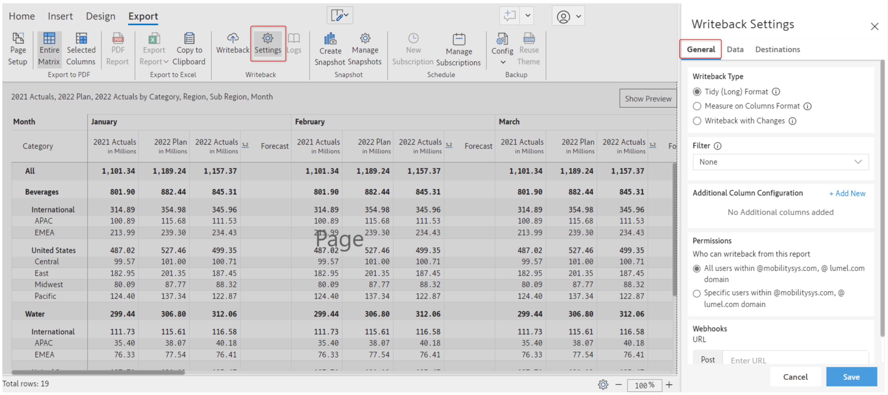<figcaption></figcaption></figure>

### i) Writeback type&#x20;

Inforiver allows the user to choose the writeback table structure from a choice of 3 types.&#x20;

<figure>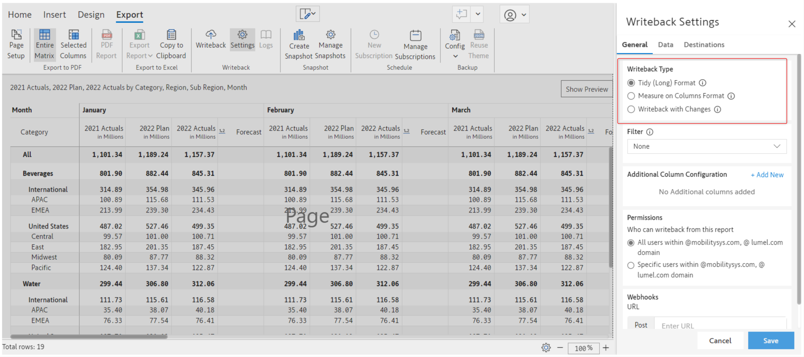<figcaption></figcaption></figure>

#### a) Tidy (long) format

This is the default writeback type for any writeback table. Tidy (long) type has one row per observation, and one column per variable. Please note only Tidy (long) type supports writing back Inforiver's comments and notes.

<figure><figcaption><p>Inforiver Tidy (long) writeback type</p></figcaption></figure>

#### b) Measure on columns format

As the name suggests, this option stores the measures in the form of columns. This format is also called as "wide" format. More measures are added, more columns are added to the writeback table to accommodate them. &#x20;

<figure><figcaption><p>Inforiver Measure on columns writeback type</p></figcaption></figure>

#### c) Writeback with changes&#x20;

Writeback with changes type also called "delta writeback" allows the user to record the changes/difference/adjustments made on a report during the writeback. If a new data comes into the database, the old data is moved to a column called _PreviousValue_ and the new data takes its place under _Value_ column. Inforiver also marks the _IsLatest_ column=1 to indicate the latest row. Writeback-only changes works for both _numeric_ data type adjustments and also _text_ data type adjustments.&#x20;

<figure>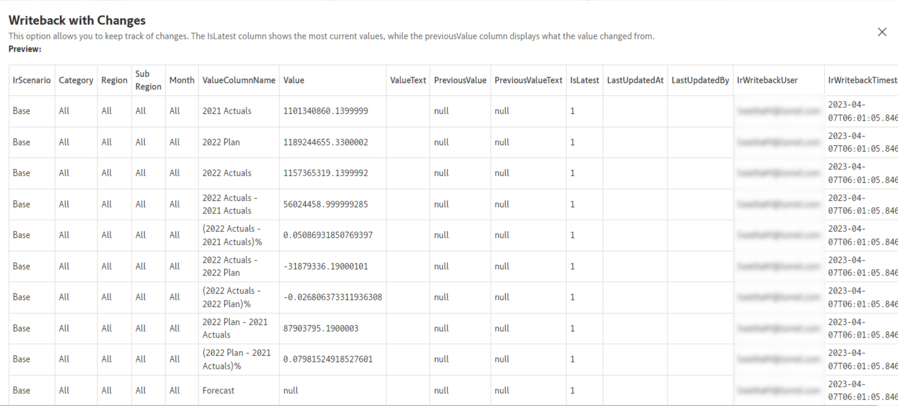<figcaption><p>Inforiver Measure on columns writeback type</p></figcaption></figure>

#### d) Writeback data type and best practices

1. **Changing writeback table type of an existing table:**&#x20;
   * After an initial writeback has been performed, changing the writeback type will display and warning before unselecting existing tables in the Export -> Settings -> Destinations tab. This means Inforiver will not include them for writeback under this new/changed writeback type.&#x20;
   * However, a user could go to Export -> Settings -> Destinations and (re)select table(s) to be included for writeback.
   * In this case, Inforiver will automatically detect conflicts between any existing table writeback type and currently selected writeback type.&#x20;
   * If there are conflicts, Inforiver will display a warning to the user seeking permission to drop and writeback. It is recommended to be sure before performing drop & writeback. In the event of not being sure, the best practice is to create a new table and perform writeback.
2. **Changing dimensions of report table:** Adding new dimension categories will display a warning to the user seeking permission to drop and writeback.&#x20;

### ii) Filter&#x20;

Filter option allows the user to filter the data that is being written back to a destination. Filter dropdown list has a few presets readily available for the users.&#x20;

<figure>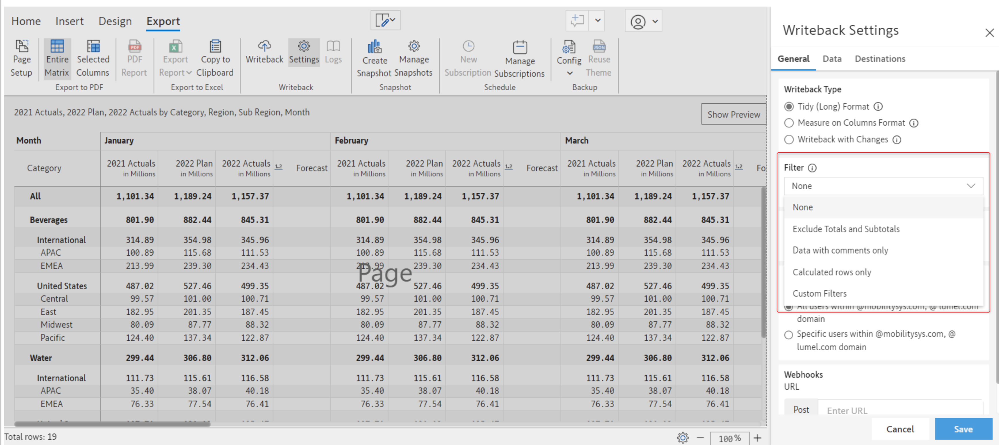<figcaption></figcaption></figure>

#### a) None&#x20;

Selecting this option will writeback the entire report/scenario without applying any filters.

#### b) Exclude totals and subtotals&#x20;

Only leaf level data is written back. Totals and subtotals are not written back.&#x20;

#### c) Calculated rows only&#x20;

Only the calculated rows (including the notes added in the calculated rows) are written back under this filter option.&#x20;

#### d) Data with Comments

Only cells that have a comment will be included in Inforiver writeback. Please note Data with comments only works in Tidy(Long) writeback type.&#x20;

#### e) Custom filters&#x20;

Allows the user to define and set custom filter conditions. Inforiver allows a drag-and-drop, no-code filter creation experience that allows the user to set choose filter criteria for writeback with relative ease.&#x20;

<figure><figcaption></figcaption></figure>

<figure>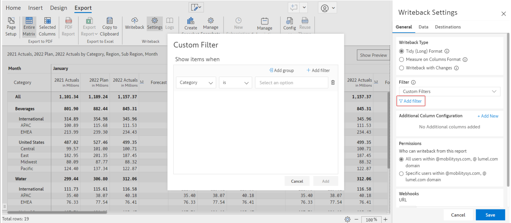<figcaption></figcaption></figure>

Within Custom Filter,&#x20;

* **Add filter:** Allows the user to create their own filter condition. Filter condition requires selecting a dimension category, logical expression, matching value of the dimension category. Inforiver has a several built-in logical expressions to assist building filter conditions.&#x20;
* **Add group:**  Allows user to group filter conditions. Useful when there are multiple filter conditions for multiple dimension categories.&#x20;
* **Combinators:** AND or OR operators are available for filter logic creation.&#x20;

#### Filter FAQs:

* If Power BI RLS is implemented, recommended filter setting is to exclude totals and sub totals.
* Exclude totals and sub totals, Data with comments filter setting presets will not be available for measure on column writeback type.
* Data with comments filter setting preset will not be available for writeback with changes writeback type.

### iii) Additional column configuration&#x20;

This allows a user to add dimension keys to the writeback table during writeback. This will require the user to provide consent to access all the datasets from the workspace.&#x20;

Inforiver allows you to add two types of following key columns,

1. Add Dimension Key
2. Add Date Key

#### Add Dimension Key

This allows the user to add key columns for dimensions (excluding datetime dimensions). Procedure is as follows,&#x20;

1. **Select the dimension table** that has the dimension category and dimension key
2. **Column:** Choose the column from the dataset that matches your dimension category
3. **Visual Column:** Choose the column in the Inforiver visual that matches your dimension category
4. **Additional column from dataset:** Choose the dimension key columns that will be included in the writeback table
5. **Column name in writeback table:** Choose a name for the dimension key column to be included in the writeback table.

#### Add Date Key

This allows the user to add date key column to the writeback table.&#x20;

Date key column of a date table is typically at a date level. Inforiver reports are often used for high level aggregations such as Revenue by Year-Months, etc. In such situations, _Add Date Key_ feature adds a Date Key column and writes values by appending 01-01 to any high-level date dimensions. For example, If the report is set at Year-Month level. Inforiver adds 01-01-2023 for Jan'2023.&#x20;

<figure>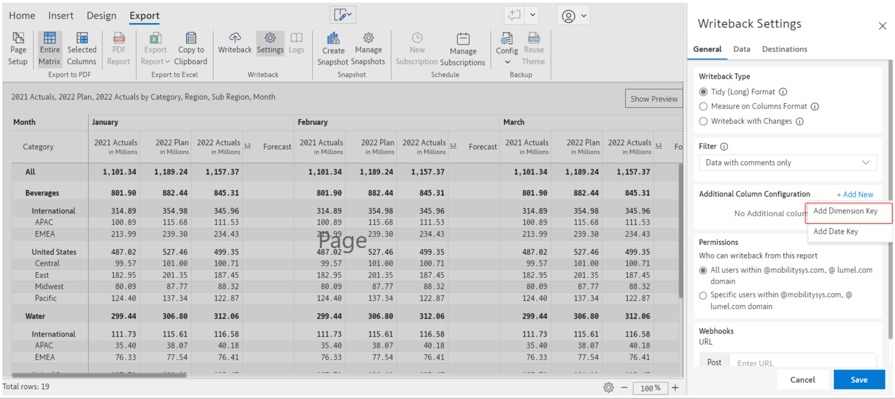<figcaption></figcaption></figure>

<figure>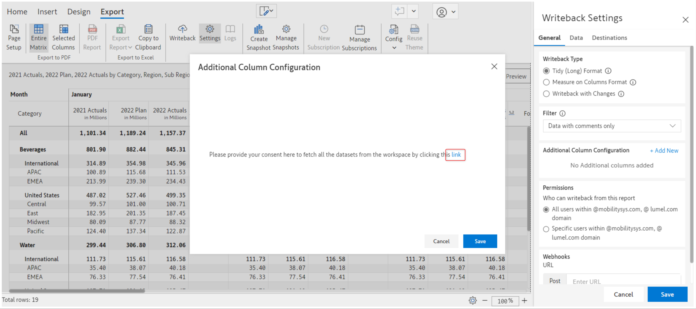<figcaption></figcaption></figure>

<figure>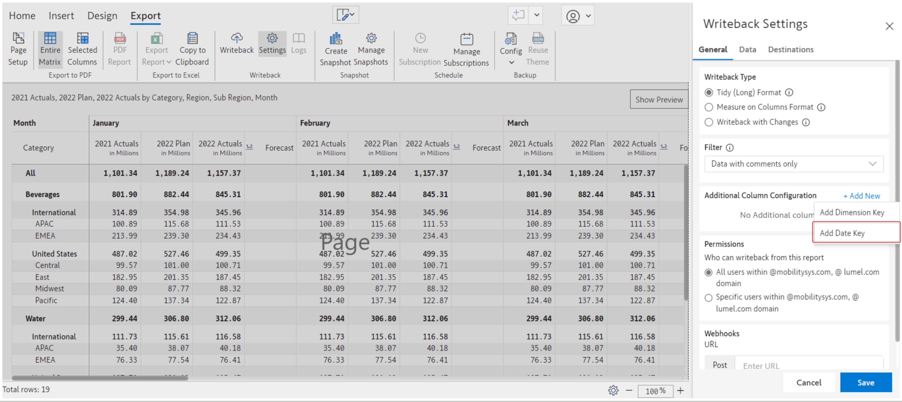<figcaption></figcaption></figure>

<figure>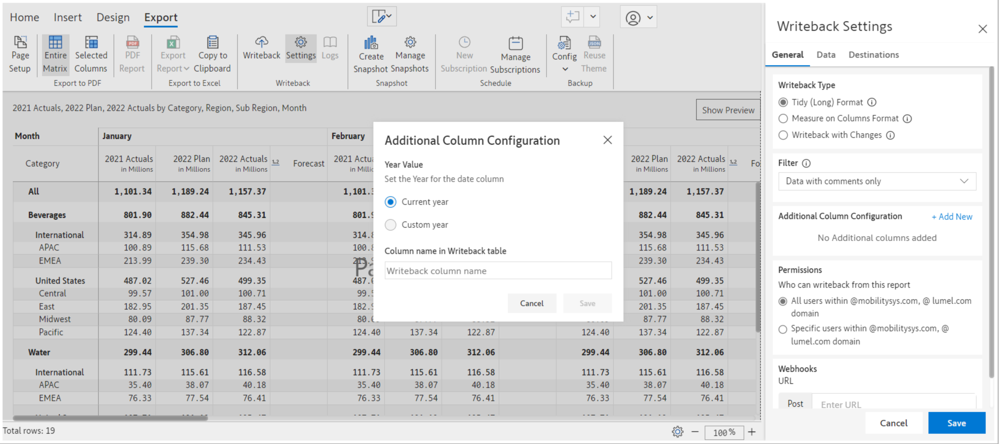<figcaption></figcaption></figure>

<figure>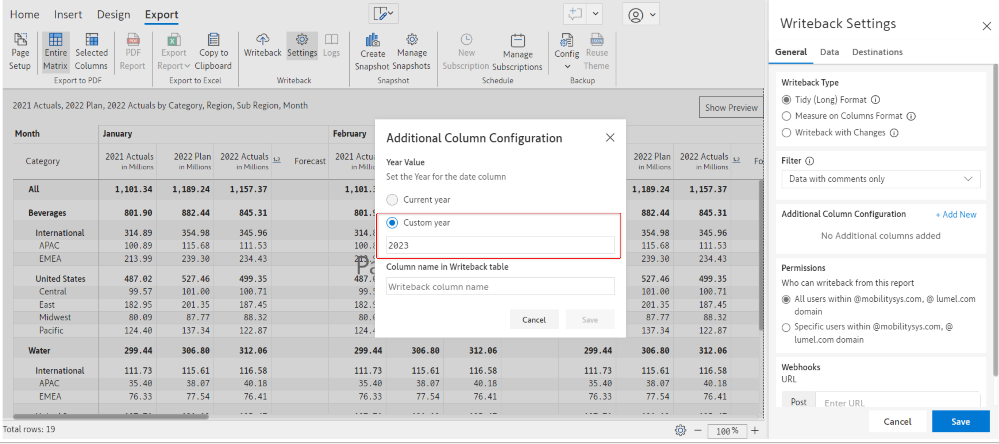<figcaption></figcaption></figure>

#### Additional Column Mapping and Best Practices

* If a high level dimension category is included in the visual and additional column mapping is chosen, Inforiver will write dimension keys only if there are no conflicts. In case of conflicts, writeback will go through successfully except the dimension key columns will be written NULL. This will be recorded in the writeback logs. It is recommended that the user shall add appropriate categories to avoid conflicts.
* Add Date Key only works with Power BI time intelligence generated date hierarchy set in the columns field of the visualization pane.

### iv) Permissions

Permissions option allows user control over writeback. It is possible to grant writeback permissions to everyone in your organization or to a select few users to perform writeback. Inforiver leverages Azure Active Directory (AAD), hence finding and granting writeback permissions to your co-workers will be relatively easy.&#x20;

#### a) All users within specific domains&#x20;

Under this option, all the users within the specified organization will be able to configure the report writeback.

#### b) Specific users within the domain&#x20;

Selecting this option will display an input field. Users can then specify the email addresses or names of the people within the team or organization in grant writeback permissions.&#x20;

<figure><figcaption></figcaption></figure>

### v) Webhooks

Inforiver webhook delivers a JSON payload to any HTTP endpoint. The JSON payload contains essential information about writeback instance as shown below.

```json
 "executionId": "WB1680171814",
            "status": "Success",
            "reportName": "Total Revenue by Store Country",
            "createdBy": "testuser@lumel.com",
            "createdAt": 1680155877,
            "error": [],
            "details": {
                "destinations": [
                    {
                        "destinationName": "Azure SQL: Test_Writeback_Table",
                        "databaseType": "azuresql",
                        "host": "writebackdemo.database.windows.net",
                        "port": "1433",
                        "database": "writeback_demo_db",
                        "schema": "Data",
                        "dataTableName": "Test_Writeback_Table",
                        "type": "Azure SQL",
                        "numberOfRows": 560,
                        "status": "Success",
                        "errorMeta": {},
                        "message": "Data inserted successfully"
                    }
                ],
                "metaData": {
                    "environment": "Service",
                    "reportUrl": "https://app.powerbi.com/groups/acdefg/reports/abcdef-ghi/ReportSectionabsdef?ctid=123456",
                    "writebackFilter": {
                        "type": "none"
                    },
                    "writebackType": "Convert to Tidy (Long) Format",
                    "scenariosWrittenback": [
                        "Base"
                    ],
                    "isAutoWritebackEnabled": false,
                    "autoWritebackEnabledScenarios": []
```

&#x20;

<figure>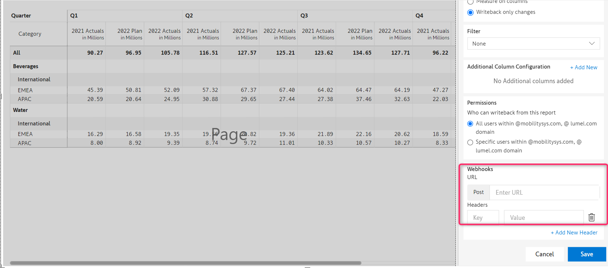<figcaption></figcaption></figure>

To setup Inforiver Webhook, paste HTTP endpoint URL in the URL field. Click the 'Add new header' link to add a new header. In the header, add the key-value pair. When writeback is initiated, Inforiver will deliver its JSON payload to the configured endpoint.&#x20;

&#x20;It is possible to initiate and trigger further workflows using Inforiver webhook. A few examples are as follows

* Approval workflow using Power Automate Microsoft Teams
* Refresh Dataset/Dataflow workflow using Power Automate

The above are sample workflows that could be triggered using Inforiver webhook. There are many other workflows possible. Please note Inforiver webhook is different to URL as Destination. Inforiver webhook's JSON payload only contains essential information about the writeback table. URL as Destination JSON payload contains the entire writeback table. Learn more [here](../destinations/url-as-destination.md).

