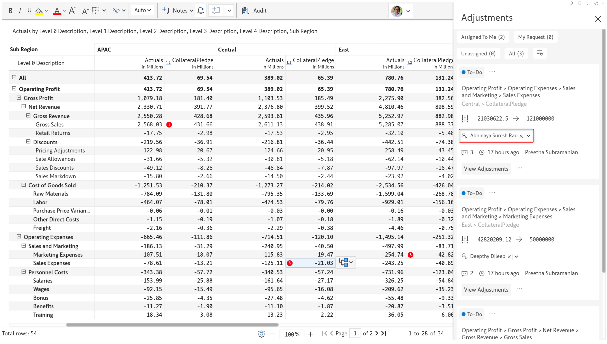
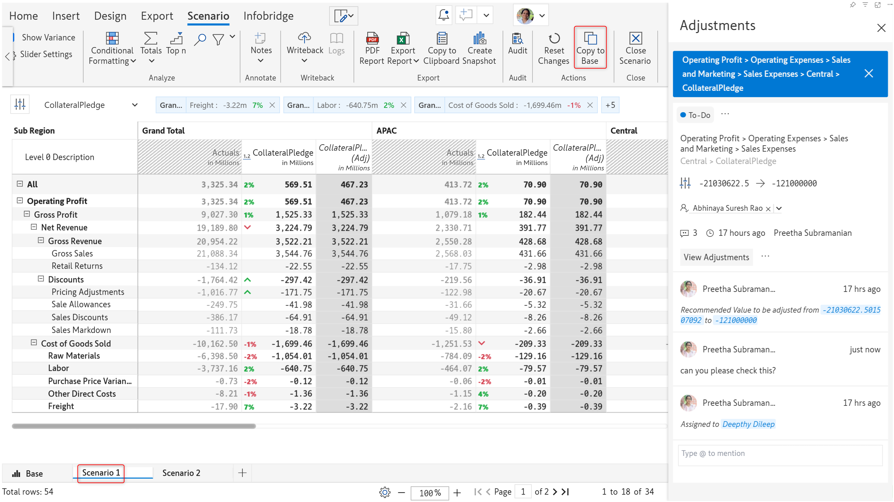

# 17. Collaborative adjustment workflows

The adjustments workflow in Inforiver provides a mechanism for requesting and recommending updates to read-only data input values. For instance, a report viewer can request an adjustment to a bonus or tax rate field. Designated approvers can then review and approve the adjustment request.&#x20;

## 1. Requesting an adjustment

**1.1. Submitting a request:** To request an adjustment, you can either double-click the cell or click on the adjustment icon that appears when you click a cell. In the Request Adjustments popup, you can specify the new value in the **Requested Value** textbox. You can optionally add a comment and tag an approver from the **Assign a user** dropdown.

<figure><figcaption>
Requesting an adjustment
</figcaption></figure>

The red time icon  indicates that an adjustment has been requested for that particular cell.

<figure><figcaption>
Adjustment requests in a report
</figcaption></figure>

**1.2. Adjustment request notifications:** When you assign an adjustment request to a particular associate, they will receive an email that provides details about the adjustment. The email will contain a link to the report.

<figure><figcaption>
Adjustment notification email
</figcaption></figure>

When an approver opens the report, they will receive a notification message indicating pending adjustments.

<figure><figcaption>
Pending adjustment notification
</figcaption></figure>

## 2. Reviewing adjustments

**2.1. Viewing adjustment requests**: If you are an approver, when you open the report, you’ll notice a bell icon that indicates an adjustment has been requested. Click on the bell icon to open the Adjustments side pane.&#x20;

<figure><figcaption>
Adjustments pane
</figcaption></figure>

**2.2. Re-assigning adjustments:** You can assign an adjustment request to another person by clicking the dropdown icon against the assignee.

<figure><figcaption>
Re-assigning adjustment requests
</figcaption></figure> <figure><figcaption>
Adjustment request re-assigned
</figcaption></figure>

**2.3. Displaying comments**: When you click on the comments icon - , you will be able to see the requested adjustment value and comments associated with the request.

<figure><figcaption>
Displaying comments
</figcaption></figure>

**2.4. Evaluating adjustment requests:** Before committing to an adjustment, Inforiver allows you to compare and gauge the impact of the adjustment by displaying the adjustment as an additional measure in your source report or by running simulations in a scenario.

* **Display the adjustment as a measure:** Click the **View Adjustments** button to display the adjustment as a read-only measure. The adjustment measure header will be italicized with “(Adj)” appended to it. The requested adjustment will be highlighted in yellow. If an update has been requested for the grand total, all the contributing cells will be highlighted as well.

<figure><figcaption>
Adjustments as a read-only measure
</figcaption></figure>

Click on an adjustment request then click the arrow icon that appears to accept the request and copy the value.

<figure><figcaption>
Applying adjustments
</figcaption></figure>


Use the column gripper menu for the adjustment measure and select **Remove Adjustment Measure** to hide the adjustment field.


* **Display the adjustment as a scenario:** You can even run simulations before making a decision about applying an adjustment. To assess the impact of an adjustment in the bigger picture, click the **View in Scenario** option. Inforiver will automatically create a scenario that contains the recommended adjustment. You can run simulations on your data and use the **Copy to Base** option to commit your updates.

<figure><figcaption>
View in scenario option
</figcaption></figure> <figure><figcaption>
Running simulations
</figcaption></figure>

**2.5. Submitting an accepted adjustment for review:** After applying an adjustment, click the Submit for Review button.

<figure><figcaption>
Submitting an adjustment for review
</figcaption></figure>

The status of the adjustment changes from _To-Do_ to _In Review_. You can re-assign the adjustment request to the designated reviewer. The color of the notification icon also changes from red to yellow.&#x20;

<figure><figcaption>
Submitting adjustments for review
</figcaption></figure>

**2.6. Resolving a request:** From the adjustments pane, the requester can choose to resolve the thread if the adjusted value is acceptable. Please bear in mind that only the requestor can resolve a request. Anyone can re-open the thread if the adjusted value needs to be revised.

<figure><figcaption>
Resolving an adjustment request
</figcaption></figure>

## 3. Managing adjustments

You can quickly filter the adjustments assigned to you for review/ adjustments requested by you/ unassigned adjustments by clicking the respective buttons at the top of the adjustments side pane. Users with read/write access to the report will be able to view unassigned adjustment requests as well.

<figure><figcaption>
Adjustment filter buttons
</figcaption></figure>

Inforiver provides also dropdown filters on the status, assignee, and requester fields, to help you streamline adjustment requests. Click the filter icon to enable the dropdowns.

You can filter adjustment requests by status:

<figure><figcaption>
Filtering by status
</figcaption></figure>

E.g. You can show all the adjustment requests that have been resolved.

<figure><figcaption>
Displaying adjustments based on the status
</figcaption></figure>

Use the **Assigned to** dropdown to filter adjustments based on the approver. Similarly, you can use the **Assigned by** dropdown to filter adjustments requested by specific people.

<figure><figcaption>
Displaying adjustmets based on the approver
</figcaption></figure>
