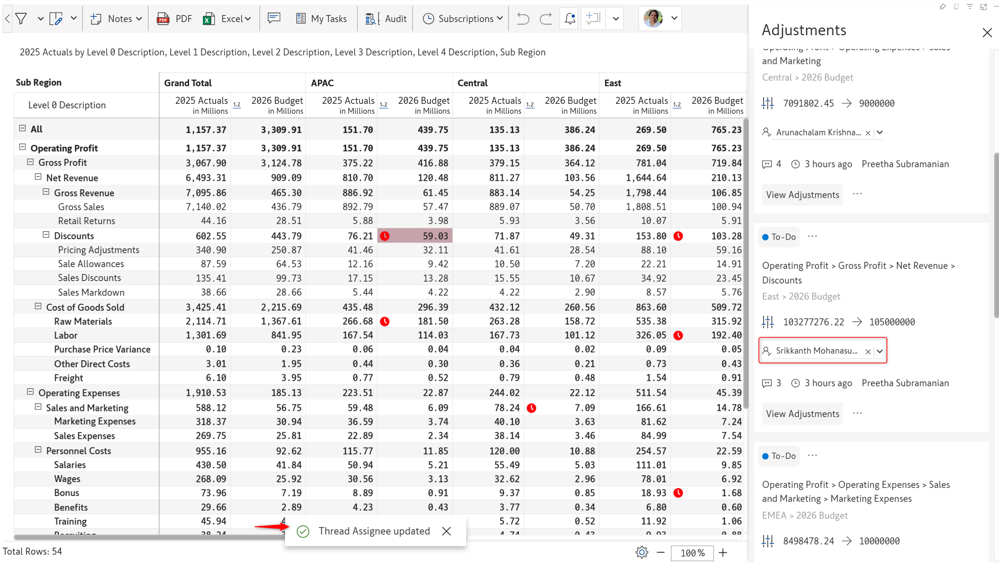

# 17. Collaborative adjustment workflows

The adjustments workflow in Inforiver Matrix provides a mechanism for requesting and recommending updates to read-only data input values. For instance, a report viewer can create an adjustment request and assign it to another associate who can review the change. The assignee can in turn suggest a different value or accept the same value. The adjustments workflow allows multiple users to collaborate on and track updates to changes in data input values.&#x20;

* The adjustment workflow will be enabled for read-only data input measures. [Learn more about setting permissions for data input fields](4.-adding-business-logic-and-formulae/manage-inserted-rows-and-columns-1.md#id-2.1.-data-input-access).

<figure><figcaption>
Setting read/write permissions for data input fields
</figcaption></figure>

* Adjustment workflows are enabled by default. Disable the toggle from Display settings if you do not want report viewers requesting adjustments.

<figure><figcaption>
Disabling adjustments
</figcaption></figure>

## 1. Requesting an adjustment

This is the first step of the workflow in which a report viewer or a requestor can submit an adjustment request.&#x20;

**1.1. Submitting a request:** To request an adjustment, a report viewer with read-only access to data input fields can either double-click the cell or click the adjustment icon that appears when they click a cell.&#x20;

In the Request Adjustments pop-up, specify the new value in the **Requested Value** textbox. Optionally add a comment and tag an assignee from the **Assign a user** dropdown.&#x20;

Let's consider a scenario where a report viewer is requesting an update to the budget. The designated assignee can review the budget change suggested by the requester.


If an assignee is not tagged explicitly, the report author can review and accept the adjustment request.


<figure><figcaption>
Adjustment request window
</figcaption></figure>

The red time icon  indicates that an adjustment has been requested for that particular cell.

<figure><figcaption>
The red icon indicates the cells that have adjustment requests
</figcaption></figure>

**1.2. Adjustment request notification emails:** When the requestor assigns an adjustment request to an associate, they will receive an email that provides details about the adjustment. The email will contain a link to the report.

<figure><figcaption>
Adjustment request notification email
</figcaption></figure>

## 2. Reviewing adjustments

In the second step, an assignee can review and accept a request or suggest a new adjustment value. When the assignee opens the report, they will receive a notification message indicating pending adjustments.&#x20;

<figure><figcaption>
Pending adjustments notification on opening the report
</figcaption></figure>

**2.1. Viewing adjustment requests**: The bell icon in the report indicates an adjustment has been requested. Click the bell icon to open the Adjustments side pane.&#x20;

<figure><figcaption>
Adjustments side pane
</figcaption></figure>

**2.2. Evaluating adjustment requests:** Before committing to an adjustment, Inforiver Matrix allows you to compare and gauge the impact of the adjustment by displaying the adjustment as an additional measure in your source report or by running simulations in a scenario.

* **Display the adjustment as a measure:** Click the **View Adjustments** button to display the adjustment as a read-only measure. The adjustment measure header will be italicized with “(Adj)” appended to it. The requested adjustment will be highlighted in yellow. If an update has been requested for the grand total, all the contributing cells will be highlighted as well.

<figure><figcaption>
Viewing adjustments as a read-only measure
</figcaption></figure>

Click the adjustment value, then click the arrow icon that appears to accept the request and copy the value.

<figure><figcaption>
Accepting adjustment requests
</figcaption></figure>

Notice how the allocated budget of 59.03m has been updated to the requested 80.25m.

<figure><figcaption>
Requested adjustment value applied to the data input measure
</figcaption></figure>


Use the column gripper menu for the adjustment measure and select **Remove Adjustment Measure** to hide the adjustment field.


* **Display the adjustment as a scenario:** You can even run simulations before making a decision about applying an adjustment. To assess the impact of an adjustment in the bigger picture, click the **View in Scenario** option.&#x20;

<figure><figcaption>
View in scenario option
</figcaption></figure>

Inforiver Matrix will automatically create a scenario that contains the recommended adjustment. You can run simulations on your data. If you have edit access to the report, use the **Copy to Base** option to commit your updates. In this case, an adjustment request was placed to increase the "Labour" budget to 200m. The assignee has reduced the budget by 15%.

<figure><figcaption>
Running simulations and applying simulated values 
</figcaption></figure>

Notice how the simulated value of 163.54m has been applied instead of the originally requested budget of 200m.

<figure><figcaption>
Adjustment request updated
</figcaption></figure>

## **3. Submitting an adjustment for review**

This is the third step of the workflow. After applying an adjustment, the assignee should click the **Submit for Review** button. Before resolving the thread, this allows the requester to review whether the assignee has accepted the requested value or recommended a new value.

<figure><figcaption>
Submitting an adjustment request for review by the requestor or another associate
</figcaption></figure>

The status of the adjustment changes from _To-Do_ to _In Review_. The color of the notification icon also changes from red to yellow. Optionally, if you want a second pair of eyes, you can [re-assign the adjustment](17.-collaborative-adjustment-workflows.md#id-5.-re-assigning-adjustments) request to another designated reviewer.&#x20;

<figure><figcaption>
Changing the status to in review
</figcaption></figure>

## **4. Resolving a request**

This is the final step of the workflow. From the adjustments pane, the requester can choose to resolve the thread if the adjusted value is acceptable.  Anyone can re-open the thread if the adjusted value needs to be revised.

<figure><figcaption>
Resolve thread
</figcaption></figure>

The status is changed to resolved, and the adjustment will no longer be flagged in the report.

<figure><figcaption>
Resolved adjustments
</figcaption></figure>

## **5. Re-assigning adjustments**

This is an optional step. Assign an adjustment request to another person by clicking the dropdown arrow against the assignee. Select the new assignee from the dropdown.

<figure><figcaption>
Click the dropdown arrow and select a new assignee
</figcaption></figure> <figure><figcaption>
Assignee updated
</figcaption></figure>

## **6. Displaying comments**

Click the comments icon -  to see the requested adjustment value and comments associated with the request.

<figure><figcaption>
Viewing and adding comments
</figcaption></figure>

## 7. Managing adjustments

You can quickly filter the adjustments assigned to you for review/ adjustments requested by you/ unassigned adjustments by clicking the respective buttons at the top of the adjustments side pane. Users with read/write access to the report will be able to view unassigned adjustment requests as well.

<figure><figcaption>
Adjustment filter options
</figcaption></figure>

Inforiver Matrix also provides dropdown filters on the status, assignee, and requester fields, to help you streamline adjustment requests. Click the filter icon to enable the dropdowns.

You can filter adjustment requests by status:

<figure><figcaption>
Filtering the adjustments based on the status
</figcaption></figure>

E.g. You can show all the adjustment requests that are pending.

<figure><figcaption>
Filtering adjustments based on the status
</figcaption></figure>

Use the **Assigned to** dropdown to filter adjustments based on the assignee. Similarly, you can use the **Assigned by** dropdown to filter adjustments requested by specific people.

<figure><figcaption>
Displaying adjustments based on the assignee
</figcaption></figure>
