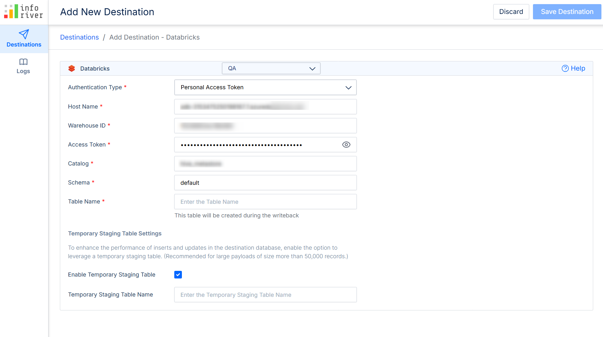

# Date

Use the date variable in reports with date dimensions to select a date.

### 1. Configuration 

This section outlines configurations specific to date variables.

**1.1. Value:** Assign a default value for the date variable.

<figure><figcaption>
Date variable creation
</figcaption></figure>

### 2. Examples 

**2.1. Filter data**

When you have date dimensions in your reports, you can use date variables to create dynamic filters.

**STEP 1:** Create a date variable with the configuration shown below.

<figure><figcaption>
Create a date variable
</figcaption></figure>

**STEP 2:** Create an Inforiver filter that references the technical name of the date variable.

<figure><figcaption>
Create an Inforiver filter
</figcaption></figure>

**STEP 3:** Select dates from the variable to instantly filter your data.

<figure><figcaption>
Filtering data with date variables
</figcaption></figure>
