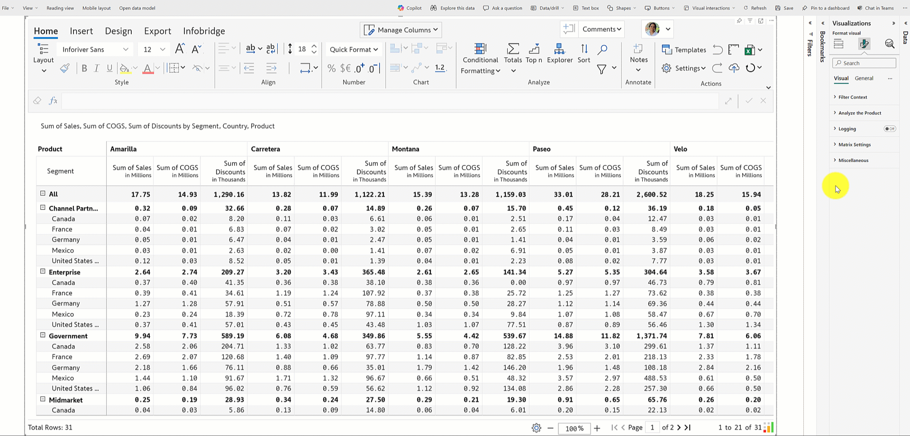

# 19. Leveraging Power BI bookmarks

**How to enable Power BI bookmarks in the Reading view**&#x20;

Report users can save their analysis with Power BI bookmarks. Remember to turn on the **Enable Read View Bookmarking** toggle from the APS Settings > Format visual > Miscellaneous section. When this option is disabled, report users can still create Power BI bookmarks, but the changes won’t be saved.&#x20;

<figure><figcaption>
Enable read view bookmarking
</figcaption></figure>

In the animation, we've created a default bookmark and a second bookmark after highlighting Discount values. Power BI bookmarks do not get saved since the Read View Bookmarking toggle has been disabled by the report author. Even when we switch between bookmarks, only the latest changes are displayed in the report.

<figure><figcaption>
Power BI bookmarks are not retained when the report author disabled Read View Bookmarking
</figcaption></figure>

When Read View Bookmarking is enabled, report viewers can save their analysis with Power BI bookmarks.

<figure><figcaption>
Leveraging Power BI bookmarks to save report analysis
</figcaption></figure>

Let’s dive into some popular Inforiver Matrix analysis use cases perfect for bookmarking.&#x20;

#### 1. Saving custom sorting and filtering  

Present your multivariate analysis by saving filters and custom sorting. In this report, we’ve filtered the row categories based on regions, sorted data by profit, and displayed only profitability-related metrics (Sales, COGS, and Profit). Finally, the changes are stored with bookmarks.&#x20;

<figure><figcaption>
Creating filters and hiding dimensions/measures
</figcaption></figure>

Notice how the measures, sort order, and row dimensions change based on the bookmark selected.

<figure><figcaption>
Saving custom sorting and filtering with Power BI bookmarks
</figcaption></figure>

#### 2. Switch between layouts  

Tailor your reports to specific audiences by changing the layout. You can bookmark layouts like Hierarchy, Stepped, or Drilldown and display your measures as rows or columns.&#x20;

<figure><figcaption>
Save layouts with Power BI bookmarks
</figcaption></figure>

#### 3. Navigating hierarchies  

Bookmarks are a key tool for navigating hierarchical dimensions and presenting insights at different granularities. Using bookmarks preserves analysis and details while expanding and collapsing the hierarchy. Notice how the formatting is retained when we switch between bookmarks.&#x20;

<figure><figcaption>
Navigating hierarchies with Power BI bookmarks
</figcaption></figure>

#### 4. Ranking data  

Ranking data enables businesses to prioritize and identify focus areas. &#x20;

<figure><figcaption>
Ranking in Inforiver Matrix
</figcaption></figure>

With Inforiver, you can bookmark top-performing or underperforming entities and instantly switch between them. Compared to presenting the global performance across all regions, ranking the top and bottom five performing regions would help stakeholders with faster decision-making, risk mitigation, and benchmarking.

<figure><figcaption>
Saving top/bottom performing entities/regions with bookmarks
</figcaption></figure>

#### 5. Number formatting  

Inforiver provides options to adjust the decimal precision and apply scaling (thousands, millions, billions, etc.) based on your data and target audience.&#x20;

<figure><figcaption>
Number formatting
</figcaption></figure>

You can apply number formats that cater to specific audiences and bookmark them. For instance, marketing and sales teams prefer using rounded number formats. On the other hand, financial analysts require high precision for accurate analysis.

<figure><figcaption>
Saving number formatting with Inforiver Matrix
</figcaption></figure>

### Resources

[Real time data analytics with Power BI bookmarks](https://inforiver.com/blog/reporting-matrix/real-time-data-analytics-with-power-bi-bookmarks/)
