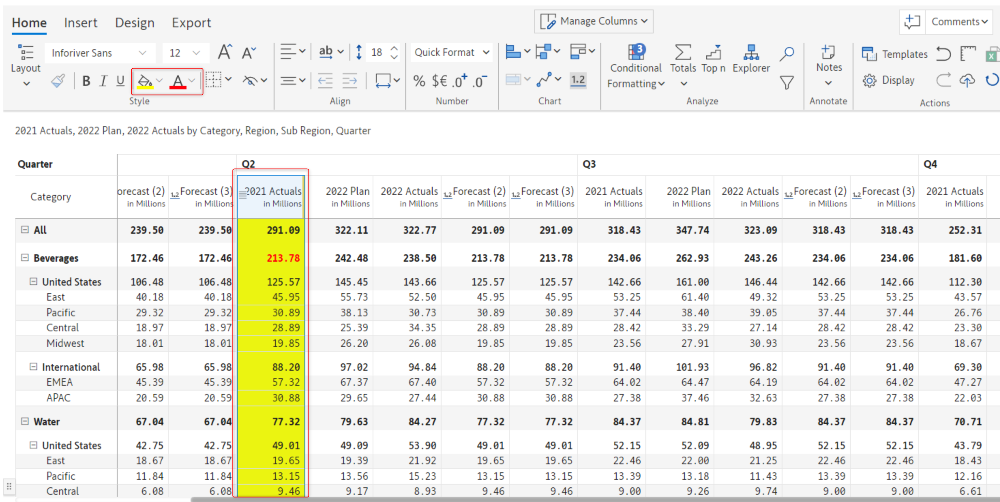

# Cell, header & value formatting

In Inforiver Matrix, you can change the font color, style, size, and text alignment in a cell, or apply formatting effects. These are available in the 'Home' tab of the toolbar in the 'Style' and 'Alignment' sections.

<figure><figcaption>
Style and alignment sections
</figcaption></figure>

## 1. Style options

Let's take a quick look at the style section in this video.&#x20;


Style options in Inforiver


#### a) Font and size

The default font is [Inforiver Sans](https://inforiver.com/blog/general/best-fonts-financial-reporting/) which has been specifically designed for use in financial and tabular reports. But you can change to a different font from the dropdown menu and change the default size.

#### b) Increase/decrease font size&#x20;

Font size can also be changed by using the Increase/Decrease font size options.

#### c) Font style&#x20;

Bold, Italics and Underline styles can be applied.

#### d) Font/background color

You can use the fill color option to apply background color to an entire column or column or even an individual cell.

And use the font color option to change the foreground color or the font color of the data values, row or column headings, and subheadings.

<figure><figcaption></figcaption></figure>

#### e) Format painter

You can copy cell formatting using the 'Format painter' option just as in Excel. But Inforiver goes one step further. If you have applied formatting to a specific level like the Subcategory in the below example, you can apply it to all the other subcategories using the 'Apply format to level' option.&#x20;

<figure><figcaption>
Apply format to level option
</figcaption></figure> <figure><figcaption>
Format applied to level
</figcaption></figure>

#### f) Borders

Inforiver provides several predefined border styles and they can be applied at a cell/row/column level. If the predefined cell borders do not meet your needs, you can create a custom border by clicking on the 'Custom' option.

<figure><figcaption>
Applying borders
</figcaption></figure>

To remove custom borders, click on 'Reset' or select the 'No borders' option (the 1st icon).

To remove the predefined borders, click on the 'No borders' option (the 1st icon).

## 2. Alignment options

Let's take a quick look at the alignment section in this video.&#x20;


Alignment options - Overview


#### a) Horizontal/vertical alignment&#x20;

Horizontal alignment can be formatted using Align left, right, and center options. For vertical alignment, the options are Align top, bottom, and middle.

#### b) Header orientation&#x20;

Column and measure header orientations can be changed using the highlighted options. This is very helpful when you have a lot of columns in your report.

<figure><figcaption>
Header orientation options
</figcaption></figure>

#### c) Increase/decrease indent&#x20;

Use the indentation icon from the toolbar to indent specific values. This feature makes creating financial statements a breeze.

#### d) Row size&#x20;

You can increase or decrease row size manually. This is especially useful when inserting inline charts.&#x20;

#### e) Word wrap

If your measure headers are very long, you can enable the word wrap option to ensure that the entire header is displayed.

**f) Fit Content**

You can choose the fit mode that is best suited for your data.

<figure><figcaption>
Fit to header
</figcaption></figure>

<figure><figcaption>
Best fit
</figcaption></figure>

## 3. Inserting icons in headers

Enhance the visual appeal of your reports with icons and symbols in measures headers, column headers, and inserted rows. You can copy the preferred icon and paste it in the title section.

<figure><figcaption>
Inserting icons in headers
</figcaption></figure>

In the next section, we'll see how to handle [totals & subtotals](totals-and-subtotals.md).

#### Resources

[Best Fonts for Financial Reporting](https://inforiver.com/blog/general/best-fonts-financial-reporting/)
