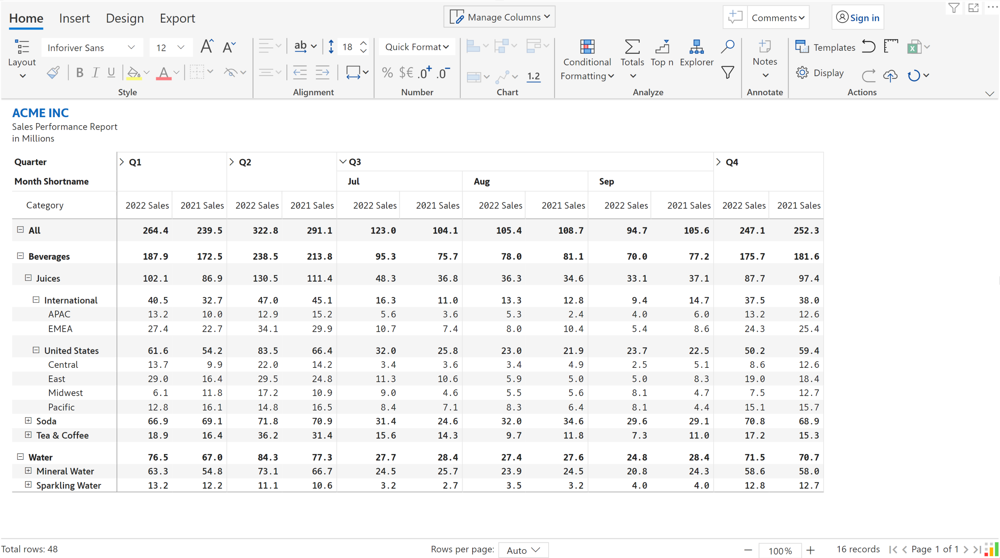
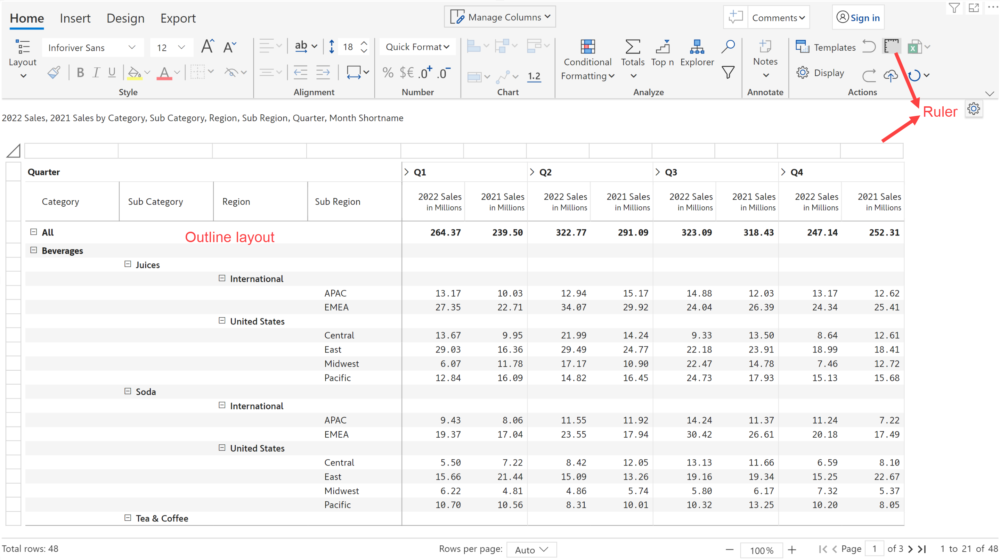
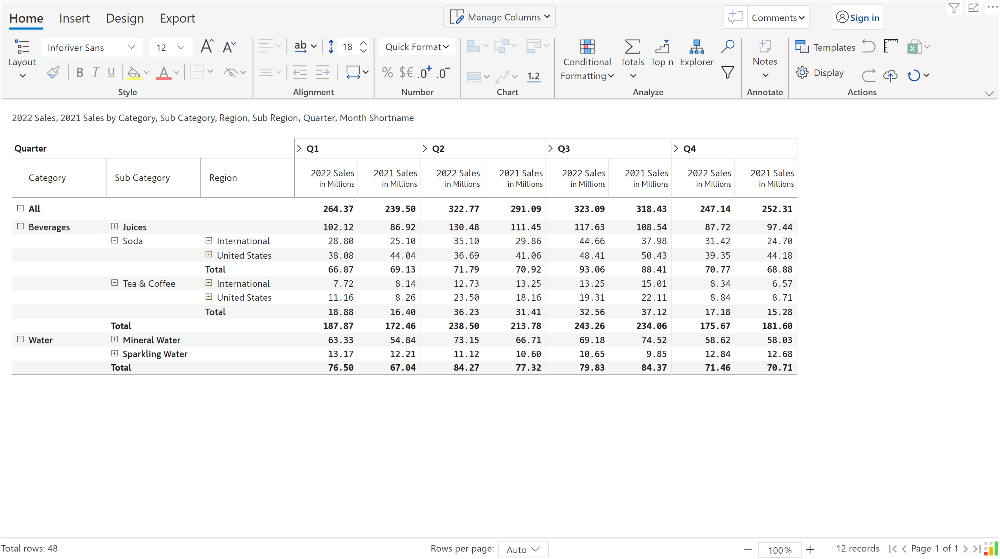
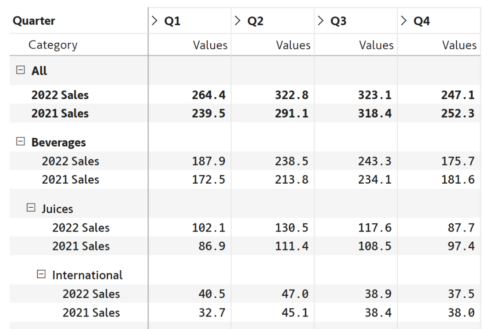
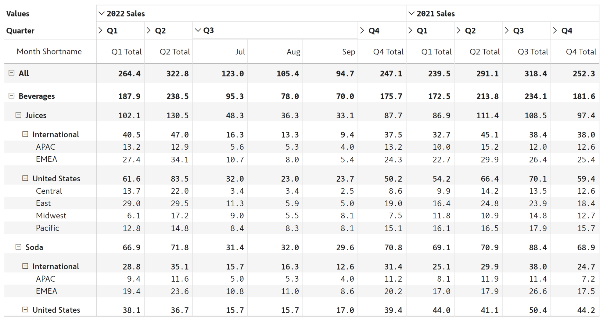

# Layout options

Inforiver offers two major types of layout options - **Table layouts** and **Measure layouts**. Each of these comes with its own set of variations and can be used together in a single layout.&#x20;

The Table Layout lets you determine how categories in rows need to be displayed.&#x20;

The Measure Layouts give you flexibility specifically with respect to how measures are displayed.&#x20;


Table and measure layouts - Overview


## 1. Table layouts

### a. Hierarchy

By default, Inforiver delivers data in a hierarchical, expand/collapse-enabled format.

<figure><figcaption>
Hierarchy layout
</figcaption></figure>

When you select the Layout item from the menu, you will notice the selection defaulted to 'Hierarchy'.

<figure><figcaption>
Other layout options
</figcaption></figure>

Changing this selection helps you modify the report layouts to the other types listed below.

### b. Outline

The outline layout shows the row categories in individual columns.&#x20;

By default, the 'ruler' is also enabled for this layout. The ruler is used to easily resize rows and columns as you do in spreadsheets, and to select a specific column. You can hide the ruler by de-selecting the ruler icon on the toolbar.

<figure><figcaption>
Outline layout
</figcaption></figure>

### c. Table

The table option shows categories in a tabular format, without any expand-collapse hierarchies for rows. Note that the hierarchy expand/collapse option is available for columns (Quarter-Month).&#x20;

<figure><figcaption>
Table layout
</figcaption></figure>

### d. Performance mode


This feature is coming soon and will be part of the 3.9 release


Inforiver’s differentiated architecture enables faster processing of large hierarchies, ensuring optimal performance while creating reports with complex hierarchical data. To efficiently analyze extensive hierarchical datasets without compromising on performance, we recommend switching to the new Performance Table layout.

<figure><figcaption>
Performance layout for hierarchies
</figcaption></figure>

### e. Stepped

The stepped layout is similar to the outline layout in that each category is listed in a column. The difference is in the availability of a separate total row for each branch of the hierarchy.

<figure><figcaption>
Stepped layout
</figcaption></figure>

### f. Drilldown

The drill down layout lets you explore one branch at a time in the hierarchy. This is also an ideal option when you have a huge volume of rows.

<figure><figcaption>
Drilldown layout
</figcaption></figure>

## 2. Measure layouts

The default Measure layout is used in all the Table layouts listed above.&#x20;

### a. In rows

When you change this to 'In rows', the measures are displayed as shown below.&#x20;

<figure><figcaption>
Measure in rows
</figcaption></figure>

To re-order rows while using Measure in rows layout, you can click on row gripper and drag the rows to be re-ordered. Another way to do this is via the ‘Manage rows’ popup screen. Click on the gripper and drag and drop the measures as desired.

<figure><figcaption>
Re-ordering rows using Manage Rows
</figcaption></figure>

### b. In columns

When you change this to 'In columns', the measures are displayed above the column hierarchy categories.&#x20;

<figure><figcaption>
Measure in columns
</figcaption></figure>

In the next section, we'll look at the [one-click templates](templates.md) offered by Inforiver.

#### Resources:

[Table and Matrix Layouts in Power BI](https://inforiver.com/blog/general/table-matrix-layout-powerbi/)

[Measures in Rows vs. Columns vs. Nested Columns](https://inforiver.com/blog/general/measures-rows-columns-nested-columns/)

[Pivot analysis using Inforiver](https://inforiver.com/excel-like-pivot-analysis-powerbi/)

[Nesting Measures in Inforiver](https://inforiver.com/blog/general/nesting-measures-inforiver/)

[Table and Matrix as Visuals = The Same but Different, Use Wisely](https://inforiver.com/blog/general/table-and-matrix-as-visuals-the-same-but-different-use-wisely/)

[7 scenarios where Table, Matrix or Scorecard visuals are better than Charts](https://inforiver.com/insights/scenarios-where-table-matrix-scorecard-visuals-are-better-than-charts/)
