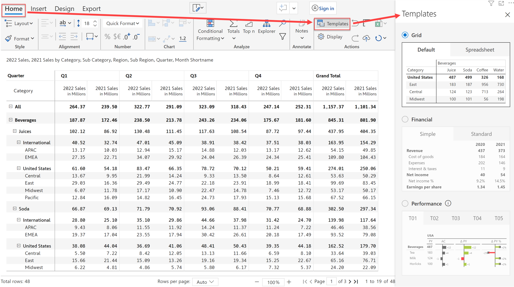
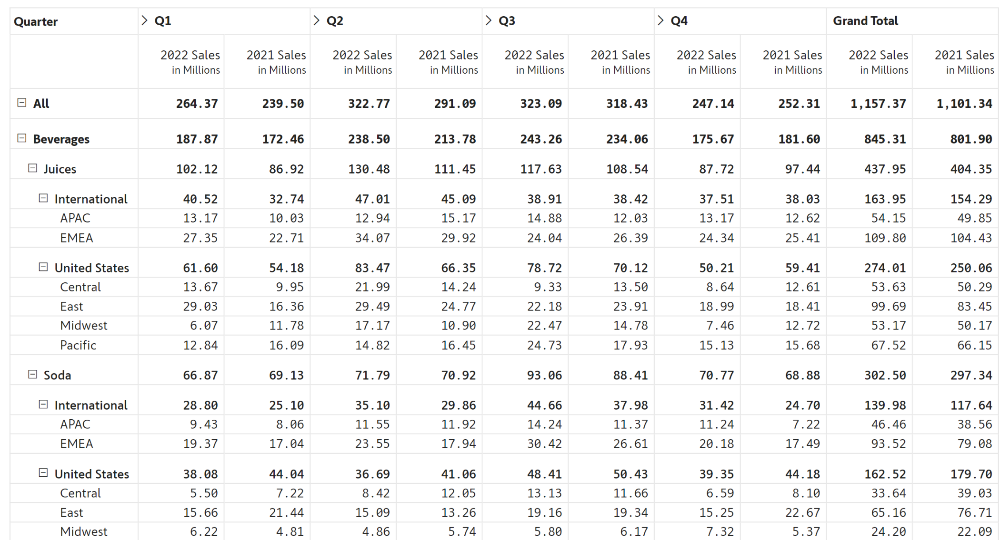
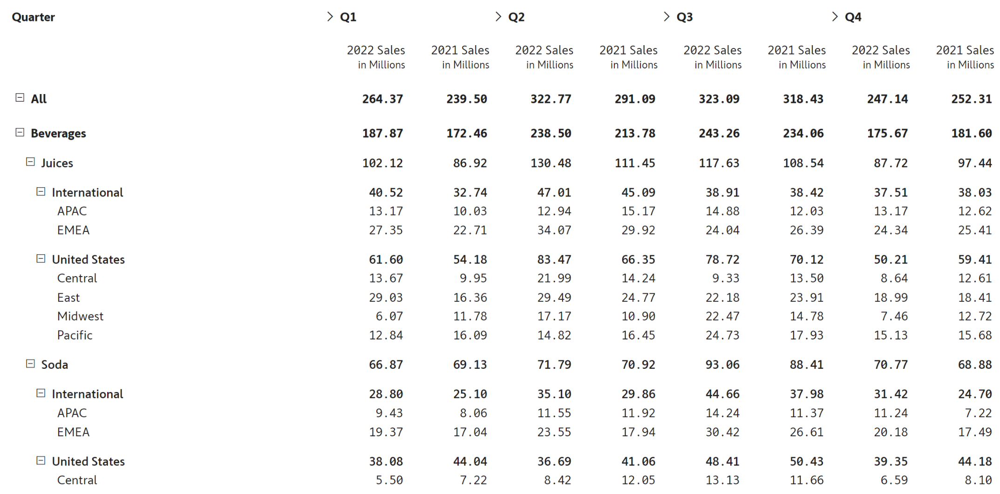
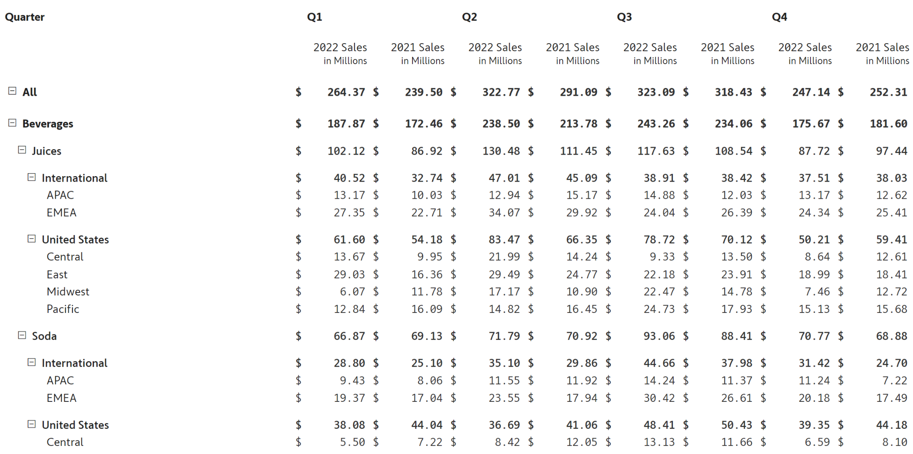
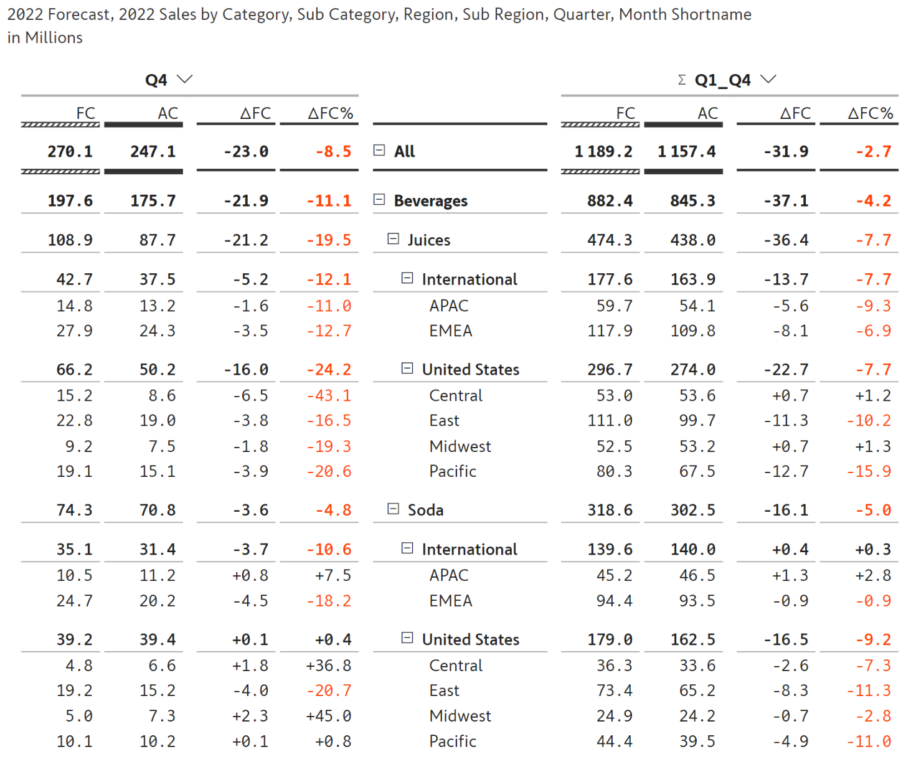
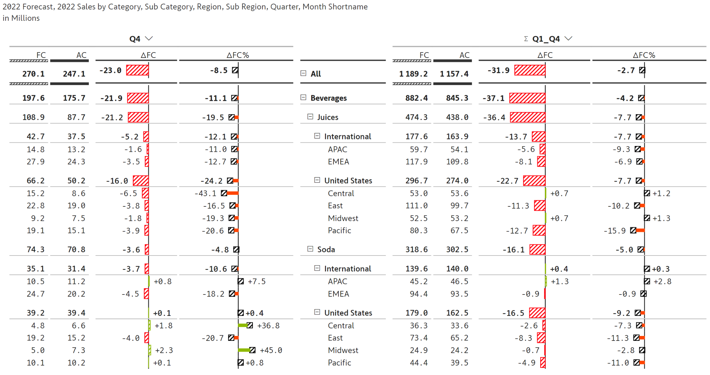
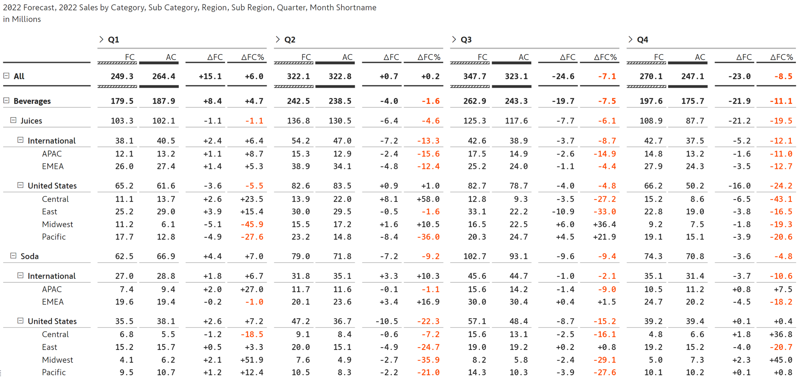
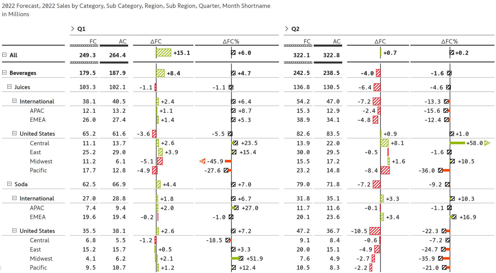
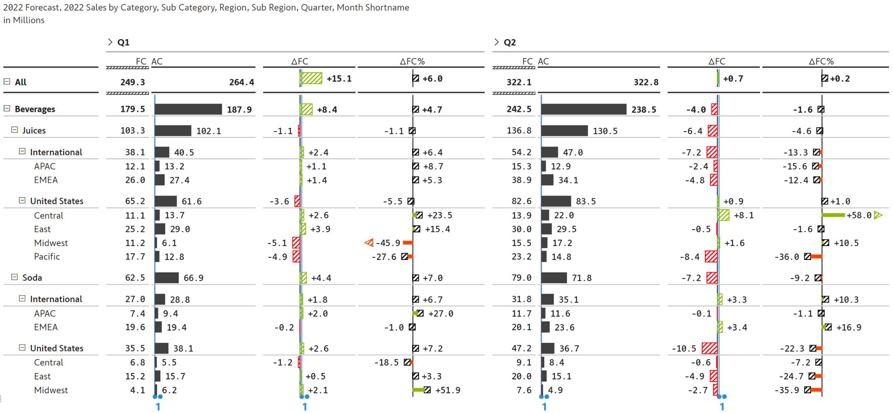

# Templates

In addition to the [layout options](layout-options.md), Inforiver provides three types of quick-start business templates, each of which can be customized further.&#x20;


Templates - Overview


These templates can be accessed from the 'Templates' icon under the 'Home' tab.

<figure><figcaption>
Templates available in Inforiver
</figcaption></figure>


You can switch between these templates at any time. However, any customizations you have done with the already existing template may be lost depending on the template you choose.&#x20;


## 1. Grid templates

Grid templates are used to build typical tabular reports.&#x20;

### a. Default grid

The Default grid option is featured below.&#x20;

<figure><figcaption>
Default template
</figcaption></figure>

### b. Spreadsheet grid

The Spreadsheet grid option is very similar, but it evokes the feeling of working with spreadsheet software like Excel. The spreadsheet option is featured below.

<figure><figcaption>
Spreadsheet template
</figcaption></figure>

## 2. Financial templates

The financial templates are ideal for building financial reports and statements. It comes in two variations, the Simple option, and the Standard option.&#x20;

### a. Simple template

The Simple option is shown below. By default, the row categories are given more space to accommodate longer category names in financial statements such as 'Number of shares outstanding.

<figure><figcaption>
Simple financial template
</figcaption></figure>

### b. Standard template

The standard option uses a currency symbol for all the measures (which can be customized or removed for specific measures).&#x20;

<figure><figcaption>
Standard financial template
</figcaption></figure>

## 3. Performance templates

Inforiver offers five (5) types of performance templates. All of these templates are based on designs recommended by International Business Communication Standards ([IBCS](https://www.ibcs.com/)).&#x20;


The performance templates are useful when you need to showcase observed performance against a benchmark (say, sales vs. plan, budget, forecast, or prior year sales).&#x20;


In our case, we have chosen to map the measures as shown below.

<figure><figcaption>
Mapping measures based on IBCS notation
</figcaption></figure>

The five performance template options available are listed below.

### a. Template T01&#x20;

This template tracks current period performance vs. till date performance. In this case, Q4 vs. YTD. A unique feature of this template is that it has the categories listed in the middle. Note that this template would make sense only if you have time series mapped in the columns.

<figure><figcaption>
IBCS table template T01
</figcaption></figure>

### b. Template T02

This is similar to template T01, except that the variances are shown in graphs. We can instantly recognize that the performance in Q4 has dipped w.r.to the forecast. Again, this template would make sense only while using time series in the columns.

<figure><figcaption>
IBCS table template T02
</figcaption></figure>

### c. Template T03

This template produces a standard hierarchical report with negative values in red.

<figure><figcaption>
IBCS table template T03
</figcaption></figure>

### d. Template T04

This template shows hierarchical data in rows and columns with absolute and percentage variances graphically. Note that while the IBCS standards are not designed for hierarchical data in columns, Inforiver does support hierarchies while using these templates. Of course, you will have to use the scroll bar to navigate all the months when you expand, say, Q1.

<figure><figcaption>
IBCS table template T04
</figcaption></figure>

### e. Template T05

This template is similar to T04, with the exception of actuals data (AC) which is shown in charts. This template also uses scale bands (as recommended by IBCS standards - these are the blue lines with two blue dots at the bottom) to compare varying scales of observed values and the absolute variance.

<figure><figcaption>
IBCS table template T05
</figcaption></figure>

In the next section, we'll be covering the [basic formatting](basic-formatting.md) options available in Inforiver.

#### Resources

[IBCS table templates in Inforiver](https://inforiver.com/ibcs-reports-powerbi/)

[IBCS tables in Inforiver - Highlights](https://inforiver.com/ibcs-reports-powerbi/ibcs-tables-powerbi/)
