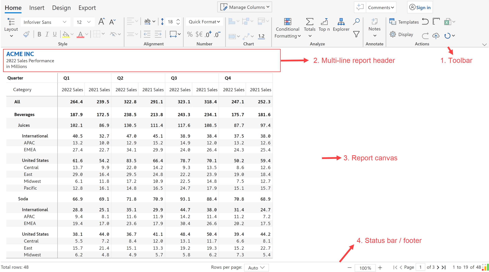
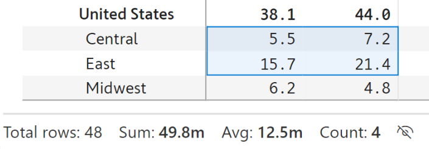

# Report interface

The Inforiver matrix report interface contains the following sections:

<figure><figcaption>
Inforiver report interface
</figcaption></figure>

1. Toolbar: The multi-tab toolbar has several action items that can be used to configure the report
2. Report header: The multi-line, formattable report header can be used to provide additional information on the report&#x20;
3. Report canvas: this section contains the body of the report where information is displayed in tabular form
4.  Status bar: The status bar contains information such as the following

    * Aggregation information: Displays the number of rows. When a measure is selected, this section can also show metrics such as sum, average, and count.

    <figure><figcaption>
Status bar
</figcaption></figure>

    * Zoom/Un zoom controls: You can use the controls provided in the footer or use the keyboard shortcuts (Ctrl + / Ctrl -)&#x20;
    * Pagination controls: You can use first-previous-next-last navigation controls, and also set the number of rows per page.

In the next section, we'll look at the available [layout options](layout-options.md).
