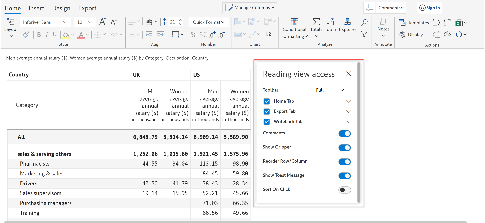

# Toolbar options

Inforiver supports minimal toolbar options for a better user experience in the small screen mode. You can also allow/restrict toolbar options to report viewers and a preview of the reading mode toolbar can be seen right from the edit mode. The available options are shown in the below image.

<figure><figcaption>
Toolbar options
</figcaption></figure>

## 1. Full

The 'Full' option shows the full view of the toolbar covering all the features under the 'Home', 'Insert', 'Design' and 'Export' tabs.

By default, all reports display the full view of the toolbar as shown below.

<figure><figcaption>
Full view of toolbar
</figcaption></figure>

## 2. Minimal

The 'Minimal' option shows the minimal view of the toolbar with options such as Layout, Top N, Auto fit, Row height, Notes, Export and many more as shown in the below image.&#x20;

<figure><figcaption>
Minimal toolbar
</figcaption></figure>

## 3. Minimal with tabs

The 'Minimal with tabs' option shows the tabs and the minimal toolbar as shown in the below image.

<figure><figcaption>
Minimal with tabs
</figcaption></figure>

## 4. Reading view preview

If you have [restricted access](toolbar-options.md#6.-set-reading-view-access) to certain toolbar options for your report consumers, you can preview the reading view toolbar right from Power BI Desktop.&#x20;

Click on the 'Reading view preview' option as shown.

<figure><figcaption>
Reading view preview option
</figcaption></figure>

This will give you a preview of how the report will look in the reading view.

<figure><figcaption>
Reading view mode
</figcaption></figure>

To switch back to the editing mode, click on the 'Show edit mode' option from the toolbar options.

<figure><figcaption>
Show edit mode option
</figcaption></figure>

## 5. Unpin toolbar

You can detach the toolbar and view the report in full screen using the 'Unpin toolbar' option.

<figure><figcaption>
Unpin toolbar
</figcaption></figure>

The unpinned toolbar is shown below.

<figure><figcaption>
Unpinned toolbar
</figcaption></figure>

You can pin it back by clicking the icon highlighted in the below image.

<figure><figcaption>
Pin toolbar
</figcaption></figure>

## 6. Set reading view access

You can customize the toolbar options that are available for the report consumers in reading mode of Power BI service.

Click the 'Set reading view access' option from the drop-down.

<figure><figcaption>
Set reading view access option
</figcaption></figure>

You can see the 'Reading view access' modal.

<figure><figcaption>
Reading view access modal
</figcaption></figure>

In this modal you can enable/disable the following options:

#### Toolbar

Using this option you can specify how you want the toolbar to be displayed in reading view mode.

* **Auto -** This option displays your current toolbar in the reading view mode
* **Full -** This option displays the [full toolbar](toolbar-options.md#1.-full)
* **Minimal -** This option displays the [minimal toolbar](toolbar-options.md#2.-minimal)
* **Minimal with tabs -** This option displays the [minimal toolbar with tabs](toolbar-options.md#3.-minimal-with-tabs)
* **Off -** This option [unpins the toolbar](toolbar-options.md#5.-unpin-toolbar)

#### Home tab

Enabling this option will display the 'Home' tab in the toolbar if the report is in reading view mode. Click 'Caret' next to the right of the 'Home' tab to expand it. This will display additional sub-options.&#x20;

You can enable/disable the following options to show/hide in the toolbar under the 'Home' tab: Layout, Style, Text, Format, Visualize, Data, Notes, and Settings.

<figure><figcaption>
Home tab sub options
</figcaption></figure>

#### Insert tab

Enabling this option will display the 'Insert' tab in the toolbar if the report is in reading view mode. Click 'Caret' next to the right of the 'Insert' tab to expand it. This will display additional sub-options.&#x20;

You can enable/disable the following options to show/hide in the toolbar under the 'Insert' tab: Customize, Compare, Stimulate, Data input, and Logs.&#x20;

<figure><figcaption>
Insert tab options
</figcaption></figure>

#### Export tab

Enabling this option will display the 'Export' tab in the toolbar if the report is in reading view mode. Click 'Caret' next to the right of the 'Export' tab to expand it. This will display additional sub-options.&#x20;

You can enable/disable the following options to show/hide in the toolbar under the 'Export' tab: Export to pdf and Export to excel.

<figure><figcaption>
Export tab options
</figcaption></figure>

#### Show gripper

Enabling this option will show a gripper and context menu (the menu that displays on the right-click of the mouse) for rows and columns.&#x20;

In this image, the context menu appears on right-click when the report is in the reading view mode.

<figure><figcaption>
Context menu on reading view mode
</figcaption></figure>

#### Reorder row/column

If you enable this option, you can easily drag and drop the rows and columns for easy reordering in reading view mode.

<figure><figcaption>
Reorder row/column option
</figcaption></figure>

#### Show toast message

Enabling this option will display the toast message in the reading view mode. In the image below, a 'Copied to clipboard' toast message is displayed in the reading mode when the 'Copy to clipboard' option is clicked.

<figure><figcaption>
Show toast message option
</figcaption></figure>

#### Sort on click

If this option is enabled, then clicking on the column header will sort the data in the column in ascending/descending order in the reading view mode.

In the below image, the up arrow on the column header is highlighted indicating that the column is sorted in descending order.

<figure><figcaption>
Sort on click option
</figcaption></figure>

#### Show search

Enabling this option will display the search icon and search bar at the top of the report in the reading view mode.


The 'Show search' option is available only if the 'Toolbar' option is set to 'Off' in the 'Reading view access' modal


<figure><figcaption>
Show search icon option
</figcaption></figure>

## 7. Quick access

Using the 'Quick access' option, you can quickly search for specific features and find the shortcut or directly navigate to it.&#x20;

Select the 'Quick access' option.&#x20;

<figure><figcaption>
Quick access
</figcaption></figure>


The keyboard shortcut for the Quick access option is **'Ctrl+F'**


A pop-up opens as shown below. The options are hyperlinked and help you navigate directly to the tool bar tab, side panel or dialog box. Let's click on 'Manage (Columns)'.

<figure><figcaption>
Quick access pop up
</figcaption></figure>

The 'Manage columns' side panel opens up as shown in the below image.

<figure><figcaption>
Aggregation
</figcaption></figure>

In the next section, we'll be covering [Keyboard shortcuts](keyboard-shortcuts.md).
