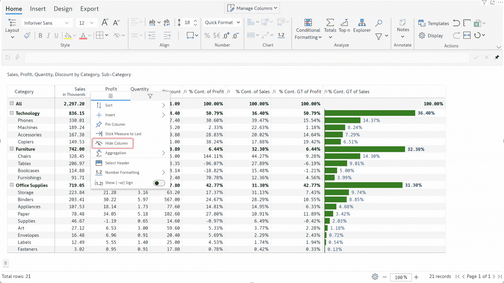

# Column gripper

You can use the column gripper context menu to quickly sort or show/hide fields or insert a new field. Let's look at the various options in detail.

#### 1. Sort

You can use the _Sort_ option to sort your data in ascending/descending order or apply an absolute sort.  For hierarchical datasets, sorting is applied to the child rows for each level of the hierarchy.

<figure><figcaption>
Sort option
</figcaption></figure>

In the example, the Jan > Profit measure has been sorted in ascending order.

<figure><figcaption>
Sorted data for the Profit column
</figcaption></figure>

#### 2. Insert

The _Insert_ option can be used for the following operations:

* **Copy as data input** - Create a new data input field. The values will be copied from the selected measure.
* **New data input** - Create a new empty data input field
* **Insert formula** - Create a new field using a built-in formula

Learn more about [data input](../../4.-adding-business-logic-and-formulae/insert-manual-input-rows.md) and [formula measures](../../4.-adding-business-logic-and-formulae/insert-calculated-columns.md).

<figure><figcaption></figcaption></figure>

#### 3. Change to visual column

When you assign measures or dimensions to the AC/PY/PL/FC/Others parameters, the native measures and dimensions are displayed for each column dimension category. You can display them as visual columns by selecting the **Change to visual column** option.

<figure><figcaption>
Change to visual column option
</figcaption></figure>

Notice how the Profit measure has been converted into a visual column.

<figure><figcaption>
Native measure converted into a visual column
</figcaption></figure>

#### 4. Pin column

The pin column option allows you to tag important columns right at the beginning of your report - saving you the effort required to scroll back and forth.

<figure><figcaption></figcaption></figure>

In the example, the Dec>Profits and Apr>Sales have been pinned to the beginning of the report.

<figure><figcaption></figcaption></figure>

You can also choose to unpin a particular field or unpin all fields.

<figure><figcaption></figcaption></figure>

#### 5. Ignore measure in null suppression

If your report has non-numeric data along with measures and all the measure values are null for certain rows, you may want to suppress such rows as they do not add value to the report.

Notice the row highlighted in the report below, all Sales values are null. You can suppress these rows with the **Ignore Measure in Null Suppression** option.


The Hide Blanks option under Hierarchy settings should be set to **Visible Values**.


Notice how the highlighted row with null measure values is suppressed after selecting the option.

<figure><figcaption>
Ignore measure in null suppression
</figcaption></figure>

#### 6. Stick Measure to Last

In some cases, using field measures can cause an automatic re-ordering of columns in the report. You may want a particular field, for instance, a field with an embedded chart,  to always retain its position at the end of the report. You can use the _Stick Measures to Last_ option to assign one designated measure to the last position. The last position will be retained even if new fields are added to the visual.

<figure><figcaption>
Stick measures to last
</figcaption></figure>

#### 7. Hide Column

You can use the _Hide Column_ option to mask a particular column in your report. In the animation below, notice how the Profit measure has been hidden in the report.&#x20;


You can use the _Show All Columns_ option to display hidden columns again.


<figure><figcaption>
Hiding columns
</figcaption></figure>

#### 8. Aggregation

Using this option, you can directly set the aggregation method used to calculate the totals and subtotals for a particular column. Learn more about [managing aggregation](../../manage-aggregations/).

<figure><figcaption>
Measure aggregation for totals and subtotals
</figcaption></figure>

#### 9. Select Measure

You may need to perform operations such as applying uniform formatting for a measure. Rather than selecting each measure and applying formatting, you can use this option to select a particular measure across the entire report and apply formatting in a single shot. In the animation below, notice how the Discount measure has been selected for all months.

<figure><figcaption>
Select measure option
</figcaption></figure>

#### 10. Select header

Use the Select Header option to apply custom formatting to the measure header.&#x20;

<figure><figcaption>
Select measure header
</figcaption></figure>

#### 11. Number formatting

You can use this option to directly set a custom scaling factor for a particular measure.

<figure><figcaption>
Number formatting
</figcaption></figure>

#### 12. Semantic formatting

Display negative values in parentheses or choose to place the negative sign after the number with **Semantic formatting** options.

<figure><figcaption>
Semantic formatting
</figcaption></figure>
