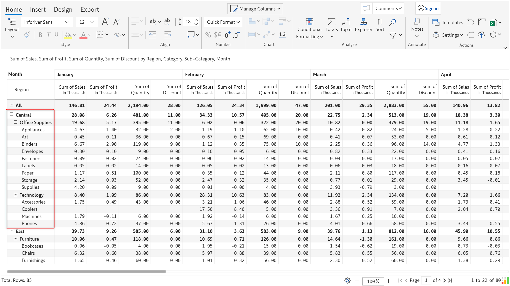
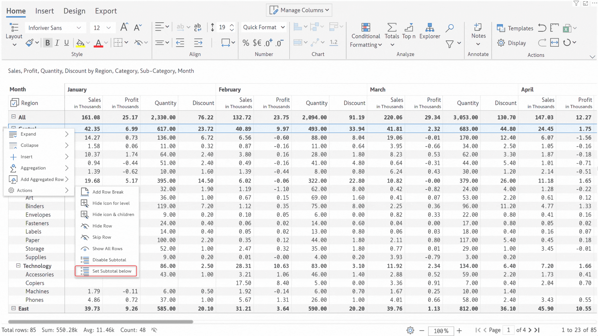

# Row gripper

In this section, let's explore the various options in Inforiver to customize rows in your reports.&#x20;

#### 1. Freeze grand total

If you have set a multi-page layout with scrolling,  use this option to ensure the grand total row is fixed to the top of the page.

<figure><figcaption>
Freeze grand total
</figcaption></figure>

#### 2. Select category dimension

Select all the categories at a particular hierarchy level using this option. You can apply styling or number formatting to all the selected rows.

<figure><figcaption>
Select row dimension category
</figcaption></figure>

#### - Select descendants

Selects the children under a particular row dimension category.

<figure><figcaption>
Select descendants
</figcaption></figure>

#### - Select parent and descendants

Selects all the children as well as the parent row dimension category.

<figure><figcaption>
Select parent and descendants
</figcaption></figure>

#### 3. Expand/Collapse

Inforiver makes it effortless for you to handle large hierarchical datasets. Instead of manually expanding or collapsing each level of the hierarchy, you have various options in the row gripper. [Learn more about managing hierarchies.](../manage-hierarchies.md)

<figure><figcaption></figcaption></figure>

#### 4. Insert

You can easily insert rows from the row gripper menu. Let's explore the different types of rows that can be inserted using this option.

<figure><figcaption>
Insert rows option
</figcaption></figure>

a) Formula

You can create a new row using Inforiver's built-in formulas or write a custom calculation. [Learn more about calculated rows](../../4.-adding-business-logic-and-formulae/insert-calculated-rows/).

b) Data input

You can insert a row and manually enter data using the static row option. [Learn more about static rows.](../../4.-adding-business-logic-and-formulae/insert-manual-input-rows.md)

c) Add Break Row

Insert break rows to demarcate row categories. You can also apply formatting, such as setting the color for break rows.

d) Empty row

Financial statements and reports often require options to add white spaces for formatting. Inforiver provides the insert empty row option to achieve this in a single click.  [Learn more about empty rows](../../2.-displaying-information/basic-formatting/insert-blank-rows.md).

e) Row hierarchy

Use this option to insert a user-defined level into hierarchical data. [Learn more about row hierarchies.](../../4.-adding-business-logic-and-formulae/insert-manual-input-rows.md#id-3.-row-hierarchy)

f) Insert row(s)

You create visual level hierarchies or bulk insert multiple row categories using this option. [Learn more about bulk inserting rows](../../4.-adding-business-logic-and-formulae/insert-manual-input-rows.md#id-2.-bulk-insert-static-rows).

#### 5. Actions

The actions section has various formatting and customization options for rows. Let's take a detailed look.

<figure><figcaption>
Actions
</figcaption></figure>

a) Add row break

You can use this option to set pagination based on the category i.e. your report will have one page per category. This option is available in the row gripper for parent nodes only.

<figure><figcaption></figcaption></figure>

We have used the _Add Row Break_ option to create one page corresponding to each category - Technology, Furnishings, and Office Supplies.

<figure><figcaption></figcaption></figure>

b) Hide Icon for level

You can use this option to disable the expand/collapse icon for a particular level of the hierarchy. The hierarchy will always be in an expanded state for that level.

<figure><figcaption></figcaption></figure>

Notice how the expand/collapse icon has been removed for the category level i.e. Furniture, Office Supplies, and Technology.

<figure><figcaption></figcaption></figure>

c) Hide icon and children

This option removes the expand collapse icon and hides all the child rows, retaining only the parent row.

<figure><figcaption></figcaption></figure>

Notice how all the children under the Furniture category have been hidden and the expand/collapse icon has been removed.

<figure><figcaption></figcaption></figure>

d) Hide row

This option can be used to mask rows in the report. Note that hidden rows will still be included in total and sub-total calculations.

<figure><figcaption></figcaption></figure>

The 'Bookcases' row has been masked using this option. Use the _Show All Rows_ option from the row gripper to display the hidden rows.

<figure><figcaption></figcaption></figure>

e) Skip row

The skip rows option can be used when you need to effectively perform a soft delete on a row - the row will be excluded from totals and exports.


Use the Alt + G shortcut to select multiple rows and skip all of them.


<figure><figcaption></figcaption></figure>

The 'Furniture' row and all its children have been removed using the _Skip row_ option and the totals and sub-totals have been adjusted accordingly. This option can be used to skip individual child rows as well.

<figure><figcaption>
Furniture row before skipping
</figcaption></figure> <figure><figcaption>
Furniture row and children and skipped
</figcaption></figure>

f) Skip and show row

This option will exclude the selected row category from totals and subtotals, but the row will still be displayed. The icon indicates that the row has been skipped.

<figure><figcaption>
Skip and show row
</figcaption></figure>

g) Disable Subtotal

Use this option to remove all the sub-total aggregations for parent nodes in the hierarchy. This option is available in the row gripper for parent nodes only. In the animation below, notice how all the subtotal calculations have been removed using this option.

<figure><figcaption></figcaption></figure>

h) Set Subtotal below

This option will position the parent sub-total rows below the child rows. In the animation below, notice how the subtotal rows have been moved to the bottom, below all the child rows.

<figure><figcaption>
Set subtotal below
</figcaption></figure>

i) Hide ruler

In the Table and Stepped layout, [rails ](../actions/rails.md)are displayed in the report by default. If you do not require rails for formatting, a Hide ruler option has been added to the row gripper under the Actions section. This is primarily intended for report authors who are unaware of the rails option on the toolbar.

<figure><figcaption>
Hide ruler
</figcaption></figure>

#### 8. Ungroup

You can use the row gripper to flatten custom row hierarchies. Notice how the parent _Operations_ group is removed and the child categories are converted into parent categories after ungrouping.

<figure><figcaption>
Ungroup
</figcaption></figure>


The Remove Group option will delete the parent category i.e. remove the selected level of the hierarchy including all child records.

