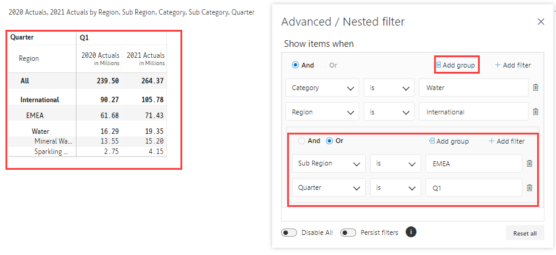

# Search & Filter

The search & filter features help you to focus on relevant data when there are a large number of records.

## 1. Search

The 'Search' option helps you find characters, words, and phrases in your Inforiver report.

a) In the 'Home' tab of the toolbar, click on the 'Search' icon **** in the Analyze section.

<figure><figcaption>
Search
</figcaption></figure>

b) Type the text/value in the search box. Inforiver starts narrowing down the matches as soon as you start typing. Navigate through the results using the up and down arrows.

<figure><figcaption>
Search Box
</figcaption></figure>

c) You can also search numeric values as shown in the below image.

<figure><figcaption>
Value Search
</figcaption></figure>


Inforiver searches across pages if you are using the multiple pages option in the 'Design' tab or you have added page breaks.&#x20;


## 2. Filter

Inforiver provides nested AND/OR filtering options to filter a range of data based on the criteria you define.

a) In the 'Home' tab of the toolbar, click on the 'Filter' icon **** in the Analyze section.

<figure><figcaption>
Filter
</figcaption></figure>

b) Click 'Add Filter'. You can filter by row or column hierarchies, or by measures. Inforiver provides conditions depending on the filter selected. Enter a condition as shown below.

<figure><figcaption>
Add Filter
</figcaption></figure>

c) The data has been filtered to show only the rows corresponding to the category 'Water' as shown in the image.

<figure><figcaption>
Filter Result
</figcaption></figure>

d) You can add multiple filters using the 'Add Filter' **** option and can apply nested AND/OR conditions. In the below example, we have added one more condition to filter only the International region for the category Water.

<figure><figcaption>
Nested Filters
</figcaption></figure>

e) Inforiver also provides an option to add filter groups. Click 'Advanced'.&#x20;

<figure><figcaption>
Advanced Filter
</figcaption></figure>

f) Click 'Add group'. In the below image, we have added four conditions nested using AND/OR and using two filter groups. The filtered table is also shown.

<figure><figcaption>
Group Filter
</figcaption></figure>

g) You can delete the individual filters by clicking on the 'Delete' icon available next to the condition.

h) If you want to temporarily turn off all the filters, select the 'Disable all' **** option.

i) The 'Persist filters' option ensures the filters are retained when switching between pages in the report.&#x20;

j) Click on **** 'Reset all' to reset all the filters.

<figure><figcaption>
Delete, Reset, Disable All, Persist Filters
</figcaption></figure>
