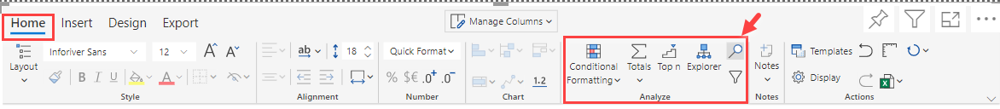
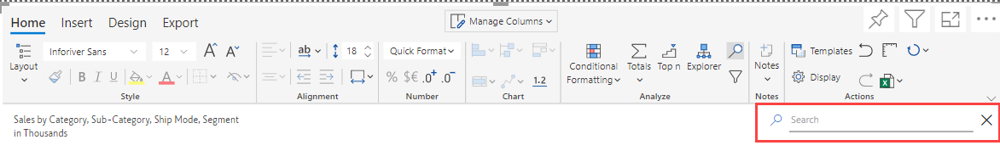
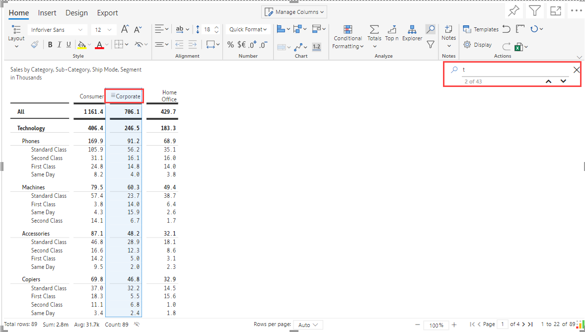
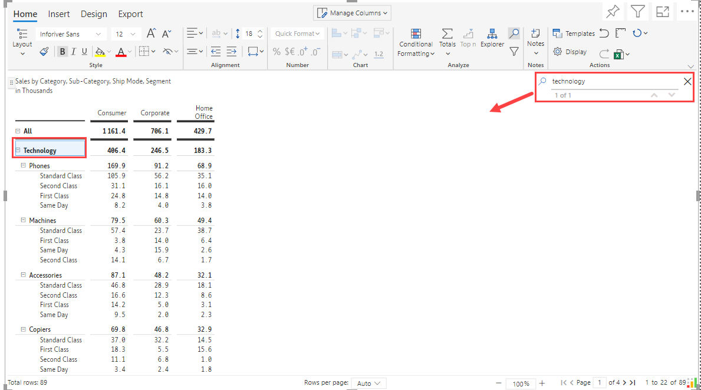

# Search & Filter

## SEARCH

In this section, let us get to know how the **Search** feature works in Inforiver. **Search** option enables you to find a specific content by inputting the text/value that you search for.

Let us get to know the **Search** functionality in detail below. Consider the example of searching for a record with the name **Technology**.

* From the toolbar, navigate to the **Home** tab, click **Search icon** .png>) from the **Analyze** section.

<figure><figcaption>
Search
</figcaption></figure>

* Input a text/value which you want to search in the search box as shown in the below image.

<figure><figcaption>
Search Box
</figcaption></figure>

* As you type in the search box, application fetches you the various instances of the search value.
* Using the **Up** and **Down Arrow**, **** you can navigate and find the required string/value.&#x20;

<figure><figcaption>
Searching across fields
</figcaption></figure>

* Input the search value, thus you can find the required string/value as shown in the below image.

<figure><figcaption>
Search for technology
</figcaption></figure>

## FILTER

In this section, let us get to know how the **Filter** feature works in Inforiver. **Filter** enables you to find, show or hide values based on single or multiple filtering conditions.

From the toolbar, navigate to the **Home** tab, click **Filter icon** .png>)from the **Analyze** section.
