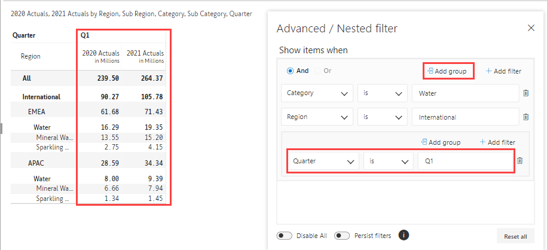

# Search & Filter

The search & filter features help you to focus on relevant data when there are a large number of records.

## SEARCH

The 'Search' option helps you find characters, words, and phrases in your Inforiver report.

* In the 'Home' tab of the toolbar, click on the 'Search' icon **** in the **Analyze** section.

<figure><figcaption>
Search
</figcaption></figure>

* Type the text/value in the search box. Inforiver starts narrowing down the matches as soon as you start typing. Navigate through the results using the up and down arrows.

<figure><figcaption>
Search Box
</figcaption></figure>

You can also search values as shown in the below image.

<figure><figcaption>
Value Search
</figcaption></figure>


Inforiver searches across pages if you are using the multiple pages option in the 'Design' tab or you have added page breaks.&#x20;


## FILTER

**Filter** enables you to find, show or hide values based on single or multiple filtering conditions.

* From the toolbar, navigate to the **Home** tab, click **Filter icon** .png>)from the **Analyze** section.

<figure><figcaption>
Filter
</figcaption></figure>

* Click **Add Filter**, select the criterion based on which you want to filter the data.
* Inforiver gives you many filtering conditions like “is”, “is not”, “is not one of”, "contains" and so on. Choose any of the options as per the requirement.
* Input the value based on which filtering is to be performed.

<figure><figcaption>
Add Filter
</figcaption></figure>

<figure><figcaption>
Filter Result
</figcaption></figure>

* You can add multiple filters by clicking **Add Filter** and can apply **AND/OR** conditions.

<figure><figcaption>
Multiple Filters
</figcaption></figure>

* Click on **Advanced** to have more filtering options, where you can group a certain set of filtering conditions by clicking **Add group** and thus can apply **AND/OR** in between the filter groups.

<figure><figcaption>
Advanced Filter
</figcaption></figure>

<figure><figcaption>
Group Filter
</figcaption></figure>

* You can delete the individual filters applied by clicking on the **delete** icon available next to the condition row.
* Click on **Disable All** toggle to clear all the filters applied at once.
* Enabling **Persist filters** toggle allows you to keep the filter active while switching between different pages and tabs.
* Click on **Reset all** to remove all the filters and reset to its previous format.

<figure><figcaption>
Delete, Reset, Disable All, Persist Filters
</figcaption></figure>
