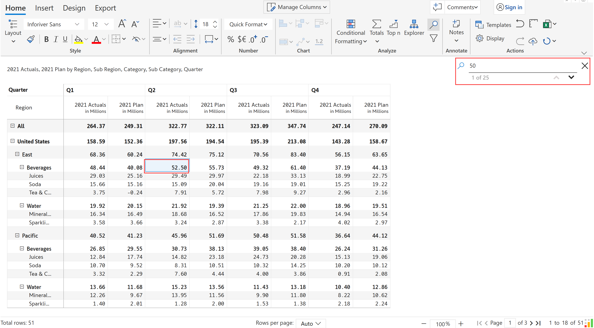
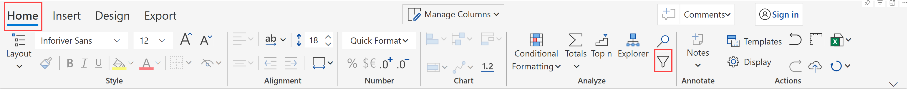

# Search & Filter

The search & filter features help you to focus on relevant data when there are a large number of records.


Search & filter - Overview


## 1. Search

The 'Search' option helps you find characters, words, and phrases in your Inforiver report.

a) In the 'Home' tab of the toolbar, click on the 'Search' icon in the Analyze section.

<figure><figcaption>
Search option in toolbar
</figcaption></figure>

b) Type the text/value in the search box. Inforiver starts narrowing down the matches as soon as you start typing. Navigate through the results using the up and down arrows.

<figure><figcaption>
Search box
</figcaption></figure>

c) You can also search numeric values as shown in the below image.

<figure><figcaption>
Value search
</figcaption></figure>


Inforiver searches across pages if you are using the multiple pages option in the 'Design' tab or you have added page breaks.&#x20;


## 2. Filter

Inforiver provides nested AND/OR filtering options to filter a range of data based on the criteria you define.

### 2.1. Nested and grouped filters

a) In the 'Home' tab of the toolbar, click on the 'Filter' icon in the Analyze section.

<figure><figcaption>
Filter option in toolbar
</figcaption></figure>

b) Click 'Add Filter'. You can filter by row or column hierarchies, or by measures. Inforiver provides conditions depending on the filter selected. Enter a condition as shown below.

<figure><figcaption>
Add filter
</figcaption></figure>

c) The data has been filtered to show only the rows corresponding to the category 'Water' as shown in the image.


You can apply filters on manual input rows like calculated rows/static rows/template rows etc. Learn more about [manual input rows](../../4.-adding-business-logic-and-formulae/insert-manual-input-rows.md) and [calculated rows](../../4.-adding-business-logic-and-formulae/insert-calculated-rows/).


<figure><figcaption>
Filter result
</figcaption></figure>

d) You can add multiple filters using the 'Add Filter' option and can apply nested AND/OR conditions. In the below example, we have added one more condition to filter only the International region for the category Water.

<figure><figcaption>
Nested filters
</figcaption></figure>

#### Add group

e) Inforiver also provides an option to add filter groups. Click 'Advanced'.&#x20;

<figure><figcaption>
Advanced filter
</figcaption></figure>

f) Click 'Add group'. In the below image, we have added four conditions nested using AND/OR and using two filter groups. The filtered table is also shown.

<figure><figcaption>
Group filter
</figcaption></figure>

g) You can delete the individual filters by clicking on the 'Delete' icon available next to the condition.

h) If you want to temporarily turn off all the filters, select the 'Disable all' option.

i) The 'Persist filters' option ensures the filters are retained when switching between pages in the report.&#x20;

j) Click on 'Reset all' to reset all the filters.

<figure><figcaption>
Delete, Reset, Disable All, Persist filters
</figcaption></figure>

#### Filtering manual input rows

Inforiver filters can detect manually inserted row categories and calculated rows. You can apply filters for data input or calculated rows just like you do for row categories from the dataset.

In the example below, the _HighTouch_ and _Vsense_ rows are manual input rows created within the Inforiver visual. Notice how even manual input row categories are detected by the filter.

<figure><figcaption>
Filtering manual input row categories
</figcaption></figure>

### 2.2. Column-level filter

Inforiver provides nested AND/OR column-based filtering options to filter a range of data based on the criteria you define.&#x20;

a) When you hover over any column, a hamburger menu appears as highlighted. Click on the hamburger menu (column gripper) and then click on the icon.

<figure><figcaption>
Column filter
</figcaption></figure>

b) Choose the filter condition from the drop-down and enter the filter value. Let us consider an example to apply the column filter 'Greater than 4 million' to the '2021 Actuals' measure. The data gets filtered to show only the values corresponding to the filter condition as shown in the image.

<figure><figcaption>
Filter result
</figcaption></figure>

d) You can add nested AND/OR filters by clicking the 'Add rule' option. In the below example, we have added one more condition - '2021 Actuals' less than 10 million.

<figure><figcaption>
Nested column filter
</figcaption></figure>


You can click 'Clear filter' to clear all the column filters applied.


In the next section, we'll look at the [KPI Explorer](explorer.md).&#x20;
