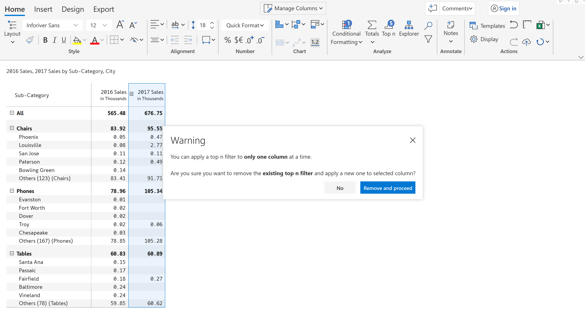

# Top N + others

Top N answers questions such as _Customers_ contributing to the most revenue, _Spend Categories_ that consume most of the budget etc.&#x20;


Top N + Others - Overview


In this section, let us see how the Top N feature works in Inforiver.&#x20;

Consider the example of displaying the Top 2 categories which generated maximum Revenue.

a) Select the Revenue column.

b) In the 'Home' tab of the toolbar, select 'Top n' from the 'Analyze' section. The Top N dialog box appears. Fill in the details to filter the Top 2 categories. Click 'Apply'.


To show the top 2% of items, just change the selection ‘Value’ to ‘Percentage’.


<figure><figcaption>
Top N dialog box
</figcaption></figure>

c) You can see the top 2 categories with the remaining categories grouped under 'Others'_._ It also indicates how many items are a part of the 'Others' row.

<figure><figcaption>
Others section
</figcaption></figure>

d) Hover over the 'Others' row to see a preview of the items grouped under Others.  Click on the expand icon to view all the categories that have been classified as Others. This will display all the categories under 'Others' in a separate window.

<figure><figcaption>
Others category details
</figcaption></figure>

e) To remove a category from the Others group, right click on the category and select the 'Remove from others' options from the menu.

<figure><figcaption>
Remove from others option
</figcaption></figure>

Notice how the selected category has been removed from the 'Others' group.&#x20;

<figure><figcaption>
Remove from others result
</figcaption></figure>

### 1. Nested rules

a) To do a nested Top N, like the bottom 3 sub-categories in each of the top 2 categories, you can create multiple rules by clicking ‘Add rule’ and filling in the fields as shown. Click 'Apply'.

<figure><figcaption>
Nested rules
</figcaption></figure>

b) The above setup displays the following output. Note that the 'Others' row is available for categories and subcategories.

<figure><figcaption>
Nested top N
</figcaption></figure>

### 2. Multi-level nested rules

a) You can increase the number of hierarchy levels even beyond two (2). Add rules as below to configure the third category.

<figure><figcaption>
Multilevel nested top N
</figcaption></figure>

This configuration gives the following output.&#x20;

<figure><figcaption>
Multilevel top N result
</figcaption></figure>

### 3. Suffix ‘Others’

When using the multi-level and nested Top N implementation, it may not be clear as to what a specific 'Others' row refers to.

<figure><figcaption>
Suffix others
</figcaption></figure>

To address this, Inforiver provides an option that appends the category name to 'Others' for each instance of others, except the one at the outer-most level.

<figure><figcaption>
Suffix others with category name
</figcaption></figure>

To delete a Top N condition, click on the 'Delete' icon. To clear all the Top N conditions, click on 'Reset all'.

<figure><figcaption>
Delete &#x26; reset
</figcaption></figure>

A warning message gets displayed when you try to apply Top N on more than one column/measure. You need to remove the existing filter and apply a new one to the selected column by clicking on 'Remove and proceed'.

<figure><figcaption>
Applying top N filter on multiple columns throws a warning
</figcaption></figure>

In the next section, we'll be covering [sorting & reordering data](../sort-and-reorder-data.md).

#### Resources

[The Business Case for dynamic & nested Top N + Others reports](https://inforiver.com/blog/general/the-business-case-for-dynamic-nested-top-n-others-reports/)

[Dynamic and nested Top N + Others in Power BI](https://inforiver.com/blog/general/dynamic-and-nested-top-n-others-in-power-bi/)
