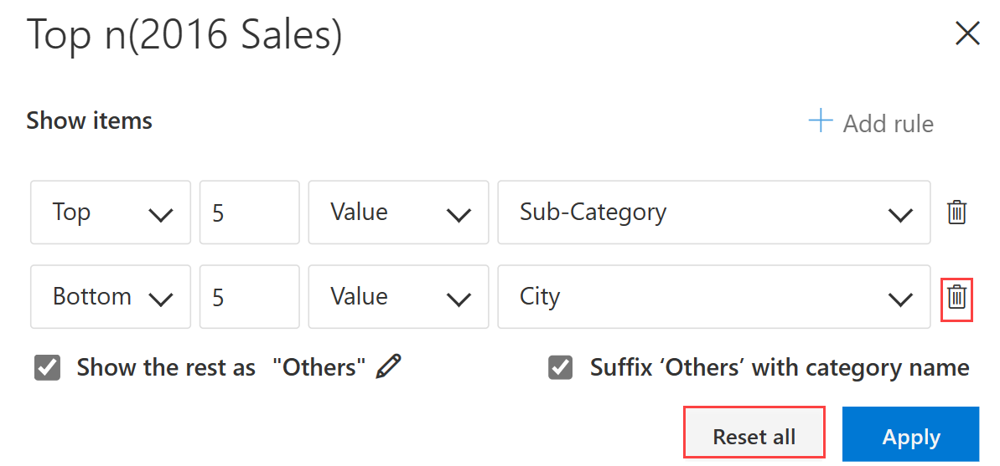

# Top N

In this section, let us see how the Top N feature works in Inforiver. Top N answers questions such as _Customers_ contributing to the most revenue, _Spend Categories_ that consume most of the budget etc.

Consider the example of displaying the Top 5 Cities by Sales for each Subcategory.

a) Select the Sales (2016 Sales) column.

b) In the 'Home' tab of the toolbar, select 'Top N' from the 'Analyze' section.

<figure><figcaption>
Top n
</figcaption></figure>

c) In the Top N dialog box that appears, input the following fields:

* Top/Bottom/Both: Both displays Top and Bottom values (Both)
* Number of items (5)
* Condition-based on Value or Percentage (Value)
* Field to which condition to be applied (Sub-Category)

<figure><figcaption>
Choose from Top, Bottom or Both
</figcaption></figure>

d) To display the remaining categories as Others, check the respective checkbox. Inorder to customize the name “Others”, click on the Pen icon.

e) Check “Suffix Others with category name”, to display the category label along with Others.

<figure><figcaption>
Aggregate &#x26; Suffix Others
</figcaption></figure>

f) Click Apply, the result is shown below.

<figure><figcaption>
Top 5 Subcategory based on the Value
</figcaption></figure>

g) To apply another Top n condition, follow the same procedure as illustrated above.

* In the Top n dialog box, click on Add rule.
* Select the fields as shown in the below image:

<figure><figcaption>
Add rule
</figcaption></figure>

<figure><figcaption>
Showing result with added rule
</figcaption></figure>

h) To delete a Top n condition, click on the respective Delete icon.

i) To clear all the Top n conditions, click on Reset All Button.

<figure><figcaption>
Delete &#x26; reset
</figcaption></figure>


A warning message gets displayed when you try to apply Top n on more than one column/measure.


<figure><figcaption>
Warning message
</figcaption></figure>

In the next section, we'll look at&#x20;
