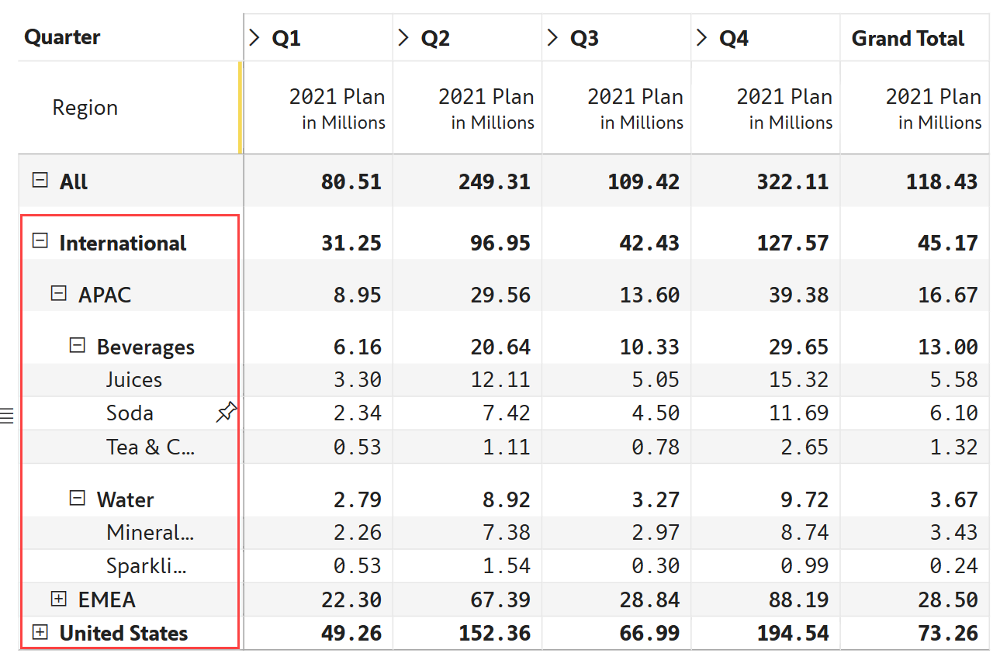
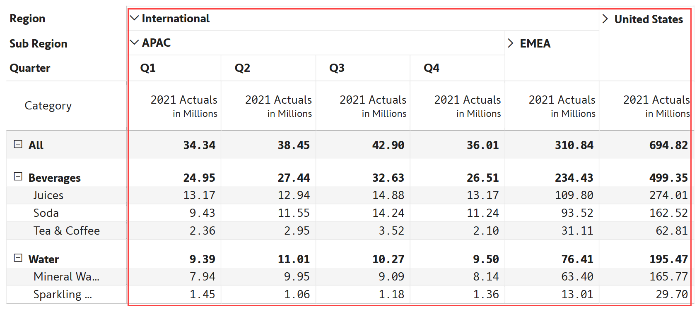

# Manage hierarchies

Inforiver provides a number of options to manage hierarchies such as expanding or collapsing row/column hierarchies to specified levels, descendants and more.&#x20;

Currently, in a native Power BI matrix, you cannot expand or collapse columns freely as you can do with rows. With Inforiver, you can expand/collapse specific columns to reveal their children, just as we can do with the row hierarchies in the native Power BI visual.

## 1. Row hierarchies

In this example, the hierarchy in rows is Region -> Sub Region -> Category -> Sub Category.

You can expand/collapse **individual rows** using the expand/collapse icons (3) (1).png>). In the image below, you can see that International is fully expanded to the last level, while EMEA and United States remain collapsed.&#x20;

<figure><figcaption>
Row hierarchy
</figcaption></figure>

Inforiver also provides a number of options for expanding/collapsing all branches, expanding/collapsing to a specific level etc. To access these options, mouse over any row, and click on the hamburger menu.&#x20;

<figure><figcaption>
Available actions
</figcaption></figure>

### a) Expand

You can perform the following **Expand** actions.

#### i. **Expand all**&#x20;

Expand all items in the rows to reveal the lowest level across all branches.

For example, click on any row and 'Expand all', all the rows till the subcategories will be revealed.

#### ii. **Expand level**&#x20;

The immediate descendants for the selected level are shown for all the branches.&#x20;

For example, if you select the row United States and 'Expand Level', the categories will be revealed for _all the regions._

#### iii. **Expand descendants**&#x20;

All the descendants for the selected row are shown.&#x20;

For example, if you select the row United States and 'Expand descendants', the categories and subcategories are expanded _only for the United States row._

#### iv. **Expand specific level**&#x20;

The descendants are expanded to a specific level for all the branches.&#x20;

For example, if you select the row United States and 'Expand Sub category', the categories and subcategories are expanded for all the regions.

### b) Collapse

You can also perform the following **Collapse** actions.

#### i. **Collapse all**&#x20;

Collapse all items in the rows to reveal only the highest level across all branches.

For example, click on any row and 'Collapse all', only the regions will be shown.

#### ii. **Collapse descendants**&#x20;

All the descendants for the selected row are hidden.&#x20;

For example, if you select the row East and 'Collapse descendants', the categories and subcategories are hidden _only for the East row._

#### iii. **Collapse specific level**&#x20;

The descendants are collapsed to a specific level for all the branches.&#x20;

For example, if you select the row Beverages and 'Collapse Region', the categories and subcategories are hidden for all the regions.

### c) Hide hierarchy

You can add a layer of abstraction to the report by choosing whether to display the child nodes under a hierarchy.

#### i. Hiding child rows

To hide all the child rows contributing to a parent row, click on the row gripper for the parent row and select the 'Hide icon & children for current row' option from the 'Show/Hide Expand icon' section.

<figure><figcaption>
Hide child nodes in a hierarchy
</figcaption></figure>

The child rows under the 'TV and Video' level have been hidden.

<figure><figcaption>
Hiding child rows
</figcaption></figure>

To reinstate the hidden child rows, select the 'Show icon & children for current row' option from the row gripper context menu.

<figure><figcaption>
Reinstating hidden rows
</figcaption></figure>

#### ii. Disabling expand/collapse for levels in the hierarchy

You can also prevent users from expanding and collapsing the hierarchy by hiding the expand icon. This can be achieved by clicking on the row gripper for the parent node and selecting the 'Hide icon for level' option from the 'Show/Hide Expand icon' section.

<figure><figcaption>
Hide icon for level
</figcaption></figure>

Notice how the expand icon has been removed for the hierarchy.

<figure><figcaption>
Hierarchy in expanded state
</figcaption></figure>

To reinstate the icon, select the 'Show icon for level' option from the row gripper context menu.

<figure><figcaption>
Expand icon is enabled
</figcaption></figure>

## 2. Column hierarchies

In this example, the hierarchy in columns is Region -> Sub Region -> Quarter.

You can expand/collapse **individual columns** using the expand/collapse icons  . In the image below, you can see that International -> APAC is fully expanded to show the Quarters, while EMEA and United States remain collapsed.&#x20;

<figure><figcaption>
Column hierarchy
</figcaption></figure>

To access the other expand/collapse options, mouse over the category names on the top-left of the table (Region, Sub Region, and Quarter), as highlighted.

<figure><figcaption>
Hamburger menu
</figcaption></figure>

On clicking the hamburger menu, you can see a list of options.

<figure><figcaption>
List of options
</figcaption></figure>

From this menu, you can perform the following actions:

#### **1. Expand all**&#x20;

Expand all the categories in the columns to the lowest level (Quarter) across all branches

#### **2. Collapse all**&#x20;

Collapse all the categories in the columns to show only the Regions

#### **3. Go to level**&#x20;

This option is useful when there are more than 2 hierarchy levels. Here you can expand all branches to Sub Region, for example

In the next section, we'll be [creating visual hierarchies](create-visual-hierarchies.md) using the Group feature.

#### Resources

[Expand/collapse column hierarchy in Power BI](https://inforiver.com/blog/feature-highlights/expand-collapse-column-hierarchy-in-power-bi/)
