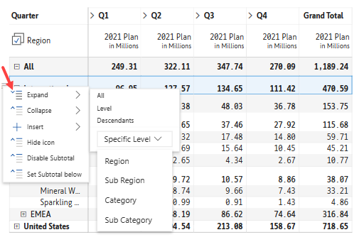
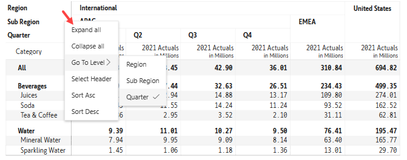

# Manage hierarchies

Inforiver offers the best way of expanding/collapsing row and column hierarchies to its child levels. In Power BI, expanding/collapsing column hierarchies is not possible.

## Row hierarchies

In the sample image below, you can see International and APAC in the rows expanding to reveal its children, while the rest of the branches (EMEA, United States) remain collapsed. You can expand/collapse the rows using the row Hierarchy Icon .png>).

<figure><figcaption>
Row Hierarchy
</figcaption></figure>

A hamburger menu appears when you mouse over any row as highlighted.

<figure><figcaption>
Hamburger Menu
</figcaption></figure>

Clicking the hamburger menu shows a list of options.

<figure><figcaption>
List of Options
</figcaption></figure>

From this menu, you can perform the following actions:

1. Expand - Expand the category to All, Level, Descendants, or chosen Specific Level.
2. Collapse - Collapse the category to All or Descendants, or chosen Specific Level.

## Column hierarchies

In the sample image below, you can see International Region and APAC Sub Region in the columns expanding to reveal the four quarters (Q1, Q2, Q3, Q4), while the rest of the branches (EMEA, United States) remain collapsed. You can expand/collapse the columns using the column hierarchy icons .png>) .

<figure><figcaption>
Column Hierarchy
</figcaption></figure>

A hamburger menu appears when you mouse over the category names on the top-left of the table (Region, Sub Region, and Quarter), as highlighted.

<figure><figcaption>
Hamburger Menu
</figcaption></figure>

Clicking the hamburger menu shows a list of options.

<figure><figcaption>
List of Options
</figcaption></figure>

From this menu, you can perform the following actions:

1. Expand All - Expand all the categories in the columns to their respective child levels(Quarter) across all branches
2. Collapse All - Collapse all the categories in the columns under the respective Regions (shows only the Regions)
3. Go To Level - This option is useful when there are more than 2 hierarchy levels, where you can expand all branches
