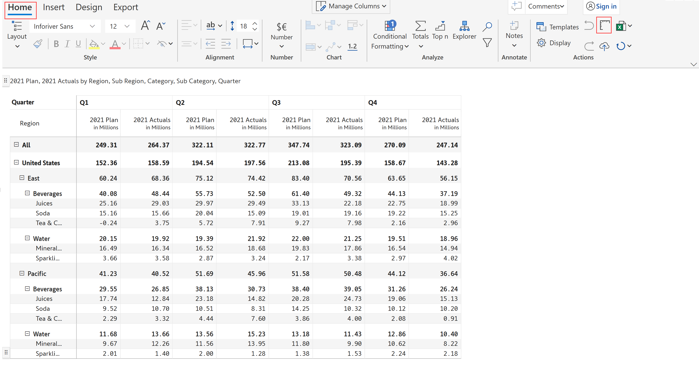

# Rails

Rails allow you to enable the horizontal and vertical ruler and adjust the column width and row height of the visual.

a) In the 'Home' tab of the toolbar, click on the 'Rails' icon **** in the Actions section.

<figure><figcaption>
Rails
</figcaption></figure>


By default, rails are enabled for all the layouts except for Hierarchy, Drilldown and Measures (Pivot).


b) Let's see how to adjust the column width using rails. Simply drag and place the ruler to the desired size as shown below.

<figure><figcaption>
Adjusting the column width using rails
</figcaption></figure>

c) Below is an example of adjusting row height.

<figure><figcaption>
Adjusting the row height using rails
</figcaption></figure>

d) You can select any row/column by clicking the corresponding rail.

e) Hovering over the rails, you can view the gripper for both rows and columns.

<figure><figcaption>
Row gripper
</figcaption></figure>

<figure><figcaption>
Column gripper
</figcaption></figure>

f) You can give numbering over rails. In the 'Home' tab of the toolbar, select 'Display' from the 'Actions' section. In the 'General' tab of the side panel, enable the 'Show Ruler Numbering'.

<figure><figcaption>
Show ruler numbering
</figcaption></figure>

g) You can now see the numbering over the rails.

<figure><figcaption>
Numbering over rails
</figcaption></figure>

In the next section, we'll cover how to [manage column widths](manage-column-widths.md).
