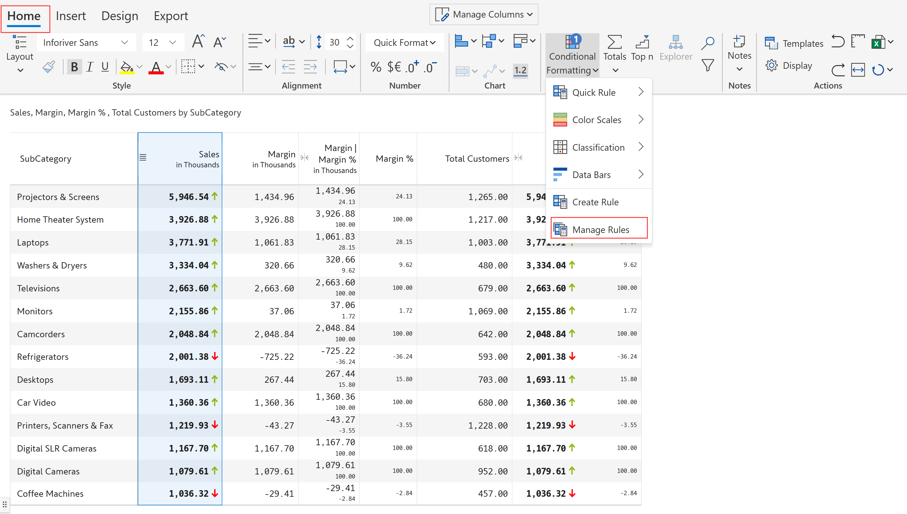

# Reset

Reset option allows you to remove or revert any changes that have been made to a particular cell or range of cells, and restore them to their original state. Inforiver provides various reset options such as Reset formats, Reset value, Reset notes and Reset all.&#x20;

* Reset formats: This option removes any formatting that has been applied to the cells, such as font color, font size, and cell borders.
* Reset value: This option resets any changes to the cell values.
* Reset notes: This option deletes all the notes added to the report.
* Reset all: This option removes all the changes to the report including formatting, data edits, charts, filtering etc., and restores it to the original state.

In the 'Home' tab of the toolbar, select the 'Reset' icon from the 'Actions' section. You can see that Reset Formats and Reset Value options are disabled. To enable them, you need to select one or more cells with formats applied or edited values.

<figure><figcaption>
Reset
</figcaption></figure>

### **1. Reset formats**

In the below example, you can see some cells formatted with background and font color.&#x20;

Select one or more cells with formatting applied. Click 'Reset formats' to remove the format.&#x20;

<figure><figcaption>
Reset formats
</figcaption></figure>

The formatting has been reset.

<figure><figcaption>
Format style reset
</figcaption></figure>

Note that 'Reset formats' does not remove conditional formatting applied in the visual. For example, consider the measure (AC vs PL %).

<figure><figcaption>
Conditional formatting not reset
</figcaption></figure>

Select a cell with conditional formatting, you can see that the 'Reset formats' option is not enabled.

<figure><figcaption>
Reset not enabled
</figcaption></figure>


Reset format is not applicable for conditional formatting, semantic formatting and the other formatting options available in 'Display settings'.


### **2. Reset value**

In the below example, you can see that two values are edited in '2021 Actuals'.

Select the cells with edited values. Click 'Reset value' to restore the value.

<figure><figcaption>
Reset value
</figcaption></figure>

The cells have been restored to their original values.

<figure><figcaption>
Values are reset
</figcaption></figure>

### 3. Reset notes

In the below example, you can see that there are several notes added to the report. Click on 'Reset notes' to remove all the notes.


In case you want to delete only selected notes and not all the notes, use the delete icon corresponding to the notes when you hover over them. The 'Reset notes' option resets all the notes in the report.


<figure><figcaption>
Reset notes
</figcaption></figure>

All the notes have been removed.

<figure><figcaption>
Notes removed
</figcaption></figure>

### 4. Reset All

To remove all the changes in the visual and reset to the original settings, select 'Reset All'.

<figure><figcaption>
Reset all
</figcaption></figure>

This opens a pop-up. Click 'Proceed'.

<figure><figcaption>
Confirmation message
</figcaption></figure>

All the changes are removed and the visual is set to the original format as shown.

<figure><figcaption>
Original settings
</figcaption></figure>

In the next section, we'll start with [adding business logic and formula](../4.-adding-business-logic-and-formulae/).
