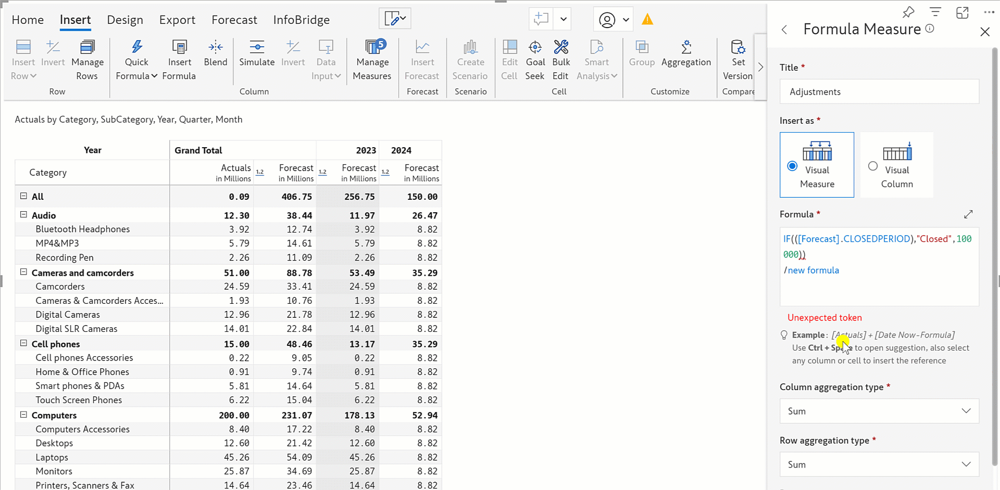

# Insert calculated rows

Inforiver provides an option to insert calculated rows using an intuitive formula editor. The Excel-like formula engine supports 50+ functions (logical, boolean, math functions, and more). The formula editor provides syntax, examples, and features such as autocomplete, multi-line support, and more to help users create, and troubleshoot formulas.




Refer to [formula syntax](../../../formula-syntax/) for a detailed list of functions, operators, and identifiers that can be used for calculations.


Let us take this example, where we have sales data by category and subcategory. Let's insert a row for Specialty Beverages which is calculated as the minimum of the other subcategories in Beverages across quarters.

Select the Tea & Coffee row above which we need to insert the row. In the Insert tab, click on the **Insert Row** dropdown. Select the Formula option.

<figure><figcaption>
Inserting a calculated row
</figcaption></figure>

A blank row gets inserted and a side panel opens up as shown.

<figure><figcaption>
Create calculated row
</figcaption></figure>

You can also create parent rows as calculated rows.&#x20;

<figure><figcaption>
Parent rows as calculated rows
</figcaption></figure>

### 1. Formula editor

1.1. Rename the title and click on the formula editor. You can see a list of available functions in the Functions tab.

<figure><figcaption>
Enter the title
</figcaption></figure>

1.2. As you start typing, Inforiver's IntelliSense narrows down the list of functions to match the entered text. Click on MIN.

<figure><figcaption>
Select function
</figcaption></figure>

1.3. Inforiver displays the syntax for the function. Click on the arrow highlighted.

<figure><figcaption>
Formula syntax
</figcaption></figure>

1.4. Inforiver displays a description of the function and a detailed explanation of the arguments with examples.

<figure><figcaption>
Function description and examples
</figcaption></figure>

1.5. To insert a reference to a particular row, click on the row when the cursor is placed in the formula editor.&#x20;

<figure><figcaption>
Referencing rows by selectingt them
</figcaption></figure>

1.6. The other way is to use the References tab. To access Soda, you need to type Beverages.Soda. As you start typing, the references get narrowed down. Select 'Beverages'.

<figure><figcaption>
Inserting a reference from the dropdown
</figcaption></figure>

Select 'Soda' from the dropdown.

<figure><figcaption>
Referencing child records from the dropdown
</figcaption></figure>

1.7. The calculated row gets created as shown.

<figure><figcaption>
Formula row is inserted
</figcaption></figure>


To see the underlying logic for calculated data, click on the cell to preview the formulae applied in the formula bar.


While you can use the [SUM](../../../formula-syntax/math-functions/sum.md) and [AVERAGE](../../../formula-syntax/math-functions/average.md) functions to calculate the sum and average of rows respectively, you can also use the **Aggregation** option from the 'Insert Row' menu.

Select a parent-level row and choose the **Aggregation** option from the Insert Row menu.

<figure><figcaption>
Inserting aggregated rows
</figcaption></figure>

Select the aggregation type from the dropdown menu.

<figure><figcaption>
Creating a custom aggregated row
</figcaption></figure>

Any errors in the formula can be easily located with clear and concise error messages. In the maximized formula editor view, you will also notice line numbers, allowing you to quickly locate and fix errors.

<figure><figcaption>
Fixing errors in formula
</figcaption></figure>

### 2. Include in total

a) Check the 'Include in total' checkbox as we need the Specialty Beverages value to be included in the Beverages total and the grand total. Click 'Create'.&#x20;

<figure><figcaption>
Including calculated row in total
</figcaption></figure>

b) You can see that the row is renamed and the values are populated. There is also a formula bar on the top which shows the formula defined.&#x20;

Note that the grand total is now updated to 255m.

<figure><figcaption>
Calculated row inserted
</figcaption></figure>

c) Let's uncheck the 'Include in total' checkbox and click 'Update'.

<figure><figcaption>
Excluding Specialty Beverages from total
</figcaption></figure>

d) You can see that the grand total has now reverted back to the original value of 239m.

<figure><figcaption>
Specialty Beverages excluded from total
</figcaption></figure>

### 3. Include in charts

a) Check the 'Include in charts' checkbox and click 'Update'.


The 'Include in charts' checkbox is enabled only when the 'Include in total' option is unchecked.


<figure><figcaption>
Include in charts
</figcaption></figure>

b) Let's now add a bar chart to 2022 Actuals. Click on the column and select the highlighted bar chart from the 'Home' tab.

<figure><figcaption>
Adding a bar chart
</figcaption></figure>

c) Notice that the Specialty Beverages row is also visualized using the bar chart.

<figure><figcaption>
Bar chart shown for calculated row
</figcaption></figure>

d) On unchecking the 'Include in charts' checkbox and clicking 'Update', you can see that the calculated row is no longer shown as charts.

<figure><figcaption>
Calculated row shown as numbers
</figcaption></figure>

### 4. Evaluate column before rows

When inserting calculated rows, in some cases you might want the total to be the sum of the child columns whereas in other cases, it needs to follow the defined formula. This behavior can be configured using the 'Evaluate column before rows' option.&#x20;

Let's consider an example where we are inserting the relative variance between two  rows. In the below image, with 'Evaluate columns before rows' enabled, you can see that the variance for the grand total is calculated based on the grand total values of Pacific and Central.

<figure><figcaption>
Total value calculated based on formula
</figcaption></figure>

When 'Evaluate columns before rows' is disabled, the grand total variance is calculated as the sum of Beverages and Water which is not the expected behavior in this case.

<figure><figcaption>
Total value calculated as sum of category values
</figcaption></figure>

### 5. Custom scaling

In certain cases, the values in calculated rows may not conform to the number scaling set at the report level. You can apply a custom scaling factor based on the nature of the calculation applied.

<figure><figcaption>
Scaling Factor
</figcaption></figure>

### 6. Bind for Cross filter/RLS

You can enable the Bind for Cross filter/RLS option – this ensures that cross-filter selections and RLS settings apply to calculated/manual input rows that reference other rows. For example, if this option is not enabled, a manager handling Canada accounts can view a manually inserted row that references US data or an inserted region that is manually created at the visual level.&#x20;

You can bind inserted rows by selecting a reference row or a dimension category.&#x20;

* **Binding by selecting a row**&#x20;

To select a particular reference row, choose _Row_ from the **SelectionType** dropdown. The Alaska>Inforiver hierarchy references the Canada row in the example below. &#x20;

<figure><figcaption>
Bind by row selection
</figcaption></figure>

The Alaska hierarchy is displayed for users with RLS access to Canada data.

<figure><figcaption>
Row binding for RLS
</figcaption></figure>

* **Dimension category**&#x20;

To bind the inserted row to a particular dimension category, choose _Dimension member_ from the **SelectionType** dropdown. In the example below, the Paseo adjustment row references the Paseo product.&#x20;

<figure><figcaption>
Bind to dimension category
</figcaption></figure>

Notice how the adjustment row is displayed for users with access to Paseo products.

<figure><figcaption>
Adjustment row dispayed for Paseo products
</figcaption></figure>

#### Resources

[Insert Formulas, Columns and Aggregation](https://www.youtube.com/watch?v=hjPAbuYJUSc)

[Visual calculations using Inforiver](https://inforiver.com/webinars/visual-level-formula-calculations-powerbi/)

[Implement SUM measure totals in Power BI (without using DAX)](https://inforiver.com/blog/general/sum-measure-totals-powerbi-no-dax/)

[Excel-like MoM, QoQ, YoY % Calculations in Rows in Power BI](https://inforiver.com/blog/general/excel-like-mom-qoq-yoy-calculations-power-bi/)
