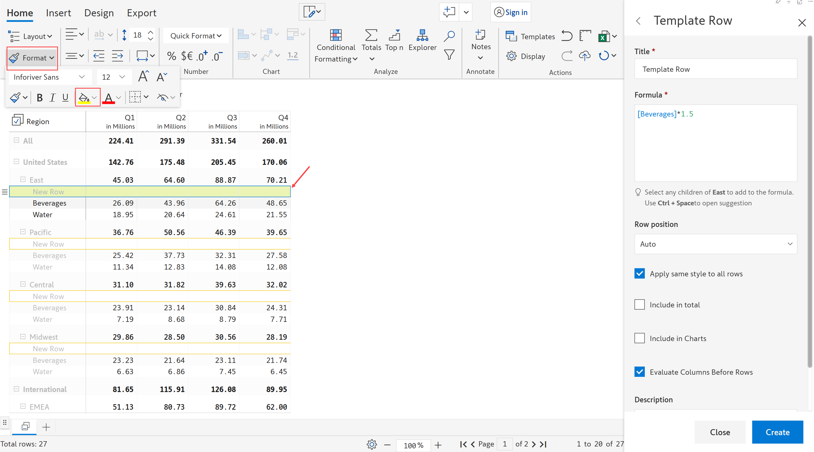
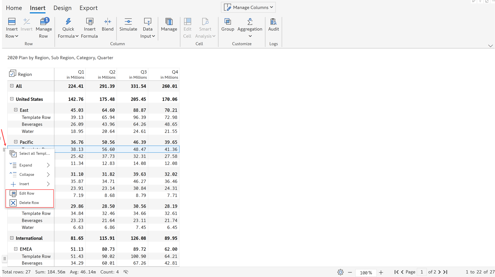

# Template rows

Inforiver allows inserting calculated rows at every level in the hierarchy with the template row option.



Let us take this example: Sales data by region and category. Let's insert a calculated row in each hierarchy which is 1.5 times the value of Beverages across quarters.

a) Select a row above which you would like to insert the row.

b) In the 'Insert' tab of the toolbar, click on the ‘Insert row' dropdown and select the 'Template row' option.

<figure><figcaption>
Insert template row
</figcaption></figure>

c) A new row gets inserted and the 'Template row' side panel opens.

<figure><figcaption>
Template row side panel
</figcaption></figure>

d) Enter the 'title' and insert the required 'formula'. Refer to [calculated rows](./) for more details on using the formula editor.

<figure><figcaption>
Title &#x26; formula
</figcaption></figure>

e) Select the 'Row position' as ‘First’, ‘Auto’ or ‘Last’ from the drop-down.

'First' - the template row will be placed first at the category level, irrespective of where it is added

'Auto' - the template row is placed above the selected row where it is added

'Last' - the template row is placed last at the category level, irrespective of where it is added

<figure><figcaption>
Row position
</figcaption></figure>

f) You can select the 'Apply the same style to all rows' checkbox if you want to replicate the same formatting to all of the rows. For example, let's apply a background color for the row.

<figure><figcaption>
Format style applied
</figcaption></figure>

g) To include the row value in subtotals and totals, check the 'Include in total' check box.

<figure><figcaption>
Include total
</figcaption></figure>

h) If charts are added to the table, the 'Include in charts' option allows you to visualize the calculated rows as well using charts.


The 'Include in charts' checkbox is enabled only when the 'Include in total' option is unchecked.


i) If the 'Evaluate columns before rows' checkbox is enabled, the defined formula is used for calculating the column totals. If this check box is disabled, then sum aggregation is followed fo the column totals. To learn more, refer [Evaluate columns before rows](https://inforiver.gitbook.io/inforiver/working-with-inforiver/4.-adding-business-logic-and-formulae/insert-calculated-rows#4.-evaluate-column-before-rows).

j) You can add a description for the formula if needed. Click 'Create'.

<figure><figcaption>
Create template row
</figcaption></figure>

k) The row gets created at the category level for all the subregions as shown.

<figure><figcaption>
Template rows
</figcaption></figure>

l) The below image shows another example, where the rows 'Extra Large' are defined as the previous month's value for the size 'Large'. To learn more about the formula used, refer to [RELATIVE\_COLUMN](../../../formula-syntax/identifiers/relative\_column.md).

<figure><figcaption>
Template rows
</figcaption></figure>

m) You can edit/delete the inserted template row by clicking on the row gripper of the selected template row and choosing the respective option from the drop-down.

<figure><figcaption>
Edit &#x26; delete template row
</figcaption></figure>
