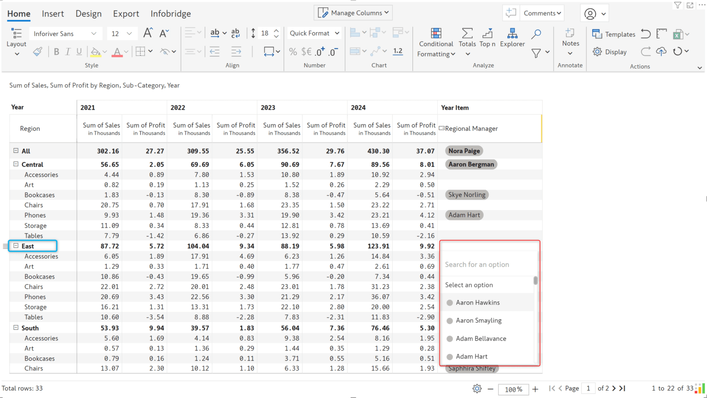

# Lookup visuals for dropdowns

The Inforiver Lookup visual has been designed to help you seamlessly integrate data from different semantic models into your reports and ensure that the data is up-to-date and accurate.&#x20;

#### 1. Top 3 benefits of using the Inforiver Lookup visual  

* You can fetch data from your source tables in real-time, provided you have an up-to-date semantic model or the lookup table is in direct query/lake mode.&#x20;
* Row-level security is implicitly handled as the helper visual displays the list of values based on the data Power BI transmits for a particular user.&#x20;
* The lookup visual is lightweight and requires virtually no maintenance like data refreshes.

#### 2. Importing and configuring the Lookup visual  

The Inforiver Lookup visual works in tandem with the Matrix visuals. It can be downloaded from our [customer portal](https://inforiver.com/login/) for free and then [imported](https://docs.inforiver.com/introduction-to-inforiver/get-started/installing-inforiver-for-yourself) into Power BI.

<figure><figcaption>
Download the ookup visual
</figcaption></figure>

To configure the visual, simply drag the dimension with dropdown options from your semantic model into the Dimension field. You can add multiple lookup visuals for a single Inforiver Matrix visual.

<figure><figcaption>
Adding lookup visuals and assigning dimensions
</figcaption></figure>

#### 3. Sourcing single-select and multi-select options from the Lookup visual  

The lookup visual is a more efficient solution that overcomes the drawbacks of connecting directly to the semantic model from Inforiver – the data is refreshed automatically when the Power BI semantic model is refreshed, and RLS settings are honored.

#### 4. Creating a dropdown with Lookup visuals  

**STEP 1:** Select the **Lookup Visual** option and specify the lookup visual name&#x20;

When you choose the Lookup Visual option, you must specify the visual name in the configuration. In this case, we are populating dropdown options for the manager’s name – so we’ve selected the corresponding visual name.&#x20;

<figure><figcaption>
Select the lookup visual name
</figcaption></figure>

**STEP 2:** Assign the dimension field to source dropdown options&#x20;

Next, select the **Column Label** field – the options in the dropdown will be sourced from this field. If you have a primary key or ID field associated with the label field, you can assign the ID field to the **Column ID**. If the column labels are updated, the ID field mapping ensures that the updated value will be reflected in your reports. &#x20;

Note: If your lookup table has no ID field, use the same label field (in this example, Manager Name) as Column ID.&#x20;

<figure><figcaption>
Assigning the Label and ID
</figcaption></figure>

**STEP 3:** Click Add to apply the configuration and create the dropdown.

#### 4. Ensuring data integrity for dropdown options  

Let’s take a closer look at assigning a manager from the dropdown. Suppose a manager has jurisdiction over the _South_ and _East_ regions only – but he is incorrectly assigned as an approver for a product category in the _Central_ region. A manual error such as this one in selecting options could result in ambiguity, delays, and possible financial losses. When you deal with huge data volumes, such operational errors are inevitable.&#x20;

With Inforiver, you can enforce data integrity by specifying filters while configuring dropdowns. Please be aware that to use filters, the dimension (in this case, Region) needs to be added to the Inforiver and Lookup visuals.&#x20;

<figure><figcaption>
Creating filters
</figcaption></figure>

Let’s look at the dropdown in action. With filters applied, notice how the options change dynamically based on the region.&#x20;

<figure><figcaption>
Options for Central
</figcaption></figure> <figure><figcaption>
Options for East
</figcaption></figure>

#### **5. Automatic cross-filtering**&#x20;

The lookup visual has the added capability to cross-filter data. The sample report shown below sources product data from a lookup visual. Notice how the product names change dynamically based on the product sub-category.&#x20;


* Power BI **Edit interactions** toggle needs to be enabled for cross-filtering to work correctly.&#x20;


<figure><figcaption>
Cross filtering
</figcaption></figure>

Disable the cross-filter option to pull all the data from the lookup visual, irrespective of the row dimension category in the matrix visual.&#x20;

<figure><figcaption>
Disabling the cross filter
</figcaption></figure>
