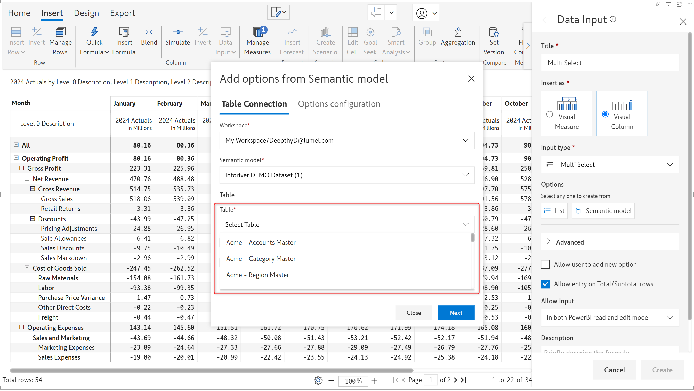

# LOV from semantic models

For the Single select and Multi-select columns, a list of values (LOV) can be created from your Power BI semantic models or other dimensions like Master Data reference fields. The options are dynamically updated as the source data changes.

### 1. Creating a LOV from a semantic model

Let's create a LOV from the dataset for a multi-select column. We'll create a multi-select field to assign a subregion.

**STEP 1:** In the multi-select column side panel, click on Semantic model to open the **Add options from semantic model** dialog box.

<figure><figcaption>
Semantic model option
</figcaption></figure>

**STEP 2:** Select the Power BI workspace from the 'Workspace' dropdown. You can also search for a specific workspace.

<figure><figcaption>
Select the workspace
</figcaption></figure>

**STEP 3:** Select the semantic model and the table from the respective dropdowns. Click Next.&#x20;

<figure><figcaption>
Select the semantic model 
</figcaption></figure>

 

<figure><figcaption>
Select the table - Acme Region Master
</figcaption></figure>

**STEP 4:** From the **Label Column** dropdown, you can choose the column from the table (selected in Step 3) which will be used to populate the multi-select options.&#x20;

You can associate the options with an ID by selecting the **ID Column**. For example, if the multi-select shows a list of product names, you can tag them to a product ID field (if available in the data model). The multi-select options will not be impacted even if the product name changes, as the Product ID field remains constant.


If an ID field is not available in your dataset, use the Label Column as the ID column.


<figure><figcaption>
Selecting the column to source the multi-select options
</figcaption></figure>

You can assign regions from the multi-select dropdown after completing the steps discussed above.

<figure><figcaption>
Multi-select dropdown sourced from the dataset
</figcaption></figure>

**STEP 5:** After configuring and creating the dropdown, to preview all the options sourced from the semantic model, click the icon. If you need to change the configuration, click the icon to open the semantic model configuration window.

<figure><figcaption>
Previewing options
</figcaption></figure>

### 2. Using joins and filters

#### Joins

The base data in our visual may be from one table, but the options in the dropdown can be from a different table. The join option comes in handy in these scenarios. If you need to join your base table with another table to source dropdown options, you need to be mindful that a common column connects the two tables. In this case, the Retail-Orders and Retail-People tables are connected by Region.

<figure><figcaption>
Joining tables
</figcaption></figure>

#### Filters

There are many scenarios wherein the options in the dropdown need to change based on the row dimension category. For example, consider that we have regional data in our rows. We need to use a dropdown to assign a manager for each region. The person we assign must also be tagged to that specific region i.e. the dropdown options for the Central region should only show the people under that region. We can use filters in such scenarios.&#x20;

Let's look at a scenario where we need to use joins and filters. Please note that the filter and join features can be used independently as well.

**STEP 1:** Select the workspace, semantic model, and table as discussed in the earlier section.

**STEP 2:** You can fetch the data from another table by checking the **Join Table** checkbox. After ticking the checkbox, you will be able to specify the table to join with.

The base table used to populate rows and columns in the report is Retail - Orders. We need to fetch the person data from the Retail - People table. The Retail -Orders and Retail-People are connected by the Region field (foreign key).

<figure><figcaption>
Joining Retail-Orders with Retail-People
</figcaption></figure>

**STEP 3:** Let's assign the field to source the multi-select options - in this case, Retail - People.Person. Since the Retail - People table does not have a unique ID column for each person, let's use the Person field as the option and the ID.

<figure><figcaption>
Soucing options from the Person in the dataset
</figcaption></figure>

**STEP 4:** We need to filter the people based on the region they are assigned to. In the **Columns** dropdown**,** select the field based on which you need to filter the options. In this case, it is the Retail - People.Region which can be used to identify the people tagged to a region. Select the matching field from the visual from the **Visual Column** dropdown.

<figure><figcaption>
Setting a filter for dropdown options
</figcaption></figure>

The dropdown options for people data have now been fetched from the Retail - People table. Notice how all the people are displayed in the options for the grand total row. For each region, only the person assigned to that region is shown in the dropdown.

<figure><figcaption>
Filtering options dynamically
</figcaption></figure>

### 3. Refreshing data

The underlying data in the semantic model is likely to change - there may be new data added or updates to the existing data. Any updates to the underlying data should be reflected in the dropdown options too.&#x20;

* You can schedule an automatic refresh at a specific time on a daily/monthly basis.
* You can also run ad-hoc data refreshes to sync the dropdown options with the semantic model.

<figure><figcaption>
Refresh dataset option
</figcaption></figure>

#### Triggering ad-hoc refreshes

You need to check the **Require Semantic model Refresh** option to trigger manual refreshes. Click the icon in the Options section to trigger a refresh from within the Inforiver visual.

<figure><figcaption>
Manual refreshes
</figcaption></figure>

Inforiver also provides an **API endpoint** to manually sync the semantic  model from outside the visual. The API endpoint is provided in the Refresh Link section. [Learn more about working with API endpoints and authorization tokens.](../../../../admin-console/settings/api-token.md)

<figure><figcaption>
API refresh option
</figcaption></figure>

Click on the icon to view the semantic model refresh history. Any errors that occur during the refresh can be viewed from this screen.

<figure><figcaption>
Refresh history portal
</figcaption></figure>
