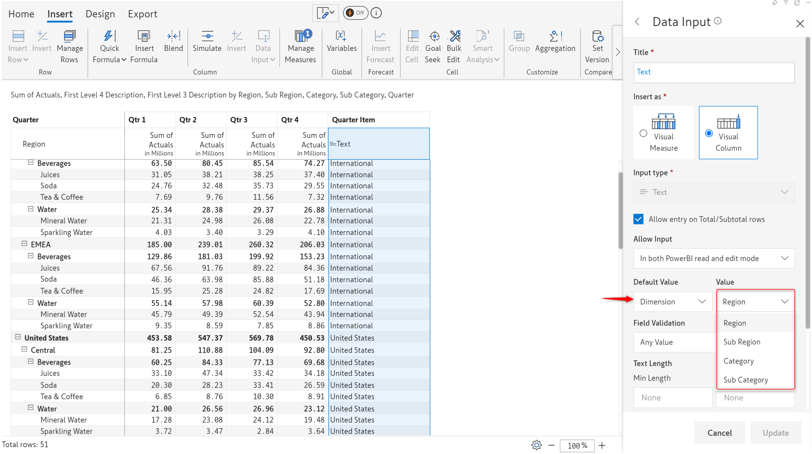

# Text, checkbox & date

In addition to [number](insert-manual-input-columns.md) and [dropdown](dropdown/) input columns, you can also use columns of types text, checkbox and date to capture manual data.

Let's cover them one by one.


If you are using Inforiver Enterprise, you need to [sign in](../insert-manual-input-columns.md#1.-sign-in) to start inserting a number column.&#x20;


## 1. Text

Text columns or measures can be inserted to capture text.&#x20;

a) Select 'Text' from the _Data Input_ dropdown.

<figure><figcaption>
Data input - text
</figcaption></figure>

b) The text column side panel is shown in the image below.&#x20;

You can choose to [insert as a visual measure or column](../insert-manual-input-columns.md#1.-insert-as). Text entry can be enabled or disabled in the total/subtotal rows using the 'Allow entry on total/subtotal rows' checkbox. Input access can be configured using the '[Allow input](../insert-manual-input-columns.md#2.-allow-input)' option. You can also set field validations which will be discussed later in this section.

Click 'Create'.

<figure><figcaption></figcaption></figure>

c) The text column gets inserted. Double-click on any of the cells and start typing the text in the editor. Press Enter to commit the text entry.

<figure><figcaption></figcaption></figure>

#### 1.1. Word wrap

Inforiver provides an option to wrap the text for long entries that get truncated.

<figure><figcaption>
Text entry truncated
</figcaption></figure>

Click on the word wrap icon in the Home ribbon to wrap text as per the width of the field.

<figure><figcaption>
Word wrap
</figcaption></figure>

#### 1.2. Text validations

Inforiver provides the ability to add data validations for text inputs. You can add validations to check the length, and data type (numeric/text/alphanumeric).&#x20;

<figure><figcaption>
Text validations
</figcaption></figure>

You can also enforce that a text entry should be an email or URL or even provide a regular expression using the Custom option.

<figure><figcaption></figcaption></figure>

For example, if you choose email as _Field Validation_ and the data entered is not a valid email ID, Inforiver will generate a pop-up error notification.

<figure><figcaption>
Error notification when validation fails
</figcaption></figure>

#### 1.3. Default values

Blank fields do not add value and are likely to reduce the appeal of a report. You can choose to use default values instead of displaying blank text data input fields. You can either enter a static default value or assign a dimension.

<figure><figcaption>
Static default value
</figcaption></figure> <figure><figcaption>
Dimension as a default value
</figcaption></figure>

## 2. Checkbox

Checkbox columns or measures can be inserted to capture binary inputs. Click on 'Checkbox' in the 'Data input' dropdown.

<figure><figcaption>
Data input column - Checkbox
</figcaption></figure>

The checkbox column side panel is shown in the below image.&#x20;

You can choose to [insert as a visual measure or column](../insert-manual-input-columns.md#1.-insert-as). Entry can be enabled or disabled in the total/subtotal rows using the '[Allow entry on total/subtotal rows](dropdown/#iii-entry-in-total-subtotal-rows)' checkbox. Input access can be configured using the '[Allow input](../insert-manual-input-columns.md#2.-allow-input)' option.&#x20;

Click 'Create'.

<figure><figcaption>
Checkbox column
</figcaption></figure>

Click on any of the cells to check the checkbox.

<figure><figcaption>
Making a selection
</figcaption></figure>

## 3. Date

Date columns or measures can be inserted by clicking on 'Date' in the 'Data input' dropdown. You can insert an empty column or copy the dates from the rows in the report.

<figure><figcaption>
Data input column - Date
</figcaption></figure>

### i) Create an empty series&#x20;

When you select this option, an empty date column is created and the side panel opens as shown in the image.

<figure><figcaption>
Date column type properties
</figcaption></figure>

You can choose to [insert it as a visual measure or column](../insert-manual-input-columns.md#1.-insert-as). Entry can be enabled or disabled in the total/subtotal rows using the '[Allow entry on total/subtotal rows](dropdown/#iii-entry-in-total-subtotal-rows)' checkbox. Input access can be configured using the '[Allow input](../insert-manual-input-columns.md#2.-allow-input)' option.&#x20;

You can also configure other optional fields as below:

#### Format

The date format can be changed by clicking the 'Format' dropdown. Choose the desired format.

<figure><figcaption>
Date format
</figcaption></figure>

#### Minimum and Maximum Date

You can set the minimum and maximum date ranges for the date input. Users will not be able to enter any dates that fall outside this range. You can enter both dates to specify a range, or just the minimum or the maximum date. To select a date, click the calendar icon.

<figure><figcaption>
Minimum and maximum date ranges
</figcaption></figure>

#### Default value

In a report that has thousands of rows, manually entering or copying dates in a data input-date field can be a tedious task. In such cases, you can set a default date. All rows will be filled with the configured default date as soon as you click **Create**.

There are multiple options to set a default date:

* **Static value**: Use the date picker to set a common date for all the rows. In the image below, the created date column is pre-filled with the default date - 07/01/2024.

<figure><figcaption>
Static value as default date
</figcaption></figure>

* **Measure**: Select the measure (native measure/formula measure/date input column) from which the default date should be sourced. In the example below, the default value is sourced from a formula measure that is available within the same report.

<figure><figcaption>
Setting a measure value as default date
</figcaption></figure>

* **Dimension**: When you have a date dimension in your row, you can select the row dimension from which the default date must be picked. The default date in the example below is picked from the row dimension, 'Order Date'.

<figure><figcaption>
Setting a dimension value as default date
</figcaption></figure>


The default date option is available for both visual measures and visual columns. Invalid date format errors are implicitly handled as blanks for a clean export and writeback.


After configuring the required settings, click **Create.**

<figure><figcaption>
Create date column
</figcaption></figure>

The date column gets inserted.

#### Entering a date

To enter data, double-click on a cell. Select a date from the calendar/date picker.&#x20;

<figure><figcaption>
Choosing a date as input
</figcaption></figure>

The date gets captured in the chosen format.

<figure><figcaption>
Date gets captured
</figcaption></figure>

### ii) Copy from rows

If your report has a list of calendar dates in the row dimension, and you want to replicate the same dates in an input column, you can use the **‘copy from rows’** option, instead of manually entering it for each record.

<figure><figcaption>
Copy from rows 
</figcaption></figure>

Inforiver automatically detects the date format which can be verified from the pop-up.

<figure><figcaption>
Automatic date format detection 
</figcaption></figure>

In rare cases when the format mapping is not as expected, you can map them manually using the help suggestions and click **Submit.**&#x20;

<figure><figcaption>
Suggestions for manual mapping
</figcaption></figure>

The date column is inserted as shown, which follows the dates in the rows. By default, the first of January is the fiscal year's start.

<figure><figcaption>
Date column inserted
</figcaption></figure>

**Note:** Inforiver accepts both hierarchical and non-hierarchical date formats. For example, the visual below has date formats such as half-years, quarters, and months assigned as individual fields instead of using a date hierarchy. Inforiver automatically maps them using the custom formats.

<figure><figcaption>
Mapping non-hierarchical date format
</figcaption></figure>

The inserted date column is shown below after setting the required fiscal year.

<figure><figcaption>
Date column inserted
</figcaption></figure>

Unconventional date formats are also accepted and automatically mapped.

<figure><figcaption>
Unconventional date formats mapped
</figcaption></figure>

#### Setting the start of the fiscal year

You also have the option to select the start of the fiscal year while copying the dates. Click 'Change fiscal year start' to choose.

<figure><figcaption>
Change fiscal year start
</figcaption></figure>

In the below example, the fiscal year start is set to April 5th. Click **Submit** to insert.

<figure><figcaption>
Fiscal year starting date is changed
</figcaption></figure>

The date column is inserted with the specified fiscal month and date.

<figure><figcaption>
Date column inserted
</figcaption></figure>

In the next section, we'll cover the [data input features available only in Inforiver Enterprise](writeback-matrix-features.md).
