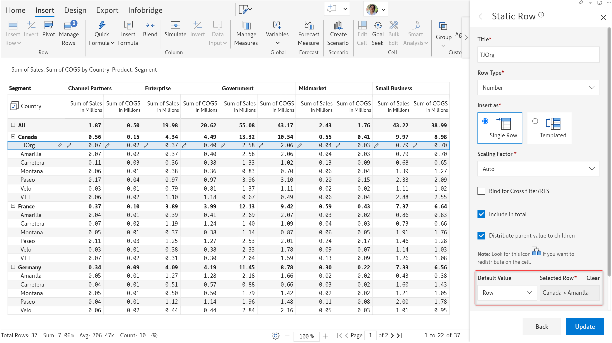

# Insert manual input rows

Quite often we would like to insert a row in our table/matrix reports in Power BI and enter our own data. For example, a financial statement report connecting to a database query may be able to fetch revenue & expense metrics, but it might not retrieve the number of shares outstanding. Similarly, a sales report can leave out the sales data for a newly launched product category.

To address such scenarios, Inforiver allows you to insert static rows in matrix-style reports where you can input or enter the data.



## 1. Insert data input row

You can insert data input rows from the Insert tab > Insert Row menu. Please bear in mind that the Insert Row button will be disabled until you select a row in your report. Select the Number option from the Data Input sub-menu.

<figure><figcaption>
Data input - Number
</figcaption></figure>

Another way to insert static rows is by using the row gripper. The gripper icon is highlighted when you hover over a row. Click on it, then select the Insert > Data Input option.

<figure><figcaption>
Inserting data input rows from the gripper
</figcaption></figure>

#### 1.1. Data input row properties

A side panel opens when creating a data input row. Type in the name of the category in the **Title** textbox and click Create. You will see an empty record created above the row that was selected.

<figure><figcaption>
Data input row created
</figcaption></figure>

#### **i. Row type**

Create a calculated row, data input row, or aggregated row by selecting the appropriate option from the dropdown.

You have the flexibility to switch between data input, calculated, and aggregated rows at any time with the Row Type dropdown. For instance, you may have used a formula and referred to the values of an existing row dimension while creating the row. You can easily change it to data input and enter values without having to create a new data input row.

<figure><figcaption>
Row type
</figcaption></figure>

#### **iii. Insert as**

Select the Single Row option to insert one data input row. Select the Templated option to replicate the row category across all levels of the hierarchy. For instance, you may create a product line specific to a particular region. You can use the Templated option to replicate the same product line across all regions.

The image below shows how template rows are rendered.

<figure><figcaption>
Template rows
</figcaption></figure>

#### **iv. Scaling factor**

You can set the scaling factor for the static row depending on the data that is expected to be entered. It is set to Auto by default.

#### **v. Include in total**

When the 'Include in total' option is enabled, any values we type in for the new row also contribute to the parent row,  in this case, 'Canada'.&#x20;

#### **iii. Distribute parent value to children**

The 'Distribute parent value to children' option ensures that if a value is entered at a total level, it gets distributed to the levels below it.

#### **iv. Bind for cross filter/RLS**

You can enable the Bind for Cross filter/RLS option – this ensures that cross-filter selections and RLS settings apply to calculated/manual input rows that reference other rows. For example, if this option is not enabled, a manager handling Canada accounts can view a manually inserted row that references US data or an inserted region that is manually created at the visual level. [Learn more about binding rows.](insert-calculated-rows/#id-6.-bind-for-cross-filter-rls)

**v. Default value**

You can either enter a static value or select another row to source default values.

<figure><figcaption>
Static default value
</figcaption></figure> <figure><figcaption>
Default values from another row
</figcaption></figure>

#### 1.2. **Delete a static row**

To delete a static row, hover over the row and click on the row gripper. Select the 'Delete Row' option. You can also delete rows from the **Manage Rows** interface that will be covered in subsequent sections.

<figure><figcaption>
Deleting a static row
</figcaption></figure>

## 2. Bulk insert static rows

You can bulk-insert leaf-level rows or hierarchies using the Insert rows option.

<figure><figcaption>
Insert rows option
</figcaption></figure>

### 2.1. Inserting child rows

To insert a leaf-level row, click on any child row or the parent row under which you want to create rows. From the row gripper, select the Insert Rows option. Notice that the parent category is already populated. You can key in the value for the child rows.&#x20;

There are 2 ways to add new rows:

* To insert a new row, click the icon that appears on hovering near the parent category.
* Click Add New, then choose whether to insert a single row or bulk insert 5/10 rows.

<figure><figcaption>
Bulk insert row categories
</figcaption></figure>

The <mark style="color:green;">TJOrg, HDTabmble,</mark> and <mark style="color:green;">DC</mark> rows are created when you click Save. You can enter values in these rows. The icon denotes manually inserted rows.

<figure><figcaption>
Entering values for data input rows
</figcaption></figure>

### 2.2. Inserting a hierarchy

To insert a new level in an existing hierarchy, you can overwrite the default parent category that is auto-populated in the Insert Rows window. For instance, if you click on <mark style="color:green;">United States (</mark>or any child row), the Insert Rows will automatically have <mark style="color:green;">United States</mark> as the Region. Double-click and overwrite the value with the desired parent category.

<figure><figcaption>
Inserting a hierarchy level
</figcaption></figure>

### 2.3. Disabling row insertion

You can restrict users from creating new categories for a particular level. Navigate to Insert >Manage Rows >  Row Settings> Insert Row Configuration.

We’ve disabled the creation of new regions. However, new subregions can still be inserted.

<figure><figcaption>
Disabling row insertion
</figcaption></figure>

Notice how the Region textbox is disabled in the Insert rows window but we are able to enter values in the SubRegion textbox.

<figure><figcaption>
Row insertion disabled at a specific level
</figcaption></figure>

### 2.4. Uploading from an Excel sheet

You can upload the row categories from an Excel sheet. In the Insert Rows window, you will be able to see the data from your Excel as dropdown options. Let's see how.

**STEP 1:** Navigate to Insert >Manage Rows > Insert Row Settings> Insert Row Configuration. Select **Options list from CSV** from the dropdown.

<figure><figcaption>
Option to source data from Excel
</figcaption></figure>

**STEP 2:** On selecting the option, The **Add Options from CSV** window opens. Click the Upload button. You can browse and upload the source file from the CSV Upload tab. Inforiver displays a preview of the contents of the CSV file.

<figure><figcaption>
CSV Upload
</figcaption></figure>

**STEP 3:** You need to map the source field from the Excel which will be used as row categories. Choose the field from the Excel from the Label Column dropdown.  In this case, the mapping is as shown below:

| Excel Column | Visual Row Category |
| ------------ | ------------------- |
| Sector       | Region              |
| Country      | Sub Region          |

<figure><figcaption>
Selecting the source field
</figcaption></figure>

**STEP 4:**  You will need to set up filters if you want to map subcategories under the respective parent category. In this case, when you select <mark style="color:green;">Frontier markets</mark> as the Region, you would only want to see <mark style="color:blue;">Vietnam, Romania, and Kenya</mark> in the Sub Region dropdown. Similarly, when you select <mark style="color:green;">CIVETS</mark> as the Region, you would only want to see <mark style="color:blue;">Colombia, Indonesia, Vietnam, Egypt,</mark> etc, and none of the countries that fall under the <mark style="color:green;">Frontier markets</mark> sector.

<figure><figcaption>
Creating a filter to map subregions to parents regions
</figcaption></figure>

Once the steps discussed above are completed, you will be able to see the data from your Excel in the Region and Sub Region dropdowns.&#x20;

<figure><figcaption>
Data from Excel populated in the Insert Rows window
</figcaption></figure>

Follow the steps discussed in sections 2.1/2.2 to insert the configured row categories into your visual.

<figure><figcaption>
Row categories sources from Excel
</figcaption></figure>

### 2.5. Insert rows from semantic models

You can also insert rows and their leaf categories from semantic models. The procedure is similar to [adding single and multi-select options from the semantic model](insert-manual-input-columns/dropdown/dropdown-options-from-semantic-models.md#id-2.-creating-a-lov-from-a-semantic-model).

**STEP 1:** To pick and upload row categories from a semantic model, navigate to Insert > Manage Rows > Insert Row Settings > Insert Row Configuration > Manage. Select **Options list from Semantic Model** from the 'Category' dropdown.

<figure><figcaption>
Options list from semantic model
</figcaption></figure>

**STEP 2:** The **Add options from Semantic model** window opens. In the **Table Connection** tab, select the workspace, semantic model and the table you need to connect to. Click **Next.**

<figure><figcaption>
Table Connection
</figcaption></figure>

**STEP 3:** Go to the **Options configuration** tab and choose the column from the connected table that will be used as the option label. In the example below, we have chosen the column 'Category' from the table 'Contoso-Product'. This column's members will be used to populate the 'Categories' row level.\
\
**STEP 4:** You can optionally specify a filter if hierarchical data is involved, and you want to maintain the same structure in your reports. In the **Columns** dropdow&#x6E;**,** select the field based on which you need to filter the options. In this case, it is the Contoso - Product.SubCategory which can be used to identify the Category. Select the matching field from the visual (SubCategory) in the **Visual Column** dropdown.

Then click **Add**.

Because of this filter, when you insert a row and add a sub-category first, you will be prompted with the category to which it belongs.

<figure><figcaption>
Options configuration
</figcaption></figure>


Configuring filter options is optional. By adding it, we ensure that the dropdown list for each category displays only the relevant sub-categories and vice-versa. For example, if you choose "Cellphones" as the category, only the sub-categories under "Cellphones" will be displayed, not other categories.

Similarly, when you choose a sub-category, you can add it only under the relevant category.


**STEP** **5: F**ollow the same steps from 1 to 4 for SubCategory dimension.

<figure><figcaption>
Options list from semantic model
</figcaption></figure>

<figure><figcaption>
Options Configuration
</figcaption></figure>

<figure><figcaption>
Configuration done
</figcaption></figure>

Once the configuration is completed as shown in the image above, you can follow the steps in sections 2.1/2.2 to insert the configured row categories into your visual.

You will see the data from the semantic model in the Category and Sub Category dropdowns.

<figure><figcaption>
Insert rows from semantic model
</figcaption></figure>

The rows are inserted as shown below:

<figure><figcaption>
Inserted rows
</figcaption></figure>


The base data in our visual may be from one table, but the options in the dropdown may be from a different table; in such cases, you can specify a join. For more information on using joins and filters, please refer to [this section](insert-manual-input-columns/dropdown/dropdown-options-from-semantic-models.md#id-4.-using-joins-and-filters).


### 2.6. Setting user permissions

You can explicitly set permissions for users to insert rows in read mode. You have options to restrict all users, allow all users, or authorize specific users to insert rows. Navigate to Insert > Manage Rows > Row Settings > Insert Row Access to set permissions.

* Enable the **Allow in Read Mode** toggle to allow users to insert rows in reading mode.
* To allow all the members in your organization to insert rows, choose the **All users** radio button.
* If you want to restrict users from inserting rows, choose the **Specific users** radio butto&#x6E;**.** You will then be able select the users to whom you want to provide access.

<figure><figcaption>
Insert row permissions
</figcaption></figure>

### 2.7. Allow blank values in categories

While inserting row hierarchies manually, you can enable the **Allow Blank Values** toggle if you expect blank row categories in the leaf nodes. This option is available at **Insert tab > Manage Rows >  Row Settings > Insert Row Configuration > Manage.**

<figure><figcaption>
Enable 'Allow Blank Values'
</figcaption></figure>

By default, this toggle is disabled. The blank categories are highlighted in a red error box, and Inforiver prevents you from inserting rows.

<figure><figcaption>
When toggle is disabled 
</figcaption></figure>

By enabling this option, you can insert row hierarchies that contain blank leaf categories. In the image below, notice that the _Corporate_ segment has only one product and does not have any discount bands under it. Similarly, the _Consumer_ segment does not have any products or discount bands tagged to it as the row categories were left blank while inserting rows.&#x20;

<figure><figcaption>
Row hierarchy with blank categories
</figcaption></figure>

Please note that you cannot create blank parent nodes for child nodes that are not blank.

## 3. Row hierarchy

This option can be used to insert a single user-defined level for hierarchical data. Only one row is created while using this option, unlike the Insert Rows(s) option, where you can define the hierarchy structure with multiple nested levels and rows. &#x20;

<figure><figcaption>
Add a new level to the hierarchy
</figcaption></figure>

After creating a custom hierarchy level, you can insert static rows, calculated rows, aggregated rows, etc. as demonstrated in the example below.&#x20;

<figure><figcaption></figcaption></figure>

## 4. Merge rows

You may be expanding to new regions or adding new product lines - with the [Static Row](https://docs.inforiver.com/working-with-inforiver/4.-adding-business-logic-and-formulae/insert-manual-input-rows#id-1.-insert-static-row), [Insert Rows(s)](https://docs.inforiver.com/working-with-inforiver/4.-adding-business-logic-and-formulae/insert-manual-input-rows#id-2.-bulk-insert-static-rows), and [Row Hierarchy](https://docs.inforiver.com/working-with-inforiver/4.-adding-business-logic-and-formulae/insert-manual-input-rows#id-3.-row-hierarchy) options, you can add dimension categories on the fly. When the same category exists at the visual level and in your semantic model, you will be able to merge the rows from your dataset.

The icon that indicates a manual input row will be replaced bywhen a row dimension category is available in the source system. Click the icon to merge the row and then click **Proceed** in the Merge rows dialog bo&#x78;**.**


Data input fields will be locked for editing until the row is merged.


<figure><figcaption>
Merge rows dialog box
</figcaption></figure>

Notice how the merge icon disappears and the data input field becomes editable after merging the EURIBOR row. When you merge rows, static rows are replaced with native rows however data inputs are retained.

<figure><figcaption>
Merged row
</figcaption></figure>

In the next section, we'll be looking at [inserting manual input columns](insert-manual-input-columns.md).

#### Resources

[Insert row and manually enter data in Power BI matrix reports](https://inforiver.com/blog/feature-highlights/insert-row-manual-data-entry-powerbi/)
