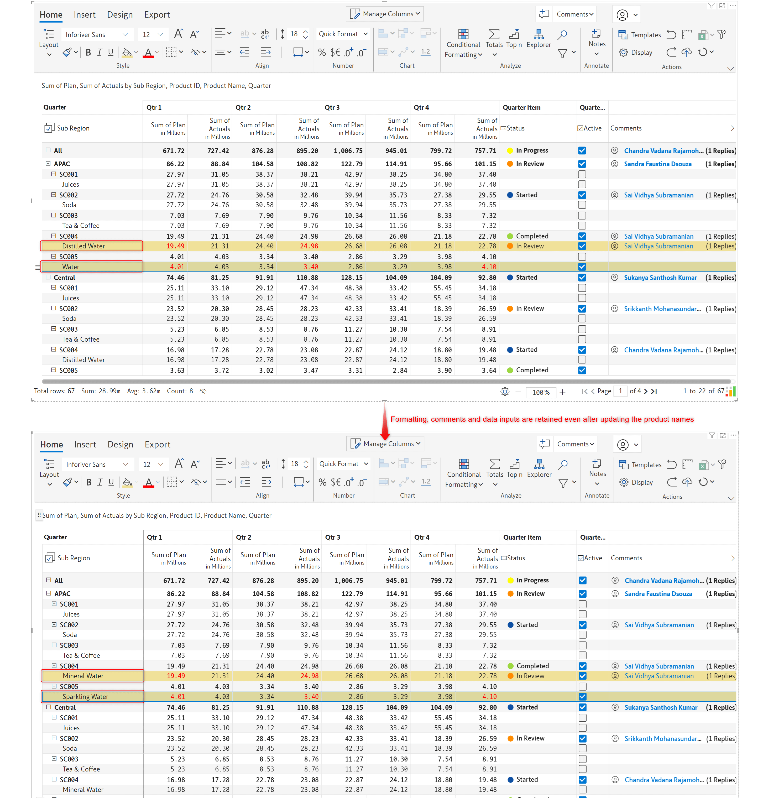
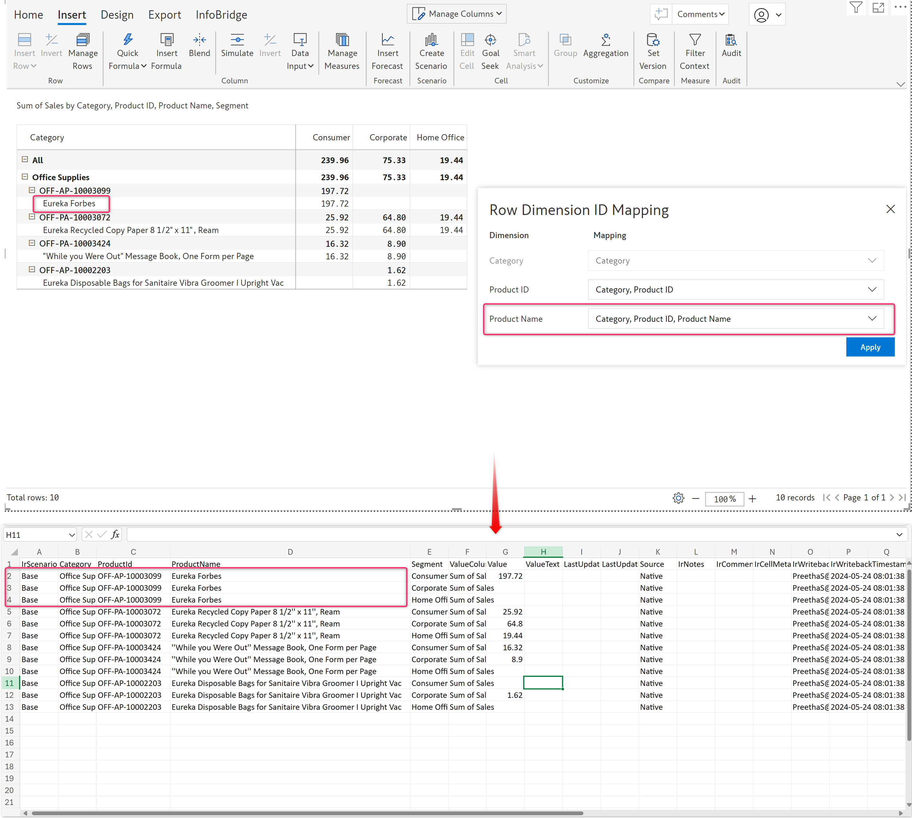
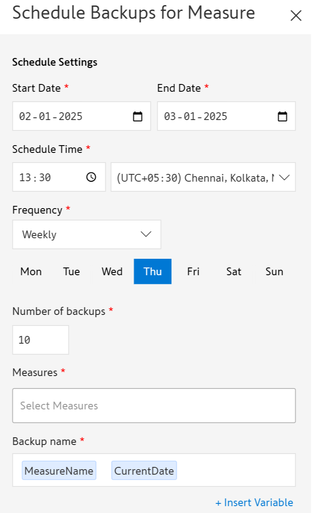
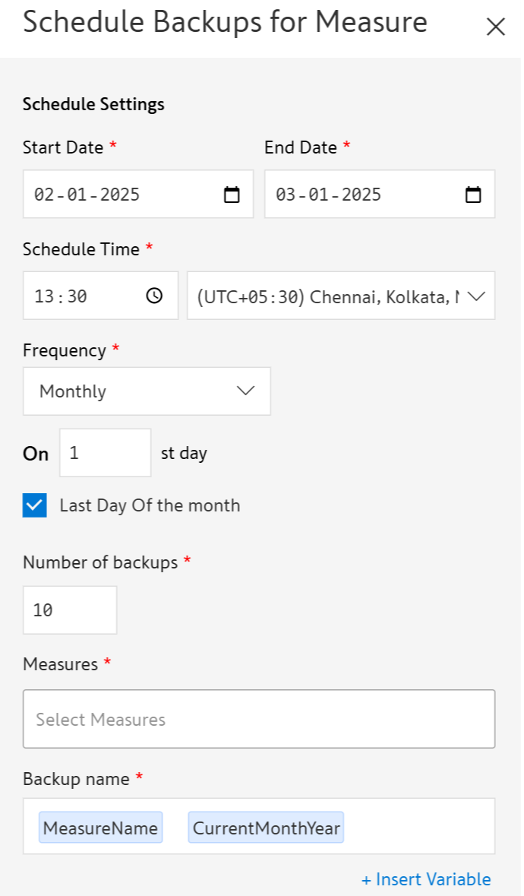

# Manage inserted measures & columns

Measures and columns inserted in the visual such as calculations or data input columns can be managed using the **Manage Measures** option.

## 1. Measures and columns

Similar to the [Manage Rows](manage-inserted-rows-and-columns-1.md#id-1.-manage-rows) option, the **Manage Measures** option displays a list of inserted columns/measures with options to edit, delete, or hide them. All the measures created in a visual can be viewed in the Measures tab. Visual columns can be viewed and managed in the Columns tab.

In addition, there is also an 'Insert New' option which lets you insert calculated columns or data input columns right from this panel.

<figure><figcaption>
Managing inserted columns
</figcaption></figure>

## 2. Settings

The **Manage Measures** side panel has a **Settings** tab that lets you control and configure important settings concerning the rows and measures, such as user permissions, time interval mapping, and row ID mapping.

<figure><figcaption>
Measure settings
</figcaption></figure>

### 2.1. Data input access

Inforiver Writeback Matrix allows setting explicit read/write access for specific users on data input and forecast columns.&#x20;

To set it, click **Insert -> Manage Measures -> Settings** **->** **Manage** in the **Data Input Access.** You can add the required users in the pop-up window.

<figure><figcaption>
Data Input Access
</figcaption></figure>


Access control for all the columns can also be set through the **Manage Columns** dropdown as explained [here](insert-manual-input-columns.md#id-3.-access-control). Specifically for the forecast columns, the user access can be configured [here](../7.-planning-budgeting-and-forecasting/forecasting.md).


### 2.2. Time interval mapping

When you have a date hierarchy in your rows/columns, you can use the time interval mapping to verify the formats that Inforiver auto-detects. Hover over theicon to view all the supported date formats.

<figure><figcaption>
Supported date formats
</figcaption></figure>

You can also choose whether to use Power BI sorting or Inforiver sorting. When the **Sort** toggle is enabled, any sorting changes made at Power BI level will not be reflected in the visual. In the example, notice how the Power BI sorting is not applied on the Quarter when the Sort toggle is enabled.

<figure><figcaption>
Sort precedence
</figcaption></figure>

### 2.3. Row ID mapping

Inforiver automatically assigns a dimension ID to each row dimension to uniquely identify them. This mapping helps to track and manage them, especially during operations like writeback. Visual components such as formatting, notes, comments, and data inputs added to the rows are also linked to the dimension IDs.&#x20;

When row dimensions are renamed/changed, we might lose these visual elements added. To avoid this, Inforiver allows us to map the row dimensions to a constant dimension ID.

In the example below, we’ve applied formatting, added notes, and comments, and added data inputs to the products, _Juices_ and _Tea & Coffee_.

<figure><figcaption>
Sample report with formatting, comments and data input columns
</figcaption></figure>

The visual elements were lost after the product names were renamed to _Fruit Juices_ and _Chai & Coffee_ respectively.

<figure><figcaption>
When the row dimension 'Product Name' is renamed
</figcaption></figure>

To avoid this, let us map the dimension IDs to a constant dimension, such as the _Product ID_ instead of the _Product Name_. To do so, navigate to **Insert -> Manage Measures -> Settings -> Row ID mapping   -> Manage**.

<figure><figcaption>
Manage Row ID Mapping
</figcaption></figure>

The image below shows the default row dimension ID mapping.&#x20;

<figure><figcaption>
Default row ID mapping
</figcaption></figure>

Let us map the 'Product Name' to the constant dimension, 'Product ID' as shown below. Click **Apply**.

<figure><figcaption>
row dimesion ID mapped manually
</figcaption></figure>

Note that changing the mapping removes all the initial formatting and visual elements associated with it.

Any formatting, notes, comments, and data inputs added after mapping with the constant dimension ID are retained as shown below, including during the writeback.

<figure><figcaption>
After manually mapping row ID dimensions
</figcaption></figure>

**Updates due to skipped row ID dimensions reflected in writeback data**

After mapping the row IDs to a constant dimension, not only the visual formatting, data changes, notes, comments, etc., are retained in the report but also captured in the writeback data promptly.

The report below shows the default mapping, followed by the results of the writeback data.

<figure><figcaption>
Writeback data before the change
</figcaption></figure>

After manually mapping the row dimension to a constant ID like the Product ID, any changes made in the report are also effectively captured in the writeback. In the image below, you can see the updated records in the report that are also reflected in the writeback data.

<figure><figcaption>
Writeback data after row ID mapping and data changes
</figcaption></figure>

### 2.4. Schedule backup for measure

You can retain point-in-time measure values with the new scheduled backup feature. The measure values are captured as separate read-only visual columns within the same visual. With this feature, you can easily calculate historical variances and analyze fluctuations in your numbers.

Navigate to Manage Measures > Settings > Schedule Backups for Measure to create monthly, weekly, or daily schedules.

<figure><figcaption>
Creating a measure backup schedule
</figcaption></figure>

* **Start and End date:** Specify the time frame during which the measure should be backed up.
* **Schedule Time:** The time and timezone at which the backup job should be triggered.
* **Frequency**: Opt for daily/weekly/monthly schedules.&#x20;
* For daily backups, you can specify the number of backups to create. For weekly schedules, you can select the day of the week to take a backup. For monthly schedules, you can specify which day of the month to take a backup on and additionally opt to take a backup on the last day of the month as well.

<figure><figcaption>
Daily schedule
</figcaption></figure> <figure><figcaption>
Weekly schedule
</figcaption></figure> <figure><figcaption>
Monthly schedule
</figcaption></figure>

* **Measures**: Select the measures that need to be backed up.
* **Backup name:** Enter the name of the backup field.

You can run ad-hoc backups by clicking the **Run now** icon.

<figure><figcaption>
Ad hoc backups
</figcaption></figure>


Measure backups will work only after the report is saved in Power BI. The report should also be created in a common workspace.


The image below shows a report with backed-up measures:

<figure><figcaption>
Measure backups
</figcaption></figure>

Measure backup jobs have dedicated logs that show the status of the backup, milestones, and the backups that are deleted when the limit is reached. Click the **View jobs** option from the Schedule Measure Backup side pane.

<figure><figcaption>
View jobs
</figcaption></figure>

Scheduled measure backup logs:

<figure><figcaption>
Scheduled measure bkp logs
</figcaption></figure>
