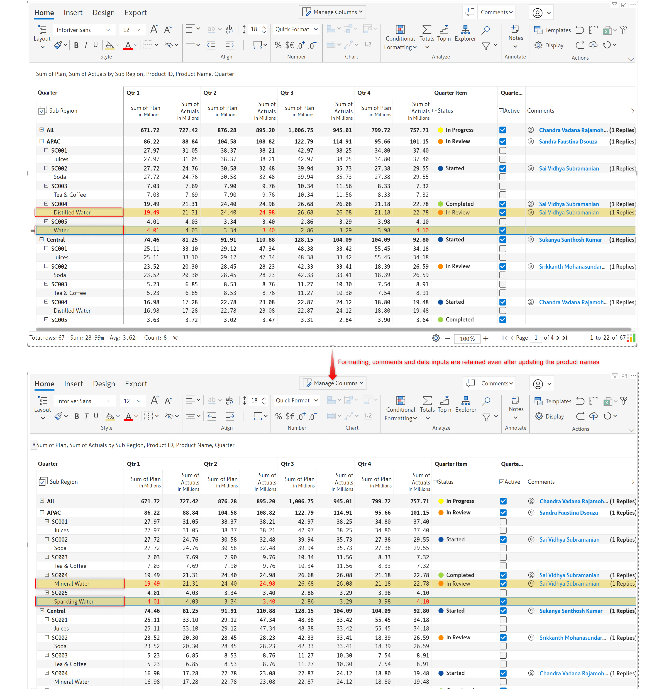

# Manage inserted rows & columns

Rows and columns inserted in the visual such as calculations, static rows, or data input columns can be managed using the **Manage Rows** and **Manage Measures** options respectively.

## 1. Manage Rows

Inserted rows such as static, calculated, etc. can be managed using the **Manage Rows** option highlighted below. A list of the inserted rows is displayed. The following operations can be performed:

a) Edit - Formulae or other properties can be modified.

b) Delete - The inserted row can be permanently deleted.

c) Show/hide row - Inserted rows can be hidden temporarily.

d) Show/hide row indicator - The pencil icon beside the inserted rows can be hidden.

<figure><figcaption>
Managing inserted rows
</figcaption></figure>

Some changes have been made - like the static row and the row indicator have been hidden and the calculated row has been deleted which are shown below.

<figure><figcaption>
Hiding row indicator, deleting and hiding rows
</figcaption></figure>

## 2. Manage Columns

Similar to the [Manage Rows](manage-inserted-rows-and-columns.md#id-1.-manage-rows) option, the **Manage Measures** option displays a list of inserted columns/measures with options to edit, delete, or hide them.

In addition, there is also an 'Insert New' option which lets you insert calculated columns or data input columns right from this panel.

<figure><figcaption>
Managing inserted columns
</figcaption></figure>

## 3. Settings

The **Manage Measures** side panel has a 'Settings' tab that lets you control and configure a few important settings concerning the rows and measures, such as user permissions, time interval mapping, and row ID mapping.

<figure><figcaption>
Settings
</figcaption></figure>

### a) Data Input Access

Inforiver enterprise allows setting explicit read/write access for specific users on data input and forecast columns.&#x20;

To set it, click **Insert -> Manage Measures -> Settings** **->** **Manage** in the **Data Input Access.** You can add the required users in the pop-up window.

<figure><figcaption>
Data Input Access
</figcaption></figure>


Access control for all the columns can also be set through the **Manage Columns** dropdown as explained [here](insert-manual-input-columns.md#id-3.-access-control). Specifically for the forecast columns, the user access can be configured [here](../7.-planning-budgeting-and-forecasting/forecasting.md).


### b) Row ID Mapping

Inforiver automatically assigns a dimension ID to each row dimension to uniquely identify them. This mapping helps to track and manage them, especially during operations like writeback. Visual components such as formatting, notes, comments, and data inputs added to the rows are also linked to the dimension IDs.&#x20;

When row dimensions are renamed/changed, we might lose these visual elements added. To avoid this, Inforiver allows us to map the row dimensions to a constant dimension ID.

In the example below, we’ve applied formatting, added notes, and comments, and added data inputs to the products, _Juices_ and _Tea & Coffee_.

<figure><figcaption>
Sample report with formatting, comments and data input columns
</figcaption></figure>

The visual elements were lost after the product names were renamed to _Fruit Juices_ and _Chai & Coffee_ respectively.

<figure><figcaption>
When the row dimension 'Product Name' is renamed
</figcaption></figure>

To avoid this, let us map the dimension IDs to a constant dimension, such as the _Product ID_ instead of the _Product Name_. To do so, navigate to **Insert -> Manage Measures -> Settings -> Row ID mapping   -> Manage**.

<figure><figcaption>
Manage Row ID Mapping
</figcaption></figure>

The image below shows the default row dimension ID mapping.&#x20;

<figure><figcaption>
Default row ID mapping
</figcaption></figure>

Let us map the 'Product Name' to the constant dimension, 'Product ID' as shown below. Click **Apply**.

<figure><figcaption>
row dimesion ID mapped manually
</figcaption></figure>

Note that changing the mapping removes all the initial formatting and visual elements associated with it.

Any formatting, notes, comments, and data inputs added after mapping with the constant dimension ID are retained as shown below, including during the writeback.

<figure><figcaption>
After manually mapping row ID dimensions
</figcaption></figure>
