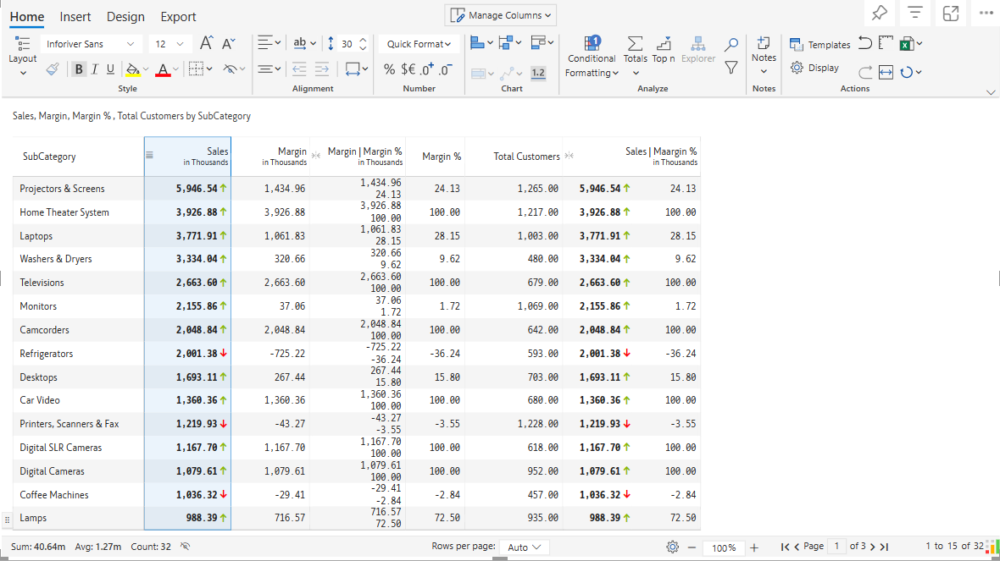

# 5. Conditional formatting

**Conditional formatting** is a feature that allows you to apply custom formatting to cells that fulfill certain conditions. It is mostly used to highlight, emphasize, or separate certain data using color-based formatting like bars, scales, etc.

To apply conditional formatting, select any measure from the visual, from the 'Home' tab of the toolbar, click on the 'conditional formatting' in the Analyze section.

<figure><figcaption>
Conditional formatting
</figcaption></figure>

The following options are available:

1. [Quick Rule](5.-conditional-formatting/quick-rule.md)
2. [Color Scales](5.-conditional-formatting/color-scales.md)
3. [Classification](5.-conditional-formatting/classification.md)
4. [Data Bars](5.-conditional-formatting/data-bars.md)
5. [Create Rule](5.-conditional-formatting/create-rules/)[s](5.-conditional-formatting/create-rules/)
6. [Manage Rules](5.-conditional-formatting/manage-rules.md)
