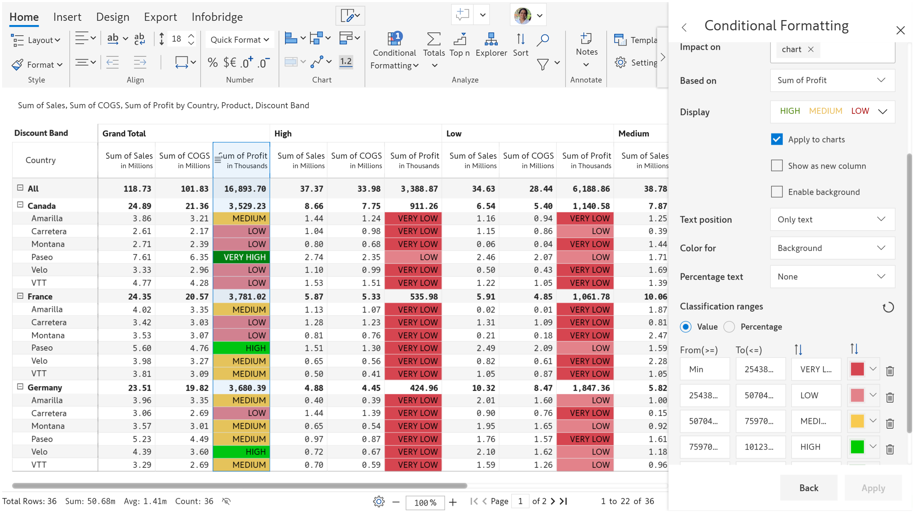
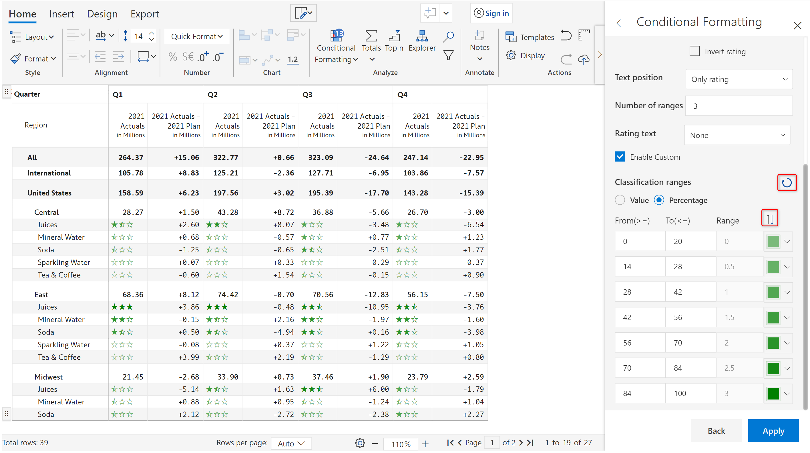

# Classification

Inforiver provides data classification based on text, icons and ratings.

Refer to [create rule](create-rule-basic-settings.md) to get started. Once the rule is created and you can see the **Conditional Formatting** side panel, follow the below steps.

Choose 'Classification' in the 'Format by' dropdown. There are several options enabled as shown in the below image.

<figure><figcaption>
Conditional formatting based on classification
</figcaption></figure>

Click on the 'Display' dropdown. You can see the three types of classifications already mentioned. Let's look at them one by one.

<figure><figcaption>
Classification types
</figcaption></figure>

### 1. Text

Many times, it may become essential to categorize performance. A common technique used by enterprises to categorize inventory, vendors or materials is [ABC analysis](https://en.wikipedia.org/wiki/ABC_analysis). Inforiver delivers this capability right out of the box.&#x20;

1.1. Select 'ABC' from the **Display** dropdown. Let's go with the default settings. Click Apply.

<figure><figcaption>
ABC analysis
</figcaption></figure>

1.2. The rows are classified and the text is displayed on the left of the data.

<figure><figcaption>
ABC analysis
</figcaption></figure>

1.3. You can also have the classifications appear in a separate column if required. Check the **Show as new column** checkbox.

<figure><figcaption>
Display text in new column
</figcaption></figure>

1.4. When there are charts in the column where classification is to be applied, check the **Apply to charts** checkbox. In the below image, 2021 Actuals are visualized using bar charts, and the colors defined for the ABC ranges are used for formatting.

<figure><figcaption>
Classification applied to charts
</figcaption></figure>

1.5. you can choose to enable a background for the text. The **Enable background** option is only available for text classification, not icons or ratings.

<figure><figcaption>
Enable background
</figcaption></figure>

1.6. You can also choose to display only the classification text by selecting _Only Text_ from the **Text position** dropdown.

<figure><figcaption></figcaption></figure>

1.7. When you choose the _Only Text_ option, you can choose to apply the color to the font, background, or both.

<figure><figcaption>
Color for font
</figcaption></figure> <figure><figcaption>
Color for background
</figcaption></figure>

1.8. You can display the percentage contribution to the left or right of the text using the **Percentage text** dropdown.

<figure><figcaption>
Percentage text option
</figcaption></figure>

1.9. You can define custom ranges as shown below. Click the **Add Range** button to create an additional range of values.

<figure><figcaption>
Customizing the ranges
</figcaption></figure>

1.10. Ranges can also be defined using numeric values. Click on the 'Value' option. The values get populated automatically based on the defined percentages, but they can be further edited.

<figure><figcaption>
Ranges based on numeric values
</figcaption></figure>

1.11. You can delete specific ranges or reset all changes using the icons highlighted in the below image.&#x20;

<figure><figcaption>
Deleting and resetting ranges
</figcaption></figure>

### 2. Icon set

Icon-based formatting provides the same properties as text-based formatting. Refer to [Text](classification.md#1.-text) for more details. We'll only at a simple example for icon sets.&#x20;

In the 'Display' dropdown, choose the 'Five arrows' option. Click 'Apply'. Note that we have applied formatting to 2021 Actuals based on 2021 Actuals - 2021 Plan. Hence, we can see which categories have done worse/better than the plan.

<figure><figcaption>
Classification based on icon sets
</figcaption></figure>

### 3. Rating

You can also use star-based ratings as seen in e-commerce sites in the product feedback section.

a) Select the '3 stars' option from the 'Display' dropdown and click 'Apply'.

<figure><figcaption>
Conditional formatting - Rating
</figcaption></figure>

b) You can see the 1-5 rating icons on the left of the data. By default, the number of ranges has been set to 5.

<figure><figcaption>
5-star rating
</figcaption></figure>

c) You can move the ratings to a separate column by clicking on the 'Show as new column' checkbox.

<figure><figcaption>
Ratings in a new column
</figcaption></figure>

#### **Invert rating**

d) Check the 'Invert rating' checkbox in cases where higher values need to show lower ratings.

<figure><figcaption>
Inverted ratings
</figcaption></figure>

e) As seen in text and icon-based formatting, you can choose only to display the classification or change the position. In the below example, we have chosen the 'Only rating' option.

<figure><figcaption>
Displaying only rating
</figcaption></figure>

#### **Number of range**s

f) You can customize the number of icons that appear in your scale – 'Number of ranges' has been set to 3 in this case.&#x20;

<figure><figcaption>
Changing the number of ranges
</figcaption></figure>

g) The rating text can be shown on the left or right. Select the position and color as shown below.

<figure><figcaption>
Rating text
</figcaption></figure>

#### **Enable custom**

h) In Inforiver, you have the option to configure value ranges for each of the ratings. Click on the 'Enable custom' checkbox. For every half rating, you'll be able to define percentage/value ranges in the 'From' and 'To' fields as shown in the below image.

<figure><figcaption>
Custom ranges
</figcaption></figure>

i) To reverse the order of colors and reset all changes to the ranges, click on the highlighted icons.

<figure><figcaption>
Reorder colors and reset changes
</figcaption></figure>

In the next section, let's look at [Ranking](ranking.md).
